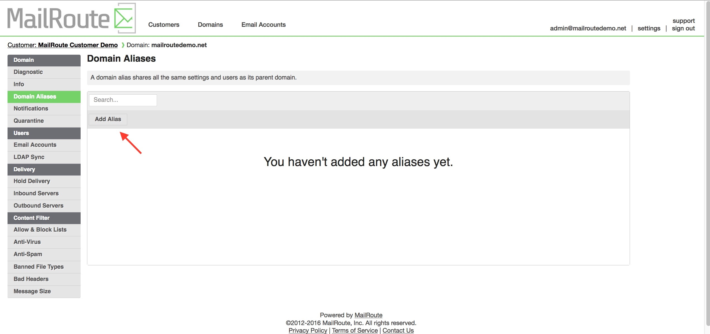
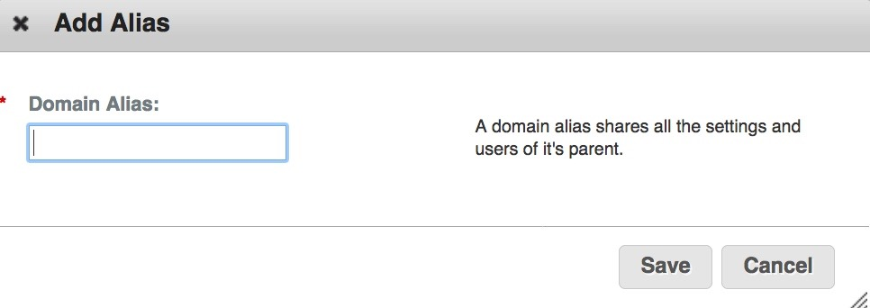

A domain may have one or more **Aliases**. A **Domain Alias** inherits all the
settings and mailboxes of its parent domain.

**Criteria:** The domains have the same, exact list of addresses and the same
delivery server. If both of these are not true, you cannot alias one domain to
the other.

This is very useful when you have several variations of a domain. For example,
perhaps "mailroutedemo.com" is your main domain, but you've also registered
"mailroutedemo.net", "mailroutedemo.org", and you want them to be configured
exactly the same as "mailroutedemo.com" - just make them aliases! Then one
user can have user@mailroutedemo.com, user@mailroutedemo.net, etc.

Edit a **Domain Alias** by clicking on its name. Delete it with the red **X**.
(Important: this will delete all associated settings and email accounts.)

Click the **Add Domain Alias** button to add a new **Domain Alias.**

[Start a free 30-day trial today.](http://mailroute.net/signup.html)

Contact [sales@mailroute.net](mailto:sales@mailroute.net) or
[support@mailroute.net](mailto:support@mailroute.net) for more information.

[888.485.7726](tel:888.485.7726)

