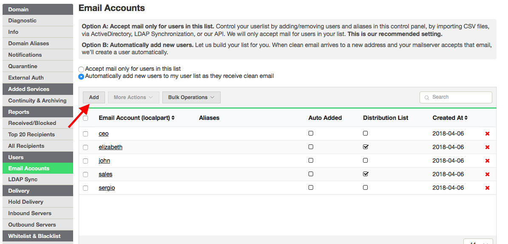
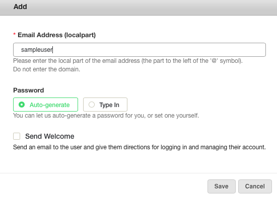
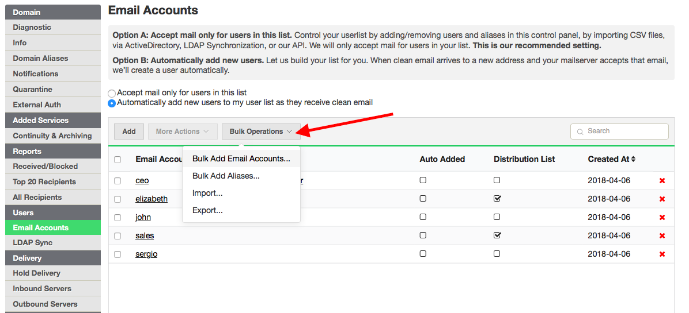
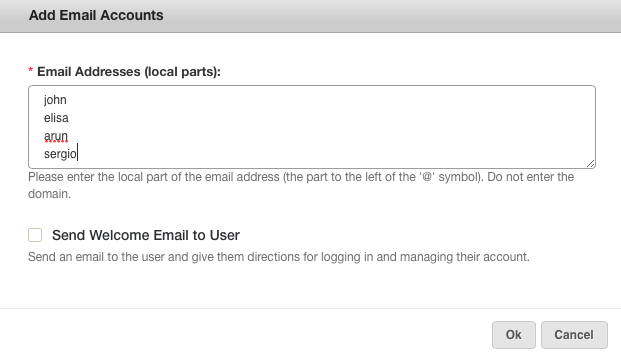
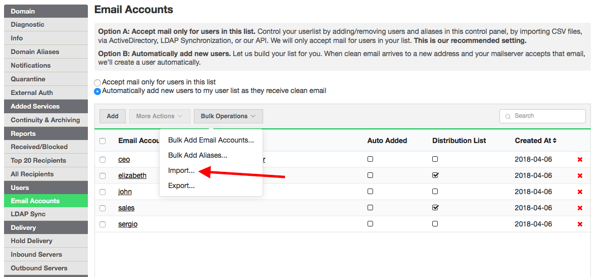
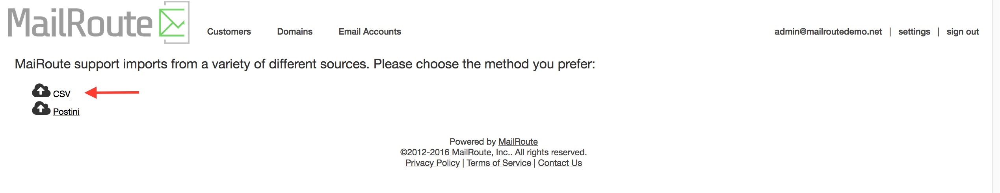
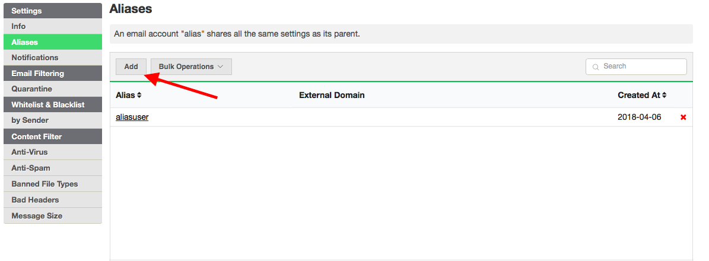
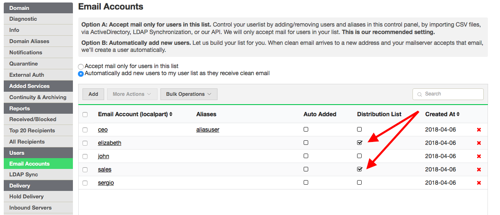

A complete list of mailbox addresses on your domain(s) is essential for
maximum protection.

**At any time during your 30-day trial, you can complete your list using one
of several methods shown below, which will turn off the Auto-Add function that
is included in your free trial.**

On day 31, following your 30-day free trial, all addresses listed under Email
Accounts will be considered legit and you will be invoiced.

The **Email Accounts** list provides access to each of the email accounts for
which you are an Administrator.

Simply click on an address to edit it or to manage its settings, allow/block
lists and quarantine. Click the red **X** at the far right of the email
account to delete it.

**Important:** Deleting an email account will delete it and all of its
associated preferences and settings. There is no way to undo this!

## Methods for Populating Your Account

**Auto-Add** occurs during your free 30-day trial, when we receive a clean
piece of mail for your domain and your server verifies the address. Mail is
delivered and the address is added to your Email Accounts list, marked as
Auto-Added. Note that we cannot identify aliases through Auto-Add and need for
you to reassign aliases on your Email Accounts list.

**To complete your list of mailboxes, we offer these easy methods:**

  * Allow Auto-Add to build your list of addresses
  * Import a CSV file, or send the file to us for uploading
  * [LDAP Sync/ActiveDirectory ](https://support.mailroute.net/hc/en-us/articles/115000403387-ActiveDirectory-LDAP-Synchronization)
  * [API](https://support.mailroute.net/hc/en-us/categories/203394488-Developers) with [libraries and scripts](https://github.com/mailroute)
  * Manually add your mailboxes to the interface

Manual input:

  1. Log in to the MailRoute interface at [https://admin.mailroute.net](https://admin.mailroute.net/).
  2. Select the All Domains tab
  3. Click on the domain you want to work on
  4. Select the Email Accounts tab.
  5. Add an **Email Account** by clicking on the **Add User** button. 

Select " **Bulk Add Email Accounts...** " from the " **Bulk Operations** "
menu. Enter the **localparts** of the **Email Accounts** into the dialog box.
This is the part **to the left of** the " **@** " symbol in the email address.

**Import** email accounts from a text file. Select " **Import..**." from the "
**Bulk Operations** " menu.

## Reassign as Alias

**Add aliases** by clicking on the specific mailbox/account and click **Add
Alias** to add a single account, or you can add multiple accounts via the Bulk
Add Aliases option under the **More Actions** menu.

**See[this article](https://support.mailroute.net/hc/en-
us/articles/115000379888-Email-Account-Aliases-and-addresses-plus-
addressing-)** on **Account Aliases and + Addressing**.

If you've entered multiple email accounts, and you decide you want one or more
of them to instead be an alias of another account, you can select Email
Accounts, click the box next to the address and then choose **Reassign as
Alias** from the **More Actions** menu. Type the email address that you wish
to assign it to, then choose it from the auto-filling pulldown menu that
appears. Click OK and that email address will be made into an alias.

****** Aliases inherit the login and all settings of their "parent" address.

## Distribution Lists

You can now **mark your distribution lists** by checking the box marked '
**Distribution List** '. This means that address will receive all of our
protection but does not need login credentials, quarantine or custom settings.
This also means it is now free of charge.

You can find other ways to manage your distribution lists
[here](https://support.mailroute.net/hc/en-
us/articles/115001583947-Distribution-Lists-Setup-Options).

  * IMPORTANT: If you are using our newly released Continuity and Archiving Lite service, email directed at aliases will appear in its "parent" address' mailbox. Aliases do not need to log in to individual mailboxes to view their email. However, you will need to avoid aliasing distribution lists. Instead check the distribution box under the Email Accounts tab or leave it unchecked if you want it treated as a billable account for customization purposes. 

  * NOTE: If you **convert an address from a regular address to a distribution list, the aliases are lost**. If you require aliases to any distribution lists **do not use this set up**.

[Start a free 30-day trial today.](http://mailroute.net/signup.html)

Contact [sales@mailroute.net](mailto:sales@mailroute.net) or
[support@mailroute.net](mailto:support@mailroute.net) for more information.

888.485.7726

