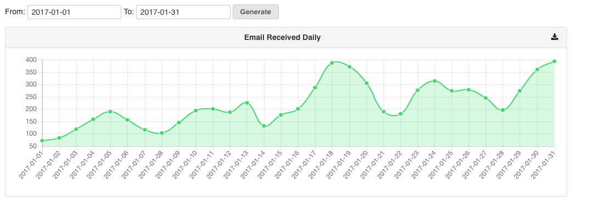
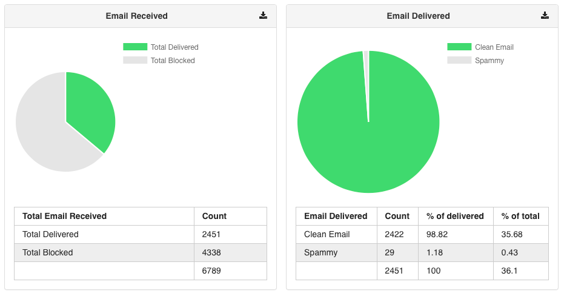
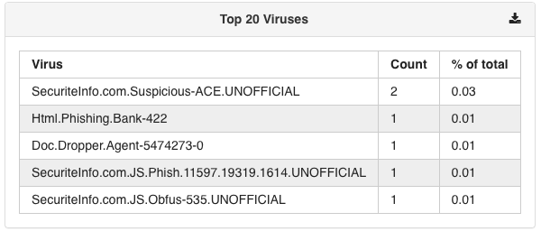
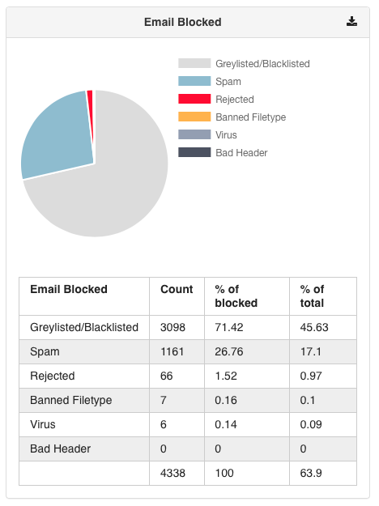
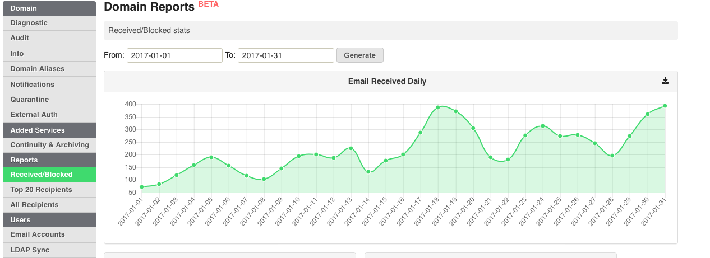

**Domain Reporting**

MailRoute has enhanced our reporting tools with our version of dashboard
reports. This feature allows admins to pull data from domain traffic for
analysis.

Generate Reports:

\- Emails received

\- Total emails delivered

\- Emails blocked

\- Top 20 Categories such as viruses, recipients, banned files, clean
recipients, spam recipients

Where do I find this?

Login to MailRoute at [admin.mailroute.net](http://admin.mailroute.net/) and
click on the Domain. On the left hand side of the screen you will see a
Reports section. Click on any of the report categories, enter the date range
and click Generate.

The data for each report is downloadable by clicking the

button on the top-right of the report.

Please contact [support@mailroute.net](mailto:support@mailroute.net) with
feedback or for further information.

