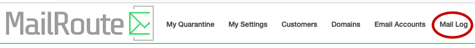
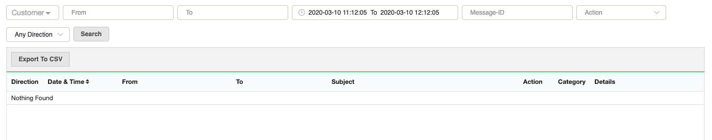
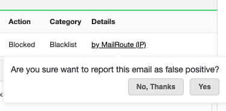
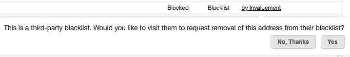
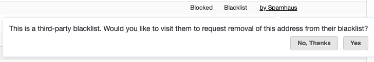
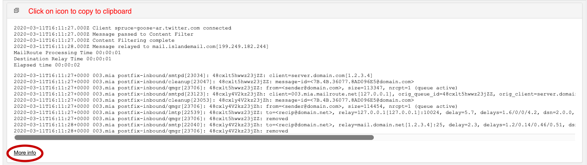

### Getting Started

Login to MailRoute's dashboard with your Admin credentials

The Mail Log is located at the top right in the Admin Menu.

You will be taken to the mail log search:

### Search Options

**Required:**

**Customer** \- Displayed only for Administrators of multiple customer
accounts. Use the drop down menu to select which customer account you would
like the mail logs for. The search will include all domains for that customer
account.

**Date** \- choose a date range for your search. This defaults to the last
hour.

**Optional** :

**From** \- enter the sender you wish to search for - either a domain or a
full email address. For example, you can search for "user@domain.com" or
"domain.com". 

**To** \- enter the recipient you wish to search for- either a domain or a
full email address. For example, you can search for "user@domain.com" or
"domain.com"

**Message ID** \- search by message ID

**Action** \- if you would like a more specific search you can select from the
drop down menu:

  * **Accepted** \- search for mail that's been accepted/delivered clean.
  * **Quarantined** \- search for mail that's been quarantined
  * **Bounced** \- search for mail that's been bounced by our servers
  * **Blocked** \- search for mail that's been blocked by MailRoute's filters, including blocklistings or for non-existent users
  * **Direction** \- Search for only Inbound or Outbound email

Press the **Search** button to see results.

### How to Read the Mail Log

**Direction** \- unless specified in the search, this will indicate if the
mail was inbound or outbound

**Date & Time** \- you can click on the sort icon to view the emails from most
recent to earliest

**From** \- you will see both the 'From:' header address and the SMTP Envelope
MAIL FROM address listed.

**To** \- the recipient of the email

**Subject** \- available for email messages that reached and were processed by
the content filter. This would not include emails that were blocked by various
blocklists.

**Action** \- indicates whether the email has been:

  * Accepted 
  * Quarantined
  * Bounced
  * Blocked

**Category -** further definition of Action

  * Blocked
  * Clean (Allowed)(Accepted)
  * Spam (Quarantined)
  * Unchecked (Accepted)

**Details** -clicking on this link provides details for further action

  * **Clean (Allowed)** \- the email has come through because the sending address has been Allowed in your settings
  * **Spam -** Scoring from content filter
  * **Unchecked -** the email has been Allowed or the email could not be checked because it is encrypted, or contains an enclosure that is encrypted or password-protected.
  * **Blocked - By MailRoute (IP)** or **By MailRoute (autoblock)** \- You will see this message

If the email was incorrectly marked as spam, you can click on ' **Yes** ' and
it's submitted to MailRoute technical support for further evaluation.

  * **By Invaluement** \- the email address/sender is on an Invaluement blocklist. This is a very reliable list with an incredibly low false-positive rate which responds very rapidly to changing events. New spam IP addresses are added rapidly, and false-positives are very quickly removed. You will see this message: 

Selecting ' **Yes** ' will take you to the Invaluement site where you can
request delisting.

  * **By Spamhaus** \- the email address/sender if on a Spamhaus blocklist. This is a highly accurate, real-time listing site. New spam IP addresses are added rapidly, and false-positives are very quickly removed. You will see this message: 

Selecting ' **Yes** ' will take you to the Spamhaus site where you can request
delisting.

  * **No such user** \- no such user was found by the mailserver.

**Click** on a message to display further details about the message:

This will display a summary of message processing times and detailed email
delivery logs, showing when a message was arrived, processed, and relayed to
the destination server, along with any relay errors or messages:

Click on ' **More Info** ':

The information includes:

  * **client_geoip.*** \- this provides approximate geographical information from the relaying mailserver based on public databases. This information is not guaranteed to be correct but it can give a good idea where email is coming from.
  * **client_ip** \- the IP address of the relaying mailserver
  * **dkim_author_sig, dkim_new_sig, dkim_valid_sig** \- information about the DKIM signature of the email
  * **ip_trace** \- a list of the IP addresses this email transited
  * **message_id** . - message ID of the email
  * **tests** \- a complete list of all scoring tests that hit in the content filter
  * **tests_ham** \- negative scoring tests 
  * **tests_spam** \- positive scoring tests

## Useful Tips:

Click  to copy the details of a message to
your clipboard, if you want to be able to send it to us at support, for
example.

The **Export to CSV** button will save the contents of your search to a CSV
file.

Need further help? Contact support@mailroute.net

