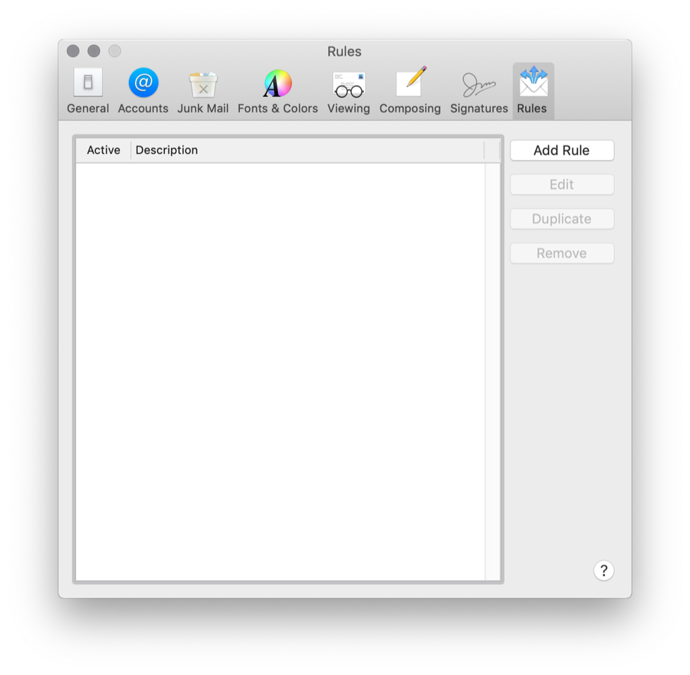
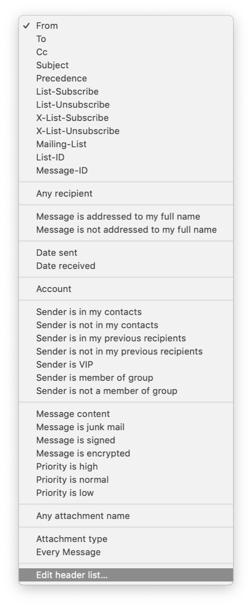
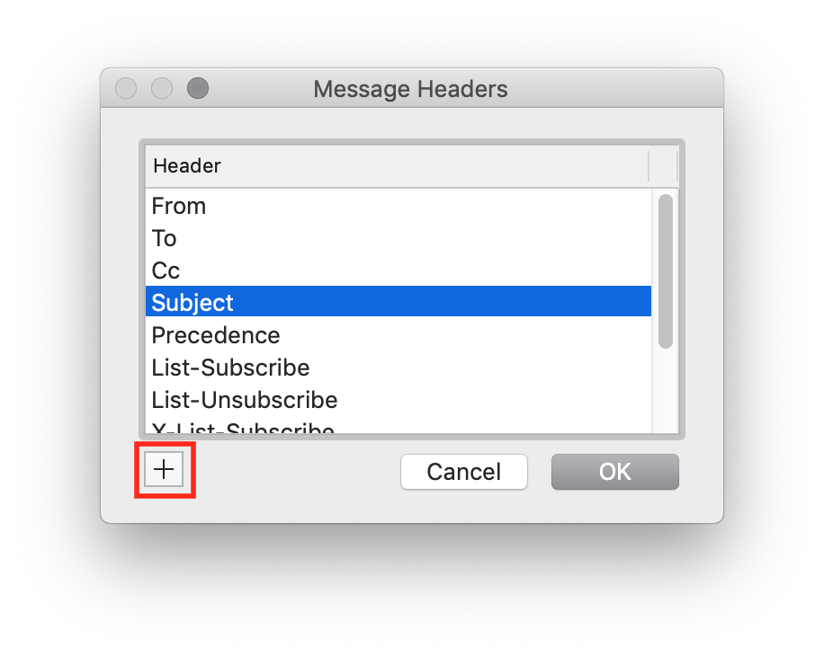
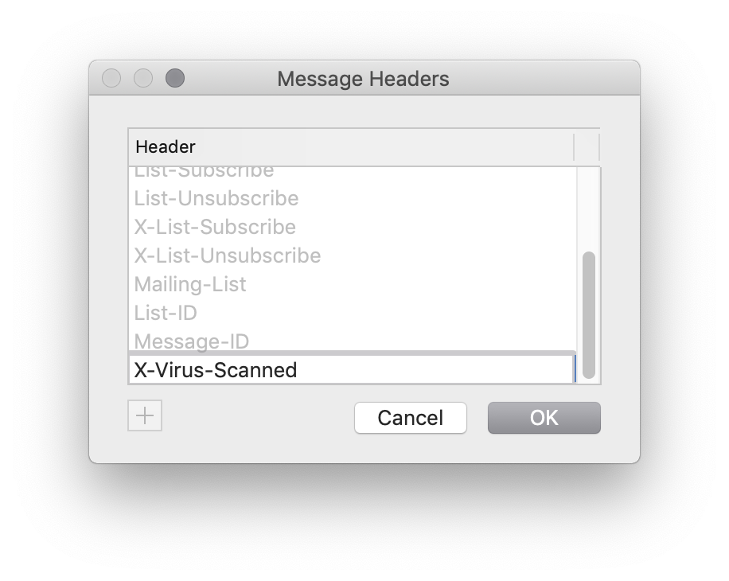
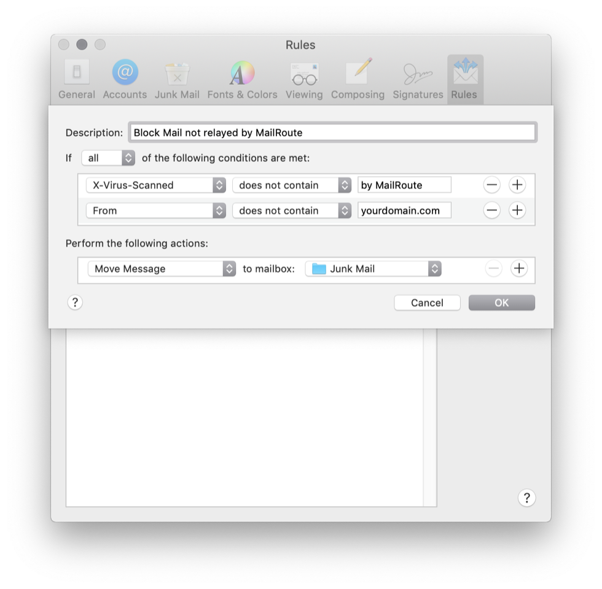

You can set up a filtering rule with Apple Mail on your desktop if you are on
a shared server and you can't configure your firewall or set up a filtering
rule on your server itself.

The rule will redirect any email **from the outside** that doesn’t contain the
MailRoute headers into a new or existing folder in your mailbox (don't apply
this rule to mail being sent within your domain).

Mail -> Preferences -> Rules

Click Add Rule.

Click "From", and then "Edit Header List"

You'll see this dialog:

Click + and add a new header to the list: "X-Virus-Scanned"

Click the From List again, and now select that new X-Virus-Scanned header from
the list. Choose "does not contain" from the next menu. Enter "by MailRoute"
into the field for that header.

Click the + button to add a new condition.

Chose "From" and then "does not contain" and then enter in your domain name.
This makes sure that email that is from other users in your domain that is
kept local to your server does not get moved.

Click "All" for "all fo the following conditions are met".

Then pick your option for what to do with the messages that do not meet this
criteria. In this example we are moving them to a folder called "Junk Mail".
You might choose to move them to an archive folder or even to delete them.

