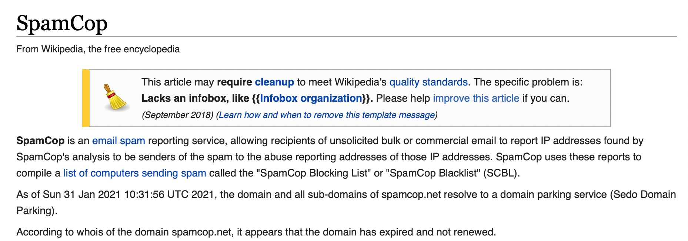

Sunday, January 31, 2021. The spam reporting service and blacklist Spamcop
have not renewed their domain name.

Email services using the Spamcop Blacklist (bl.spamcop.net) are falsely
identifying all emails as spam.

MailRoute does **not** use the Spamcop blacklists; our inbound service is not
facing this issue. But other companies and services who use Spamcop may be
refusing or quarantining all email that arrives.

For further articles please see here:

  * https://www.reddit.com/r/sysadmin/comments/l9asw7/spamcop_domain_expiredparked/
  * https://www.internetnews.me/2021/01/31/spamcop-offline-cos-the-domain-expired/

