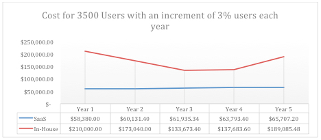

## Finding the Right Mix: Why Outsource Your Email Filtering?

# Line graph of costs

In-house with 2x redundancy VS SaaS

# Abstract

The high speed internet infrastructure, quest for IT resource optimization and
escalating operation and maintenance cost of keeping digital resources up are
leading to a cost effective and technologically efficient business solutions
with computing resources available on demand and consumption pattern on pay
per use basis. The flexibility of scaling up or down the IT resource pool for
dynamic services and reduced CAPEX & OPEX for IT industry makes it a viable
solution. This is the phenomenon in which computing resources are treated as a
utility. The concept is not totally new but the evolution of ICT with reliable
broadband infrastructure has made it pragmatic now. This paper discusses the
concept of Cloud Computing, proposed cloud models and services options,
economic opportunities and challenges.

#

# Objectives & Benefits

**Current Environment**

As times evolve so does technology, putting companies in a place where they
have to constantly invest in new infrastructure and technologies not only to
function properly but to be able to plan their future growth and support their
internal processes and operations. Software as a service (SaaS) has become a
standard which allows companies to outsource the hassle of finding a vendor,
planning and implementing, managing the implementation projects, and balancing
the sustainability, scalability, availability of the software or hardware.

**Is SaaS right for your company?**

The short answer is yes, SaaS provides a platform in which companies can look
for the best service providers who are specialized and certified on a specific
piece of software. Such companies focus on providing their employees the
necessary training and tools including legacy expertise, for them to be able
to do seamless implementations for third party clients. Therefore, when
outsourcing email filtering services there are many factors which should be
taken into account, such as security redundancy, cost efficiency and
scalability.

## **Security**

Risk outsourcing

When attacks are imminent companies struggle to keep their information and
servers safe. Most of the times companies which are attacked see their email
servers being the first in line to be targeted. Some other times companies
don’t even have the time to react to attacks. When using a third party email
filtering system, the risk of outsiders attacking servers directly on the
company’s farm is almost non-existent. Email threats are cut down at the
source leaving only clean communications to go through the company’s servers.

Cloud Secured Connections

Learning to trust the cloud has been a challenge for many companies throughout
the years, first by relying on fast and dependable internet connections to
access the information stored in the cloud, then by ensuring that the exchange
of information is reliable and that there’s not an external factor affecting
the connection or listening to the exchanges. Such cases are managed from the
source by companies which use SSL connections as well as 128bit encryption
methods for the information to be transferred to where it belongs.

## **Redundancy & High Availability**

Making sure that company information is always protected is never a luxury.
Companies take special attention into making sure that down time, system
crashes and outsider threats are minimized. At the same time, investing in
high availability and redundancy systems can become quite a large expense and
affect negatively the company’s cash flow, especially if there’s a specific
High Availability level that the company is looking to achieve. Companies are
in the business of conducting their operations successfully, not on the
business of creating data-centers which are highly available and redundant.

## **Cost efficiency**

Vendor Ownership of Resources

In the past, the idea of a company implementing a solution always came in hand
with a level of investment that had to be made on infrastructure, project
implementation, customization and repetitive fine-tuning. In contrast we have
SaaS, which provides a way of acquiring the same products but without the
investment and overhead of a full implementation.

Projection of investment

When a company takes into account the many different factors which make a
solution possible they focus primarily on the benefit they will reap in the
future, that thought alone makes the investment decision easier and sometimes
overshadows the fact that investment in infrastructure is high in the
beginning and it becomes obsolete over a short period of time. In order for a
company to invest their resources in a cost effective manner they will have to
look into alternatives such as SaaS which is a pay-as-you go service and it’s
never over or under estimated.

Scenario 1 Small Company with mobile users

  * 450 users on the first year and adjusting growth by a 5% for the next 5 years
  * Company has 24X7 support and on-call staff
  * The first year the company invests in appliances, backup, disaster recovery and high availability infrastructure as well as personnel for implementation
  * Licensing and renewal fees after the first year
  * Constant management and update of spam definitions

**Scalability**

The number of users, offices, and operations in general should not be directly
correlated to a hike on investment. Meaning, if the company grows or adds more
personnel there shouldn’t be an investment accompanied with growth as far as
infrastructure goes. SaaS provides a mean to avoid growing investment and
planning investments in infrastructure for every step of the company’s growth.

###

#

# Case Study

Boston University is currently using spam filtering systems hosted in the
cloud. The decision of moving their spam filtering on a SaaS basis was the
fact that in-house solutions used up too much physical space and were
constantly demanding the support and configuration of in-house engineers.
Since Boston University moved their Spam Filtering solution to a SaaS
environment they have been able to maximize productivity of their email
servers as well as they have been able to provide a UI to the end users for
them to manage their spam settings on a customized basis.

[Start a free 30-day trial today.](http://mailroute.net/signup.html) Use promo
code SpiceWorks for 10% off for the lifetime of account.

Contact [sales@mailroute.net](mailto:sales@mailroute.net) or
[support@mailroute.net](mailto:support@mailroute.net) for more information.

888.485.7726  
  
---

