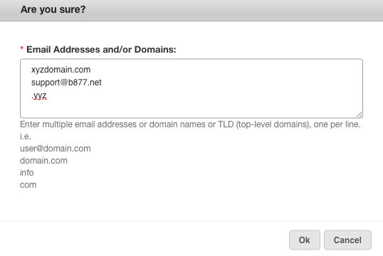

## Domain-wide Allow and Block listings:

As an administrator, you can Allow and Block entries that apply to every user
in your domain. Individual user settings override these domain-wide settings:
if you Block aol.com for the domain, but an end user Allows user@aol.com, or
even all of aol.com, then their settings will override the domain-wide
settings.

## Allow and Block Lists

Allow and Block says it all - it allows or blocks messages sent by specific
senders. Please be aware that email senders can be forged - you can't rely on
the sender 100%.

Blocked senders are blocked and end up in the quarantine.

Allowed senders always get past the spam filters, but if their messages are
corrupt or virus infected, our other filters may capture them, in order to
keep you well-protected.

Add **individual** senders or domains with the " **Add"** and choose **Allow
or Block.**

Or enter many at once with the " **Bulk Operations" menu** and choose **"Bulk
Add Allowed Senders"** or **"Bulk Add Blocked Senders"**.

You can Allow or Block:

**Addresses:** user@domain.com

**Domains:** domain.com

**TLD's (top level domains):** .info, .tv, .eu, etc (be sure to leave the
**preceding dot** out when adding TLD's)

More specific entries override the less specific, so you can block aol.com,
but exempt your Mom by Allowing mom@aol.com.

[Start a free 30-day trial today.](http://mailroute.net/signup.html)

Contact [sales@mailroute.net](mailto:sales@mailroute.net) or
[support@mailroute.net](mailto:support@mailroute.net) for more information.

888.485.7726

