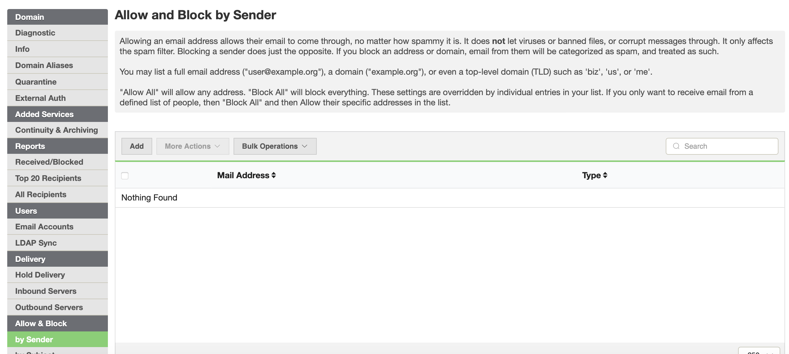
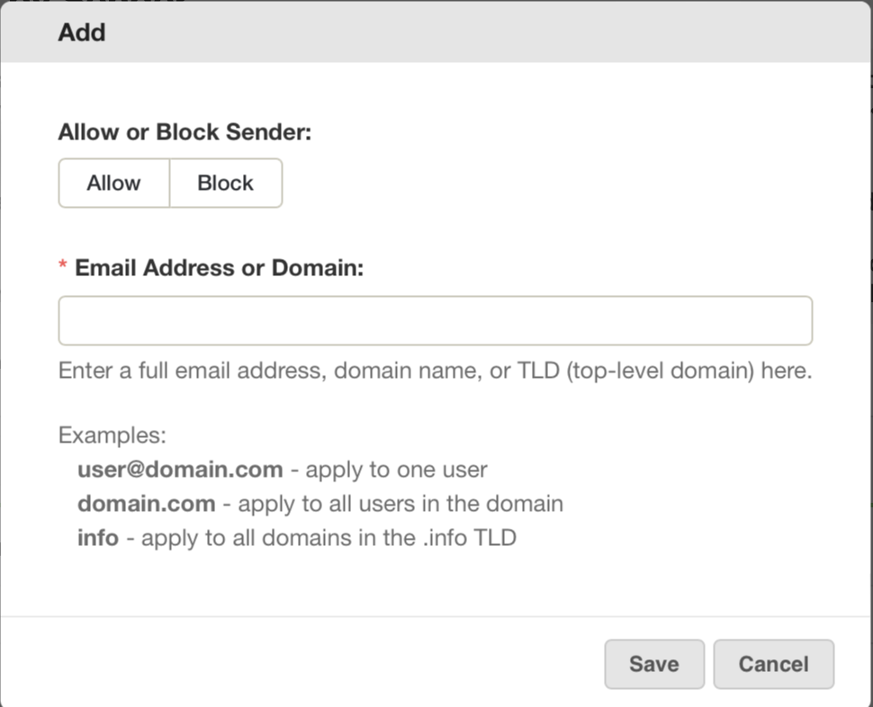
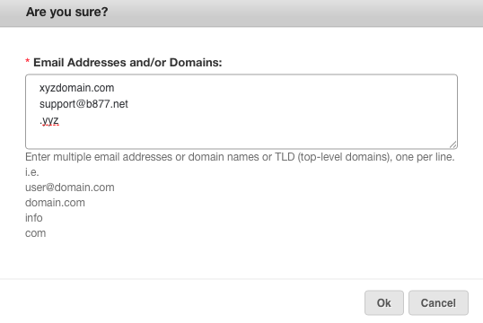
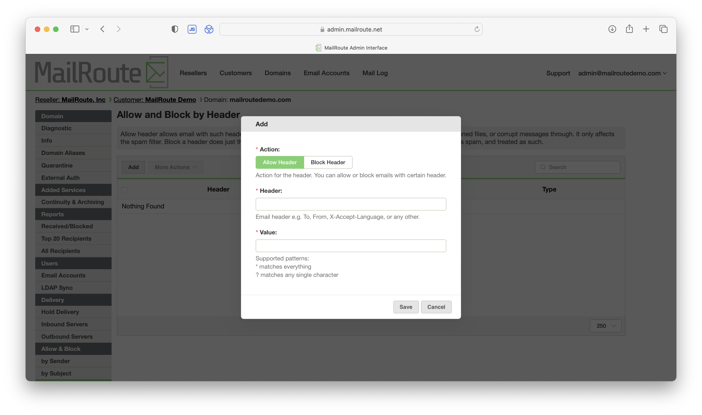
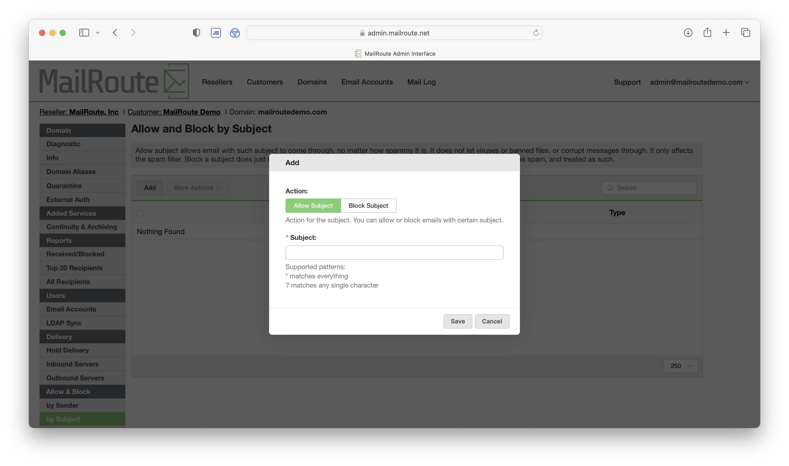
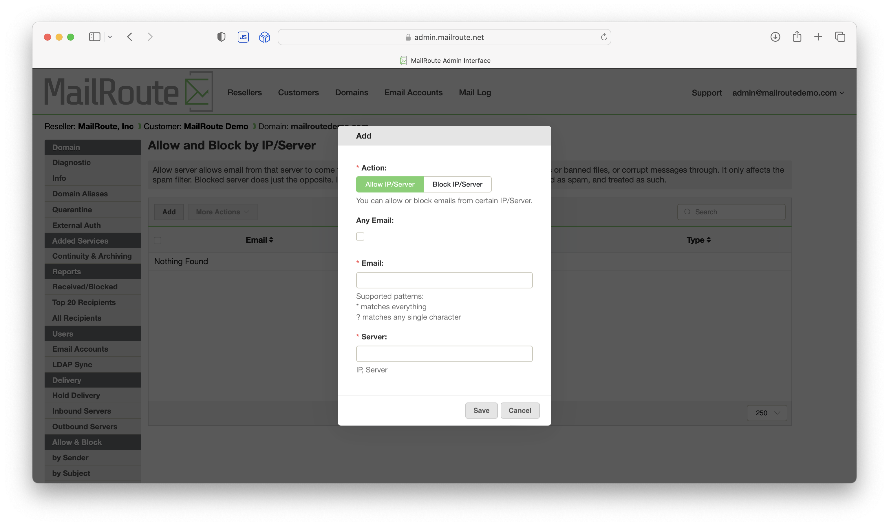

## Allow and Block Lists

Allow and Block, permits or blocks messages sent by specific senders. Please
be aware that email senders can be forged - you cannot rely on the sender
100%.

Blocked senders are blocked and end up in the quarantine.

Allowed senders always get past the spam filters, but if their messages are
corrupt or virus infected, our other filters may capture them, in order to
keep you well-protected.

Add individual senders or domains with the " **Add** " and choose **Allow** or
**Block.**

Or enter many at once with the " **Add Allowed Sender(s)** or **Add Blocked
Sender(s)**..." option in the " **Bulk Operations** " menu.

You can allow or block:

**Addresses:** user@domain.com

**Domains:** domain.com (not recommended)

You can block a TLD (these cannot be Allowed):

**TLD's (top level domains):** .info, .tv, .eu, etc (be sure to leave the
**preceding dot** out when adding TLD's)

More specific entries override the less specific, so you can block aol.com,
but exempt your Mom by allowing [mom@aol.com](mailto:mom@aol.com).

**Allow/Block b** **y Header**

****

This allows the user to specify a bit of text that, if found in any arbitrary
header in an email, will result in that email being allowed or blocked.

The value is what we search for in the header. The default match is a basic
substring match, but we also support some very basic patterns for matching:

* matches anything

? matches any single character

For example, if you wanted to match a message that has the word "banana" in
the subject, then you can just enter "banana" in the value.

But if you wanted to only match it if had both the words "banana" and
"gorilla", you could use a pattern:

banana*gorilla

If your bananas are numbers 1 through 10, and you only wanted to match them,
you could use

banana?

You could also match based on a Received header, a Content-Type header, a
DKIM-Signature header - anything you wish.

**Allow/Block by Subject**

Like Allow/Block by Header, this allows the user to specify any bit of text
that, if found in the Subject of an email, will result in that email being
allowed or blocked.

The value is what we search for in the subject line. The default match is a
basic substring match, but we also support some very basic patterns for
matching:

* matches anything

? matches any single character

For example, if you wanted to match a message that has the word "popcorn" in
the subject, then you can just enter "popcorn" in the value.

But if you wanted to only match it if had both the words "popcorn" and
"movie", you could use a pattern:

popcorn*movie

If popcorn is numbers 1 through 10, and you only wanted to match them, you
could use

popcorn?

**Allow/Block by IP/Server**

****

Emails that were relayed to us can be allowed/blocked by a specific email
server.

It can allow or block for any email address, or just specific email addresses.

**Choose the Action** \- Allow or Block

Here is where you configure it:

**Any Email:** should this apply to any email address from the server. Check
the checkbox if so.

**Email** : If you didn't check that checkbox, you can specify the email
address. This can match any part of the email address - the localpart, or the
domain, and it supports basic pattern matches too:

* matches anything

? matches any single character

So if you want to match email just from any user in
"[domain.com](http://domain.com/)", you can enter
"[domain.com](http://domain.com/)"

If you want to match a specifc user "[bob@domain.com](mailto:bob@domain.com)",
you can enter "[bob@domain.com](mailto:bob@domain.com)"

If you have 10 users named bob, with the email address in for form of bob1
bob2, etc, you can match "bob?@[domain.com](http://domain.com/)"

If you wanted to match "[bob@domain.com](mailto:bob@domain.com)",
"[bob2@domain.com](mailto:bob2@domain.com)" and
"[bob_roberts@domain.com](mailto:bob_roberts@domain.com)", you can enter
"[bob*@domain.com](mailto:bob*@domain.com)

**Server** : enter the DNS name or IP address of the server you want to Allow
or Block.

If you enter an IP address, you can also use CIDR notation to specify a range
of addresses

<https://en.wikipedia.org/wiki/Classless_Inter-Domain_Routing>

For example, you can match all addresses in 192.168.10.0 through
192.168.10.255 by entering in 192.168.10.0/24

[Start a free 30-day trial today.](http://mailroute.net/signup.html)

Contact [sales@mailroute.net](mailto:sales@mailroute.net) or
[support@mailroute.net](mailto:support@mailroute.net) for more information.

888.485.7726

