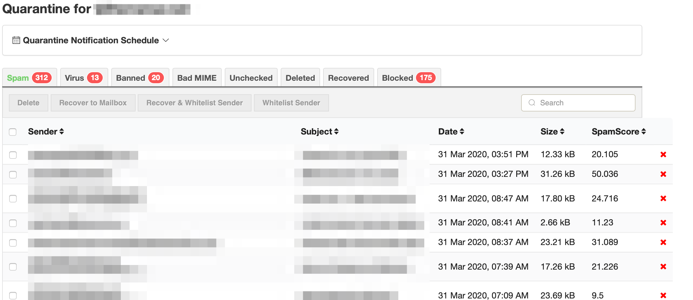

As an Administrator, you can access the email quarantine for the entire
domain. The email quarantine displays spam emails that have been filtered by
our content filters. These are emails that are considered spam, virus
infected, or have been put on Blocked lists set by yourself or your domain
administrator.

By clicking on the tabs you can view the different types of quarantined
emails:

**Spam** \- email that is considered spam by content filters. A standard spam
score is 7 unless your settings have been changed

**Virus** \- email has been identified as infected with a virus or malware.

**Banned** \- emails with banned filetypes are messages that contain various
types of dangerous enclosures. The standard filetypes blocked by this filter
include: .bat, .cmd, .com, .cpl, .dll, .exe, .pif, .scr, .js, .jar and .vbs.

These restrictions apply to files embedded inside other files, like zip or tar
files too.

**Bad MIME** \- The MIME structure of the email violates the standards. This
may be an attempt to exploit vulnerabilities in email clients.

**Unchecked** \- The email could not be checked because it is encrypted, or
contains an enclosure that is encrypted or password-protected.

**Deleted** \- when you delete an email in the spam tab, it is transferred
into the Deleted tab.

**Recovered** \- when you recover an email that is considered a false-
positive, the email is transferred into the Recovered tab.

**Blocked** \- emails that have been blocked by a user or in the domain-wide
settings are listed here.

Working With Emails in Quarantine

Emails in quarantine can be actioned in several ways if needed. Select an
email in the spam tab by clicking on the subject or by clicking on the
checkmark.

**Delete** \- this will move the email from the Spam tab to the Deleted tab.
The email will remain in the Deleted tab until the quarantine is flushed every
15 days or so.

**Recover to Mailbox** \- if an email in the Spam tab is considered a false-
positive, select to receive in your inbox

**Recover & Allow Sender** \- if the email is a false-positive and you would
like to Allow the sender, select this. *Caution* _Keep in mind that Allow
means you wish emails from this sender will always bypass our filters so we
recommend using this option only for a very few known and trusted senders._

**Allow Sender** \- selecting this means emails from this sender will always
bypass our filters so we recommend using this option only for a very few known
and trusted senders. If possible Allow by a more secure method using both the
IP/Server and email address.

Viewing the Email Details in Quarantine

If you would like to see the full header or more details of the email, click
on either the Sender or Subject of the email. There will be a pop up window
containing the entire email.

If you need the full header which includes the content filtering spam score
details, click on All Headers.

The detail in the Full Header contain all details of the date, time, sender,
recipient as well as mailserver information. You will also see details of the
X-Spam-Status indicating the filter scoring which caused the email to be
quarantined.

Quarantined emails are stored for a minimum of 15 days.

[Start a free 30-day trial today.](http://mailroute.net/signup.html)

Contact [sales@mailroute.net](mailto:sales@mailroute.net) or
[support@mailroute.net](mailto:support@mailroute.net) for more information.

888.485.7726

