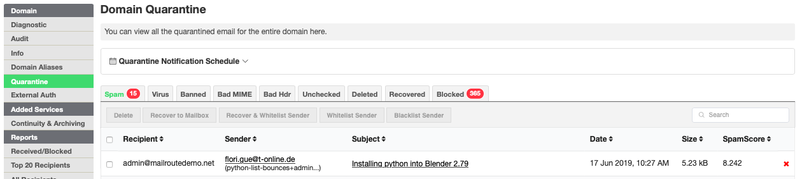
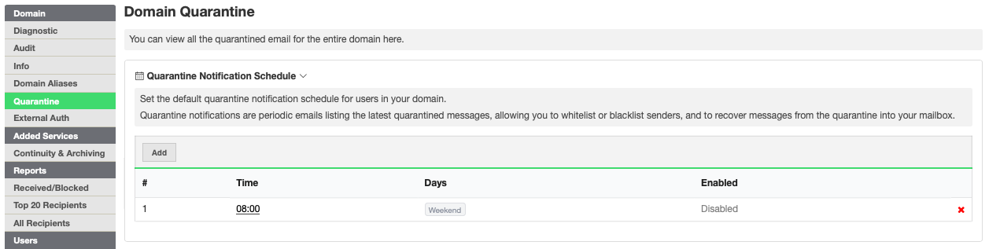

## Notifications of Quarantined Mail

We can deliver notifications of quarantined messages to the inbox of your
email addresses. Granular customization can also be set by individual
recipient and schedule.

This feature will be enabled by the account admin (see second screenshot
below).

Admins control the delivery schedule for domain(s) and end user(s). End users
can login to their account and control their own schedule as well.

Admins will enable this feature and set the Quarantine Notification schedule
for a domain. In the Quarantine tab the Notification Schedule is directly
above the quarantine details.

Click on the Quarantine Notification Schedule to enable notifications.

##  

##  Please note: Notifications are only sent out if there is something new to
report since the last notification was delivered.

###

[Start a free 30-day trial today.](http://mailroute.net/signup.html)

Contact [sales@mailroute.net](mailto:sales@mailroute.net) or
[support@mailroute.net](mailto:support@mailroute.net) for more information.

888.485.7726

