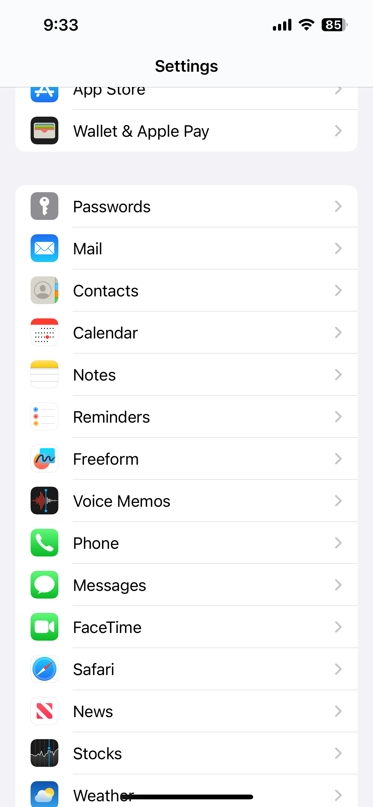
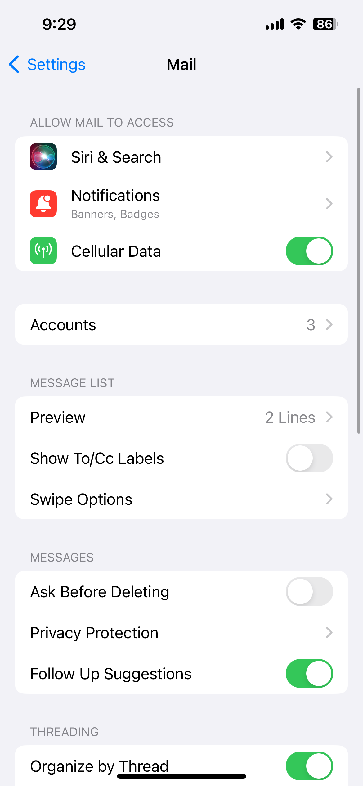
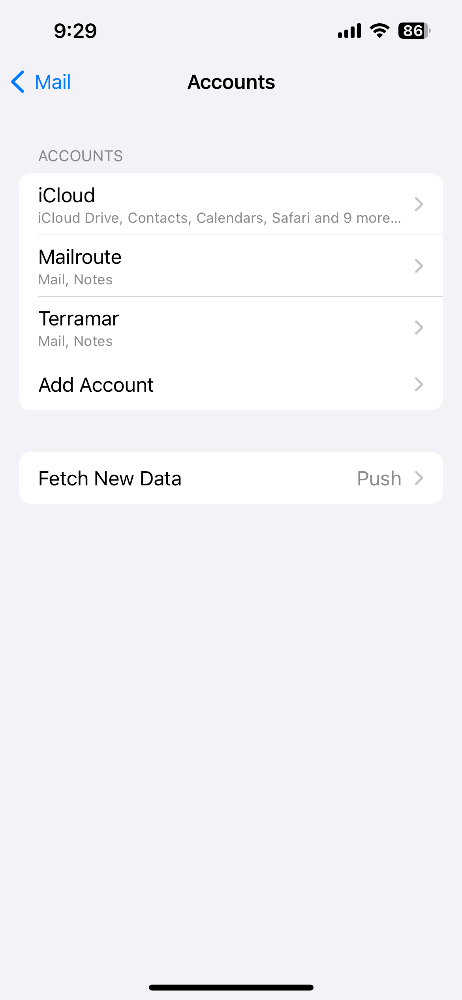
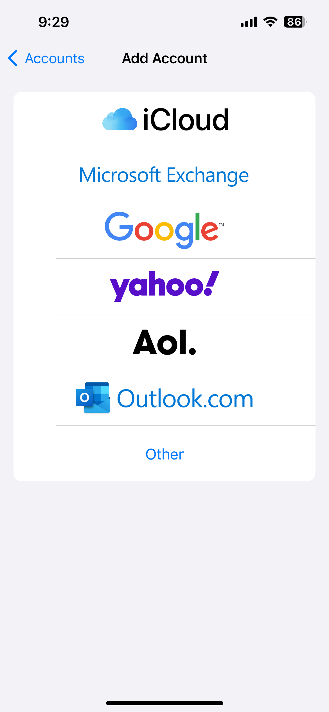
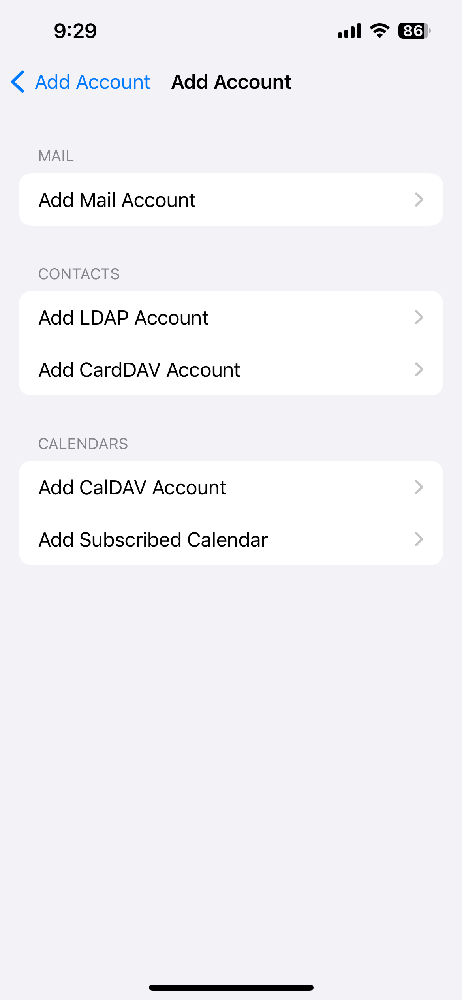
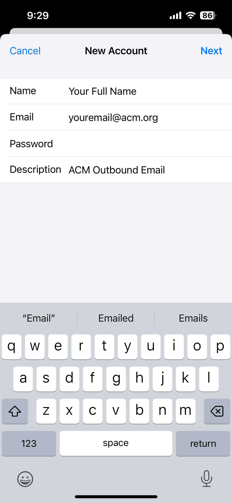
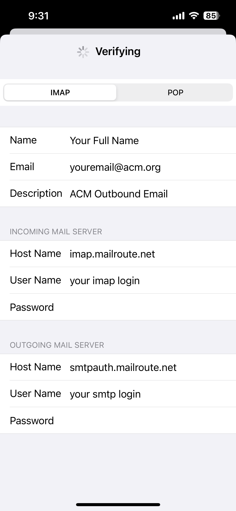
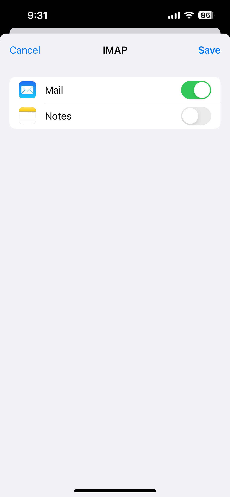
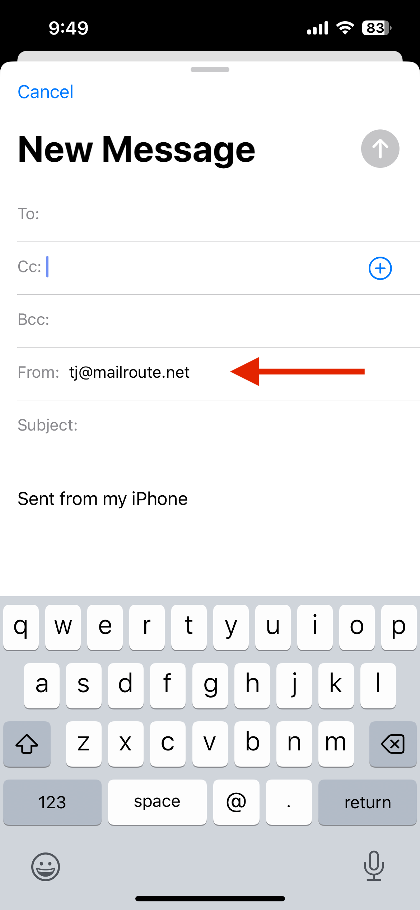

To simplify the use of your SMTP Auth Relay, we recommend creating a separate
account in your Mac Mail.app email client. This separate account has both an
IMAP and SMTP server.  
  
If you are a user of the **MailRoute Managed Email Membership Service (MEMS)**
(such as a member of a professional organization or alumni group) and using
only the MEMS email forwarding service, the IMAP account will **not** store
any of your email - it will be forwarded appropriately.  
  
Users of the **MailRoute Hosted Email Service** have full IMAP mailbox and
storage capabilities.

# **TLDR; (Too Long, Didn't Read)**

Gather the info from our Control Panel by clicking the **SMTP Auth Relay** tab
on the left menu. You'll have to click the eye
icon to view your passwords. If you don't
have a local password set up, you'll be asked to create one. The **Inbound
(IMAP)** and **Outbound (SMTP)** servers may have different logins and will
have different passwords. Go into your iOS Mail App and add a new account
using those settings.

When you send email, click the **From** address to choose your new account for
sending email. It'll pass SPF, DKIM, DMARC checks. Congratulations!

# **Long Version**

# Gather the info you need to configure your email client

To configure your email client to use the MailRoute SMTP Auth Relay service
for outbound email relay, you will need to gather some info from the MailRoute
Control Panel and then configure your email client.

  1. Login to admin.mailroute.net and click the My Settings link at the top of the page.  
  

  2. Click the SMTP Auth Relay tab in the Settings menu on the left side of the page.   
  
  
  

  3. Gather your info! You can click the copy icon  to copy the values of any field.  
  
There are separate **Inbound (IMAP) Server** and **Outbound (SMTP) Server**
configurations. You'll need both:  
  
  
 **Inbound (IMAP) Server Password** : Click the eye icon
 to display your password . If you
haven't set a local MailRoute password yet, you will be prompted to do so.
Your **Inbound (IMAP) Server** password may be the same as your Control Panel
login password. You'll be shown this, if this is the case.  
  
  
  
 **Outbound (SMTP) Server Password:** Click the eye icon
 to display your password. Accept the
Terms of Service:  
  
  
  
By the way, you can generate a new password for your **Outbound (SMTP)
Server** at any time.

  
**Configure your email client**

  1. Go to the Settings App, and choose **Mail**.  
  
  
  

  2. Tap **Accounts:  
**  
  
  

  3. Tap **Add Account:**  
  
  
  

  4. Tap **Other** from the list of account types:  
  
  
  

  5. Tap **Add Mail Account  
  
**  
  

  6. Enter in the info:  
**Name** : Enter your full name  
**Email** : Enter your email address for this account  
**Password** : Enter your Inbound (IMAP) Server Password  
**Description** : Give it a nice description  
  

  7. Then tap **Next**
  8. Here's where you fill in all the detail you gathered before:  
  
Make sure **IMAP** is selected at the top.  
  
**Incoming Mail Server**  
**Host Name** : Inbound (IMAP) Server Name:  
**User Name** : Inbound (IMAP) Login  
**Password** : Inbound (IMAP) Password  
  
 **Outgoing Mail Server**  
**Host Name** : Outbound (SMTP) Server Name:  
**User Name** : Outbound (SMTP) Login  
**Password** : Outbound (SMTP) Password  
  
Then tap **Next.**  
  
  
  

  9. Choose just the **Mail** type to enable for this account. Tap **Save:**  
  
  
  

You are ready to go!  
  

## Using your new account to send email

When you compose a new email, you can choose to send it from your new account.
This may vary slightly in different versions of iOS. But you should get the
gist of the idea.

  1. Tap on your email account to change it:  
  
  
  

  2. Tap on your **From** address:  
  
  
  

  3. Choose your new email account for sending mail!  
  

Have fun! Thanks for using MailRoute!

