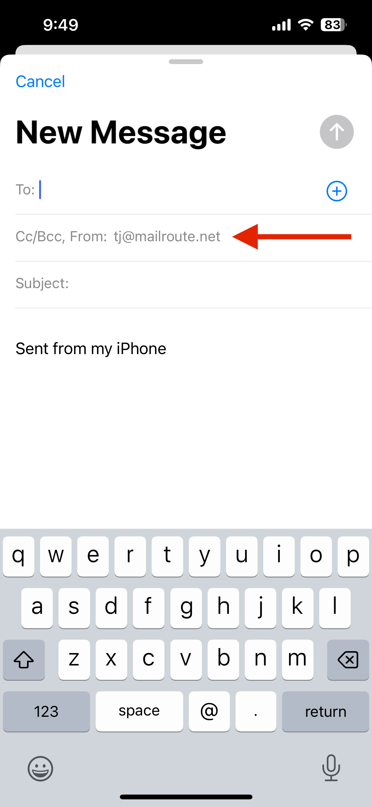
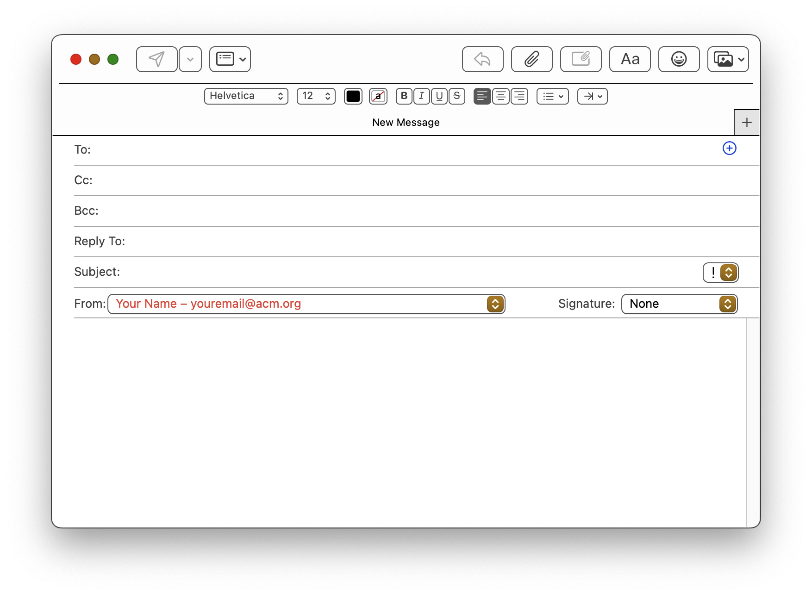

Apple's Mail.app for MacOS and the Apple email clients for iOS on the iPhone
and iPad support configuration of email accounts using configuration profiles
that store your email account details and settings. To easily configure your
app or device, you may download a digitally-signed "mobileconfig" profile.

When you install this email profile, you email app will automatically add the
new account to the list of accounts the next time you open it.

Below are the steps you take to gather you needed information, download a
mobileconfig profile, and to install it on either MacOS or iOS/iPadOS.

## **Step 1. Gather the info you need to configure your email client**

To configure your email client to use the MailRoute SMTP Auth Relay service
for outbound email relay, you will need to gather some info from the MailRoute
Control Panel and then configure your email client.

  1. Login to admin.mailroute.net and click the My Settings link at the top of the page.  
  

  2. Click the SMTP Auth Relay tab in the Settings menu on the left side of the page.   
  
  
  

  3. Gather your info! You can click the copy icon  to copy the values of any field.  
  
There are separate **Inbound (IMAP) Server** and **Outbound (SMTP) Server**
configurations. You'll need both:  
  
  
 **Inbound (IMAP) Server Password** : Click the eye icon
 to display your password . If you
haven't set a local MailRoute password yet, you will be prompted to do so.
Your **Inbound (IMAP) Server** password may be the same as your Control Panel
login password. You'll be shown this, if this is the case.  
  
  
  
 **Outbound (SMTP) Server Password:** Click the eye icon
 to display your password. Accept the
Terms of Service:  
  
  
  
By the way, you can generate a new password for your **Outbound (SMTP)
Server** at any time.

## **Step 2. Obtaining your Configuration Profile (.mobileconfig) file**

  1. Login to the [MailRoute Control Panel](https://admin.mailroute.net)  
  

  2. Click on "My Setttings" at the top menu, and then on "SMTP Auth Relay" on the left menu:  
  
  
  

  3. Download or email the Configuration Profile (.mobileconfig file) to your device. You may either download it directly to your device, or send it to yourself as an email attachment. Safari and the Apple mail clients are able to directly install the mobileconfig files.  
  

## **Step 3a. Installing Configuration Profiles on iOS and iPadOS devices**

  1. If from your email client, tap on the profile to download it.  
  

  2. Go to the **Settings** app. You shoul d see **Profile Downloaded** in the main screen (ios 17) or you may need to visit **Settings** -> **General** -> **Profiles** on older versions of the OS.  
  
  
  

  3. Tap **Install** to install the profile. A .mobileconfig file will be installed on your iOS or iPadOS device. During installation, the user is asked to enter necessary information, such as passwords that weren’t specified in the profile.   
  
  
  

  4. Launch your Email App, and your new account will be there. You may be asked for your passwords again. 

## Using your new account to send email on your iOS and iPadOS devices

When you compose a new email, you can choose to send it from your new account.
This may vary slightly in different versions of iOS. But you should get the
gist of the idea.

  1. Tap on your email account to change it:  
  
  
  

  2. Tap on your **From** address:  
  
  
  

  3. Choose your new email account for sending mail!  
  

Have fun! Thanks for using MailRoute!  
  
  
  

## **Step 3b. Installing Configuration Profiles on macOS**

  1. When a user downloads the profile using Safari or opens the attachment using Mail, the Mac recognizes the file’s .mobileconfig extension as a profile and asks the user to confirm that it’s OK to install it. You may see a notification on screen, directing you to System Settings to install the profile:  
  
  
  
  
  
  

  2. Go to **System Settings** -> **Privacy & Security** -> **Profiles**. You may have to scroll down to find **Profiles**  
  

  3. You'll see this new profile in the list. Double click it to review and install  
  
  
  

  4. Verify the settings and then press **Install**
  5. You may be asked to fill in some additional info for your account. Give the account a **Description** like "ACM Outbound Email Relay".  
Enter your **Full Name** and your **Incoming Server Password**. This is the
password from **Gather the info you need to configure your email client**
above.  
  
Click **Install**  
  
  
  
  
  

  6. Launch your Email App, and your new account will be there. You may be asked for your passwords again.   
  
  

  7. And now you're ready to go. 

## Using your new account to send email from your Mac Mail.app

When you compose a new email, you'll have a menu where the **From** address is
displayed. Click it and choose your new account from the popup menu:  
  

