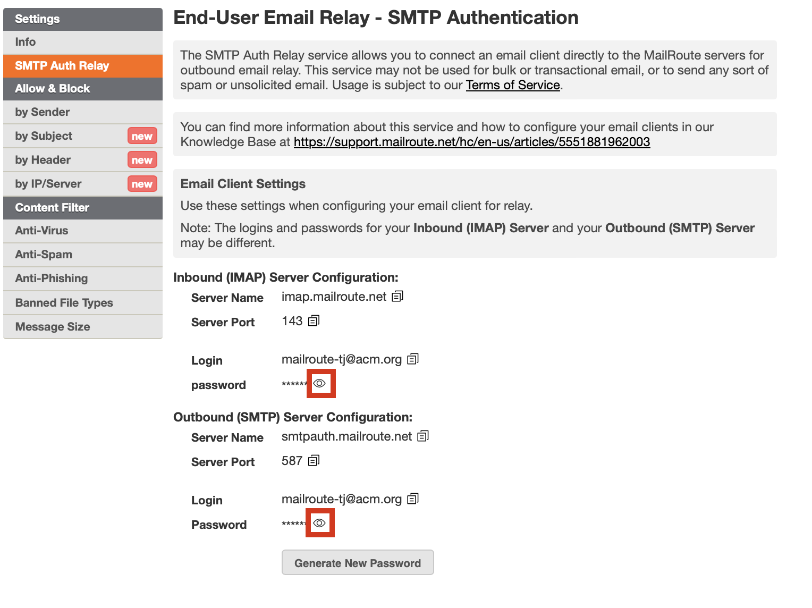

# **TLDR; (Too Long, Didn't Read)**

Gather the info from our Control Panel by clicking the **SMTP Auth Relay** tab
on the left menu. You'll have to click the eye
icon to view your passwords. If you don't
have a local password set up, you'll be asked to create one. The **Inbound
(IMAP)** and **Outbound (SMTP)** servers may have different logins and will
have different passwords. Go into your Gmail Settings -> See All Settings ->
Accounts and Import, and add an address in the Send mail as section. Be sure
it's not marked as an alias.

When you send email, click the **From** address to choose your new account for
sending email. It'll pass SPF, DKIM, DMARC checks. Congratulations!

# **Long Version**

# Gather the info you need to configure your email client

To configure your email client to use the MailRoute SMTP Auth Relay service
for outbound email relay, you will need to gather some info from the MailRoute
Control Panel and then configure your email client.

  1. Login to admin.mailroute.net and click the My Settings link at the top of the page.  
  

  2. Click the SMTP Auth Relay tab in the Settings menu on the left side of the page.   
  
  
  

  3. Gather your info! You can click the copy icon  to copy the values of any field.  
  
For the Gmail webmail interface, you will only need the info in the **Outbound
(SMTP) Server** configuration.  
  
  
 **Outbound (SMTP) Server Password:** Click the eye icon
 to display your password. Accept the
Terms of Service:  
  
  
  
By the way, you can generate a new password for your **Outbound (SMTP)
Server** at any time.

  
**Configure your email client**

  1. In your android phone or tablet, open your **Gmail app  
  
**

  2. At the top right, tap your profile picture  
  

  3. Tap **Add another account  
  
**

  4. Choose the **Other** type of account to add  
  

  5. Enter the **email address** you're going to use with this SMTP Auth Service, and tap **Next  
  
**

  6. Tap **Personal IMAP  
  
**

  7. Enter your **Inbound (IMAP) Server Password** , and tap **Next  
  
**

  8. Fill in the **Username** , **Password** , and **Server** fields. The first two may already be filled in.  
 **Username** : <Your Inbound (IMAP) Login  
 **Password** : <Your Inbound (IMAP) Password  
 **Server** : <Your Inbound (IMAP) Server  
  
Tap **Next  
  
**

  9. Fill in the details for your Outgoing server:  
 **Require signin:** Selected  
**Username** : <Your Outbound (SMTP) Login  
 **Password** : <Your Outbound (SMTP) Password  
 **Server** : <Your Outbound (SMTP) Server  
  
Tap **Next**  
  

  10. Under **Account Options** , just tap **Next**  
  

  11. Enter your **Account Name** and tap **Next** and you're configured.  
  

  12. But let's make sure everything is secure. 
    1. On the top left, click the menu button next to **Inbox**
    2. Scroll down and click the **Settings** button
    3. Scroll down and find **Incoming settings.** Click this link to view them.  
 **Port:** <Your Inbound (IMAP) Server Port>  
 **Security Type** : STARTTLS

    4. Scroll down and you'll see **Outgoing settings**. Click this link to view them
    5. Check the Port and Security type settings:  
 **Port:** <Your Outbound (SMTP) Server Port>  
 **Security Type** : STARTTLS

    6. Tap **Done** and you're - yes, you guessed it - done!

##

