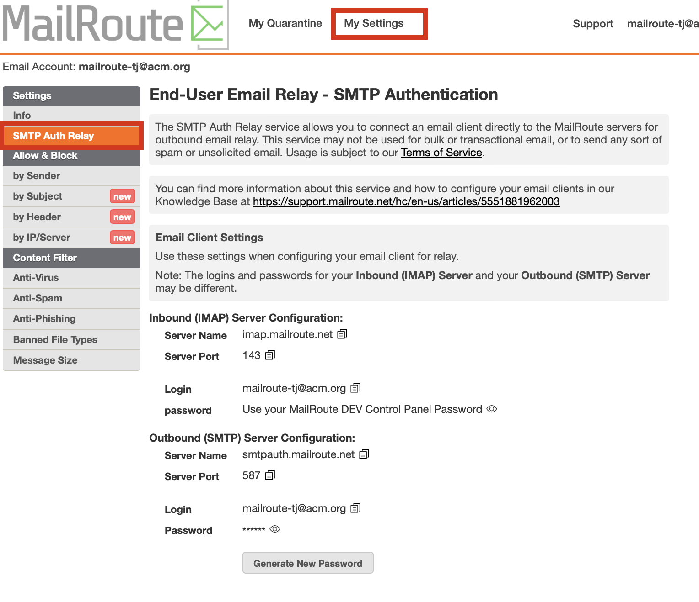
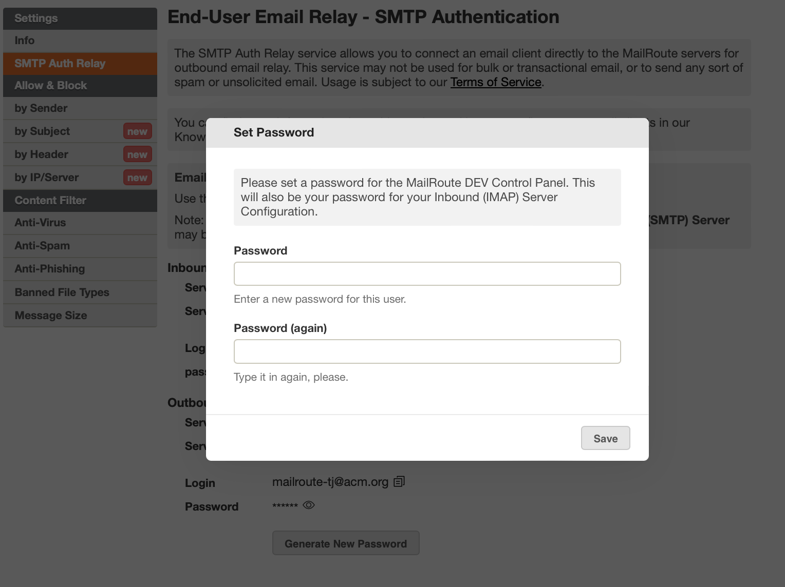
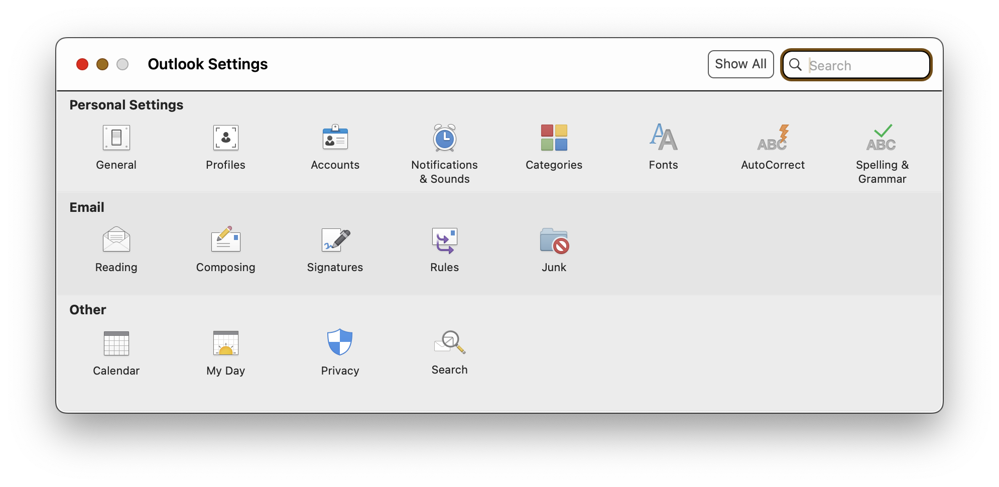
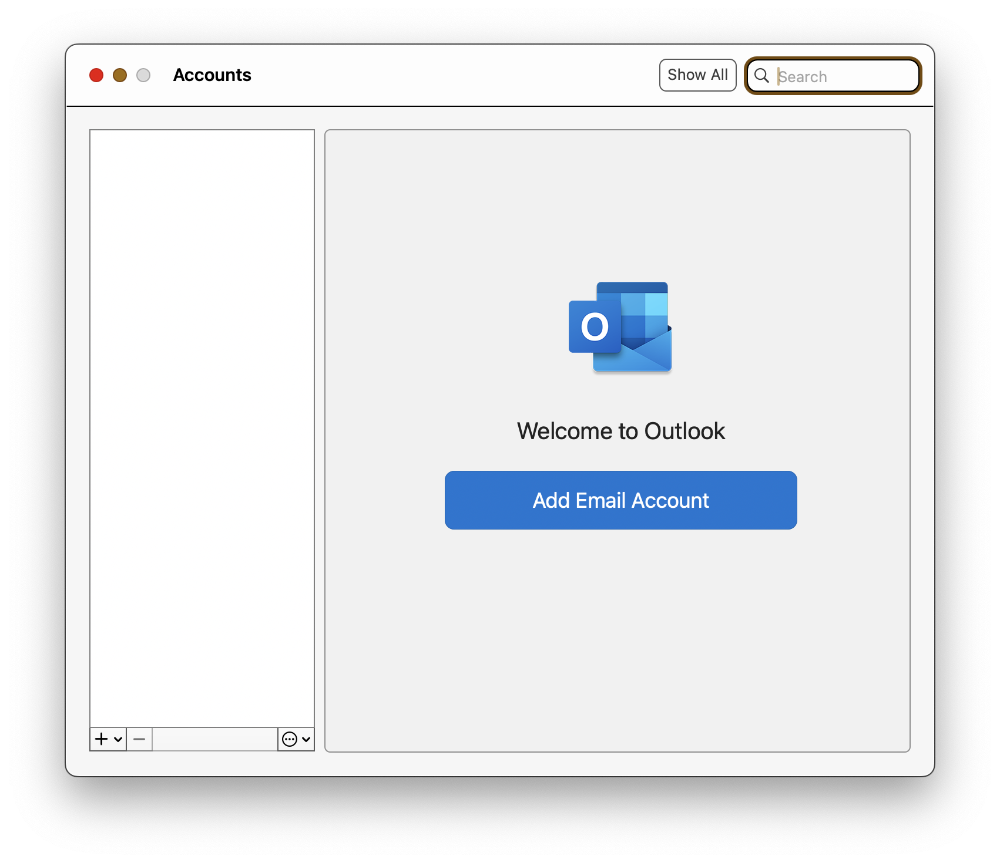
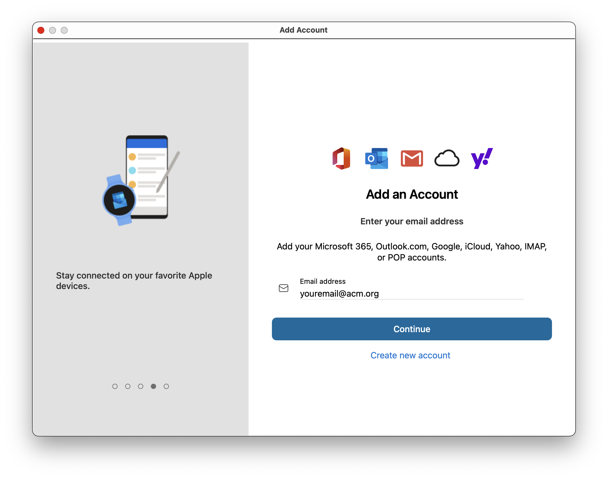
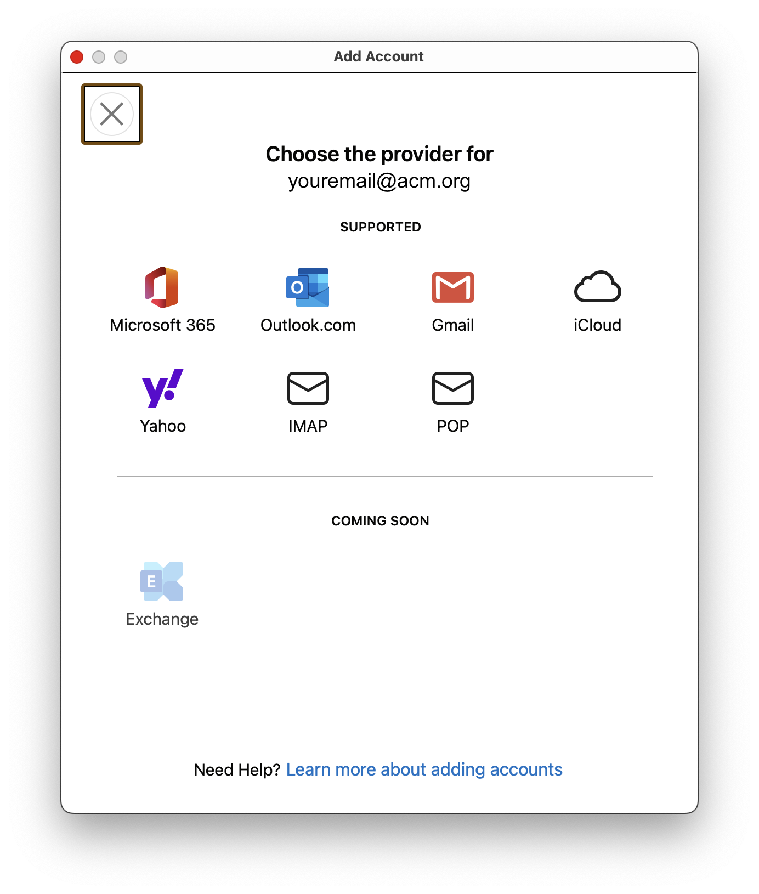
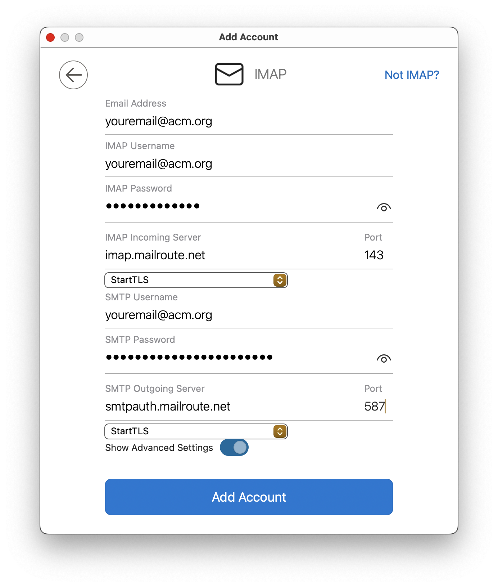
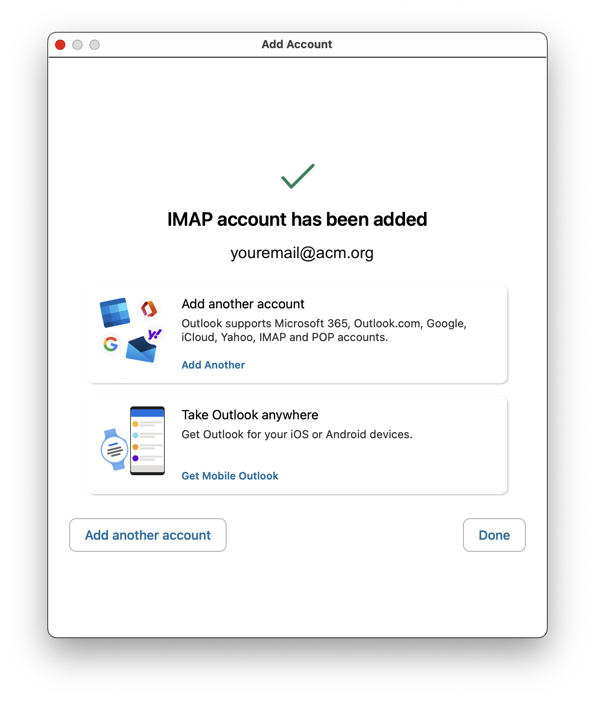

  
To simplify the use of your SMTP Auth Relay, we recommend creating a separate
account in your Mac Outlook email client. This separate account has both an
IMAP and SMTP server.  
  
If you are a user of the **MailRoute Managed Email Membership Service (MEMS)**
(such as a member of a professional organization or alumni group) and using
only the MEMS email forwarding service, the IMAP account will **not** store
any of your email - it will be forwarded appropriately.  
  
Users of the **MailRoute Hosted Email Service** have full IMAP mailbox and
storage capabilities.

#  **TLDR** **;** **(Too Long, Didn't Read)**

Gather the info from our Control Panel by clicking the **SMTP Auth Relay** tab
on the left menu. You'll have to click the eye
icon to view your passwords. If you don't
have a local password set up, you'll be asked to create one. The **Inbound
(IMAP)** and **Outbound (SMTP)** servers may have different logins and will
have different passwords. Go into your Outlook app, add a new account using
those settings.

When you send email, click the **From** address to choose your new account for
sending email. It'll pass SPF, DKIM, DMARC checks. Congratulations!

# **Long Version**

# Gather the info you need to configure your email client

To configure your email client to use the MailRoute SMTP Auth Relay service
for outbound email relay, you will need to gather some info from the MailRoute
Control Panel and then configure your email client.

  1. Login to admin.mailroute.net and click the My Settings link at the top of the page.  
  

  2. Click the SMTP Auth Relay tab in the Settings menu on the left side of the page.   
  
  
  

  3. Gather your info! You can click the copy icon  to copy the values of any field.  
  
There are separate **Inbound (IMAP) Server** and **Outbound (SMTP) Server**
configurations. You'll need both:  
  
  
 **Inbound (IMAP) Server Password** : Click the eye icon
 to display your password . If you
haven't set a local MailRoute password yet, you will be prompted to do so.
Your **Inbound (IMAP) Server** password may be the same as your Control Panel
login password. You'll be shown this, if this is the case.  
  
  
  
 **Outbound (SMTP) Server Password:** Click the eye icon
 to display your password. Accept the
Terms of Service:  
  
  
  
By the way, you can generate a new password for your **Outbound (SMTP)
Server** at any time.

  
**Configure your email client**

      1. Open the Outlook email client on your Macintosh.  
  

      2. Choose **Settings** from the **Outlook** menu in your menu bar. We're going to add a new mail account to your email client. 
      3. Choose **Accounts** from the icons at the top, and then press the **+** icon at the bottom left of the window to add a new account: 
      4. Choose **Add Email Account  
**

      5. Enter your email account in the **Email Address** field, and then click **Continue:** 
      6. In the **Choose Provider** dialog **,** select **IMAP:** 
      7. Now we're finally going to get to set all the final settings for your account!   
  
In the **Add Account** window, you can enter your **Email Address** , your
**IMAP Username** , **IMAP Password** , **IMAP Incoming Server** , **SMTP Auth
Username** , **SMTP Auth passwword**. Chose **StartTLS** for both IMAP and
SMTP servers, with the ports you saved from the MailRoute Control Panel:  
  
  
  
Then click **Add Account**. You'll see a window showing that it was
successful: ****  
  

      8. Now you can close your **Settings/Accounts** window and use your account!

## Using your new account to send email

When you compose a new email, you'll have a menu where the **From** address is
displayed. Click it and choose your new account from the popup menu:  
  
  

