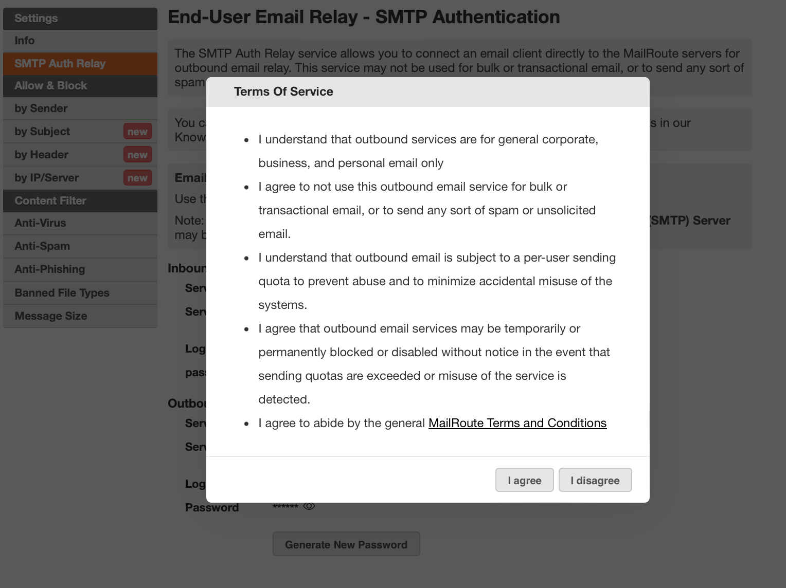
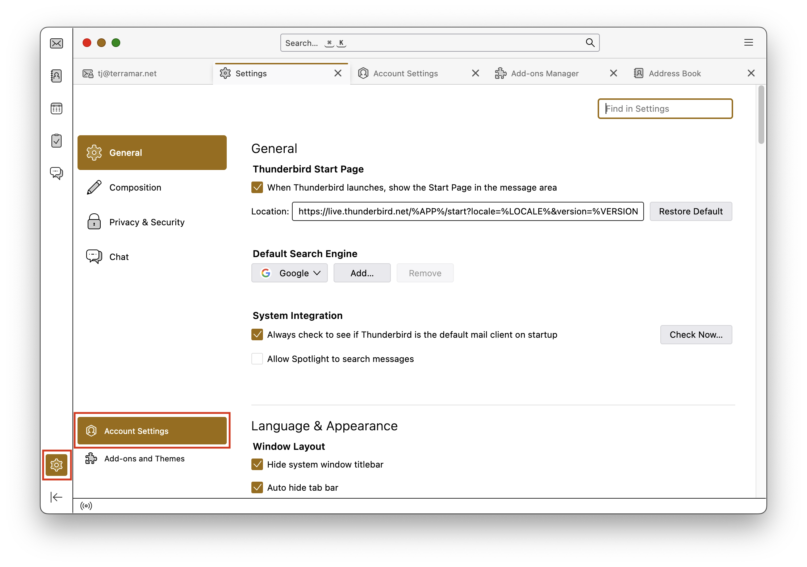
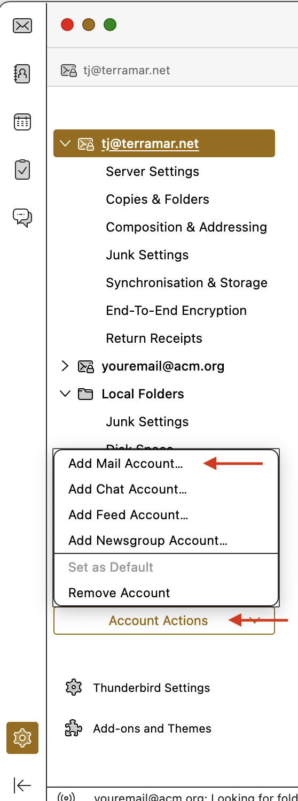
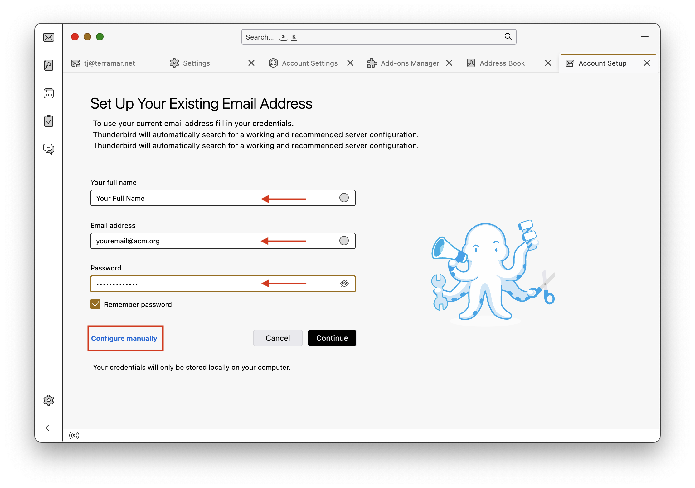
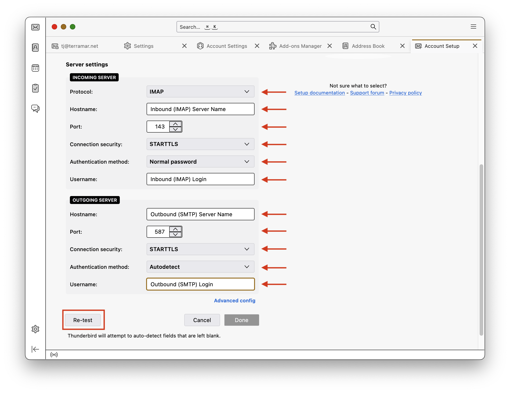
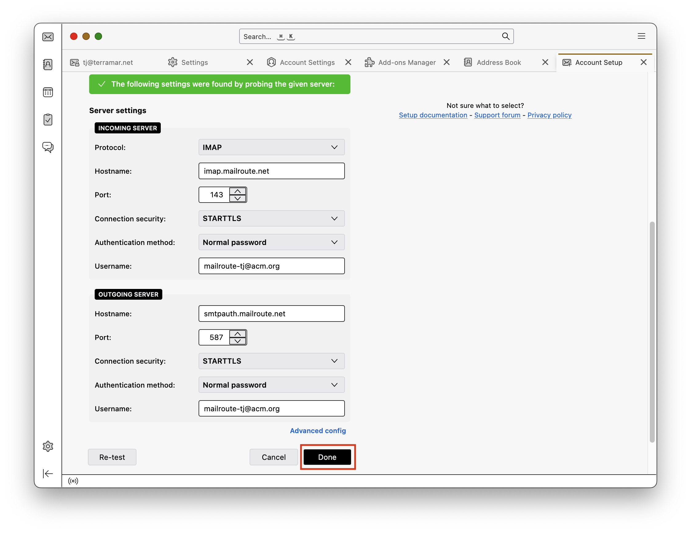
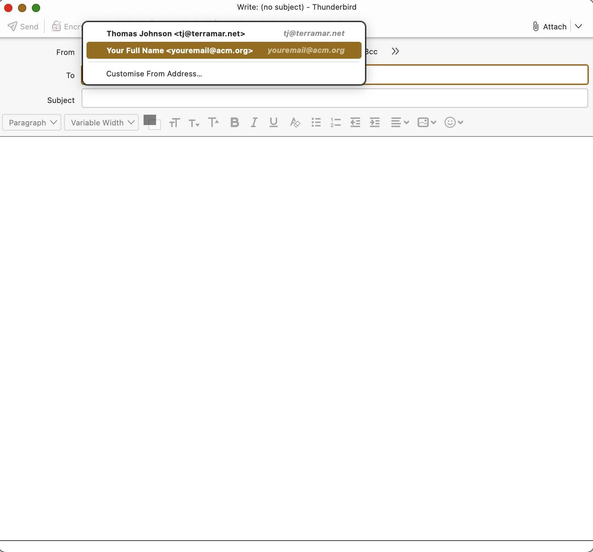

To simplify the use of your SMTP Auth Relay, we recommend creating a separate
account in your Thunderbird email client. This separate account has both an
IMAP and SMTP server.  
  
If you are a user of the **MailRoute Managed Email Membership Service (MEMS)**
(such as a member of a professional organization or alumni group) and using
only the MEMS email forwarding service, the IMAP account will **not** store
any of your email - it will be forwarded appropriately.  
  
Users of the **MailRoute Hosted Email Service** have full IMAP mailbox and
storage capabilities.

#  **TLDR** **;** **(Too Long, Didn't Read)**

Gather the info from our Control Panel by clicking the **SMTP Auth Relay** tab
on the left menu. You'll have to click the eye
icon to view your passwords. If you don't
have a local password set up, you'll be asked to create one. The **Inbound
(IMAP)** and **Outbound (SMTP)** servers may have different logins and will
have different passwords. Go into your Mail.app, add a new account using those
settings.

When you send email, click the **From** address to choose your new account for
sending email. It'll pass SPF, DKIM, DMARC checks. Congratulations!

# **Long Version**

# Gather the info you need to configure your email client

To configure your email client to use the MailRoute SMTP Auth Relay service
for outbound email relay, you will need to gather some info from the MailRoute
Control Panel and then configure your email client.

  1. Login to admin.mailroute.net and click the My Settings link at the top of the page.  
  

  2. Click the SMTP Auth Relay tab in the Settings menu on the left side of the page.   
  
  
  

  3. Gather your info! You can click the copy icon  to copy the values of any field.  
  
There are separate **Inbound (IMAP) Server** and **Outbound (SMTP) Server**
configurations. You'll need both:  
  
  
 **Inbound (IMAP) Server Password** : Click the eye icon
 to display your password . If you
haven't set a local MailRoute password yet, you will be prompted to do so.
Your **Inbound (IMAP) Server** password may be the same as your Control Panel
login password. You'll be shown this, if this is the case.  
  
  
  
 **Outbound (SMTP) Server Password:** Click the eye icon
 to display your password. Accept the
Terms of Service:  
  
  
  
By the way, you can generate a new password for your **Outbound (SMTP)
Server** at any time.

  
**Configure your email client**

  1. Open your Thunderbird email client. Select the **Settings** icon on the lower left, and then the **Account** Settings button..  
  

  2. Click **Account Actions** and then **Add Mail Account...** from the popup menu:  
  
  
  

  3. Enter your **full name** , **email address** , and **Inbound (IMAP) Password**. Then click the **configure manually** link. 
  4. Enter in the Server settings that you gathered earlier.  
  
 **Incoming Server**  
**Protocol** : IMAP  
**Hostname** : Your Inbound (IMAP) Server  
**Port** : 143  
**Connection Security** : STARTTLS  
**Authentication method** : Normal Password  
**Username** : Your Inbound (IMAP) Username  
  
 **Outgoing Server**  
**Hostname** : Your Outbound (SMTP) Server  
**Port** : 587  
**Connection Security** : STARTTLS  
**Authentication method** : Autodetect  
**Username** : Your Outbound (SMTP) Login  
  
Then click the **Retest** button:  
  
  

  5. It should verify all your settings, so you can click the **Done** button!  
  

  6. You're all done! Go have fun with your new account!  
  

## Using your new account to send email

When you compose a new email, you'll have a menu where the **From** address is
displayed. Click it and choose your new account from the popup menu. That's
all there is to it. The email will come from your new account, and will pass
SPF, DKIM, and DMARC checks!

  

