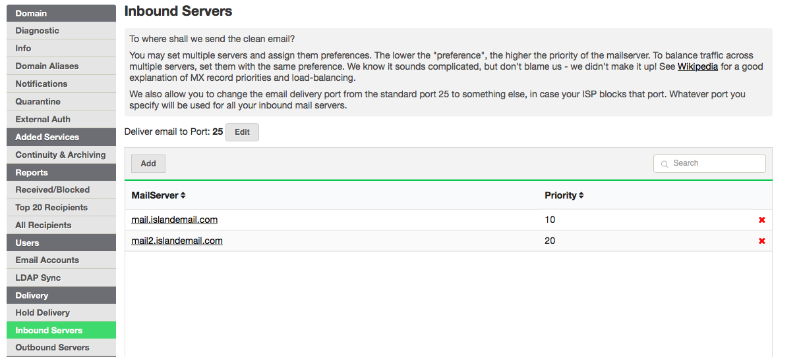
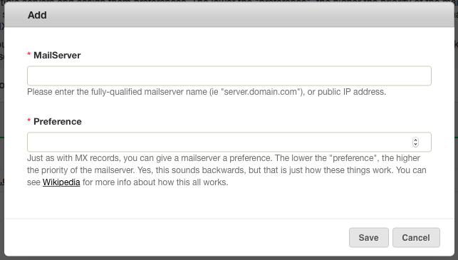
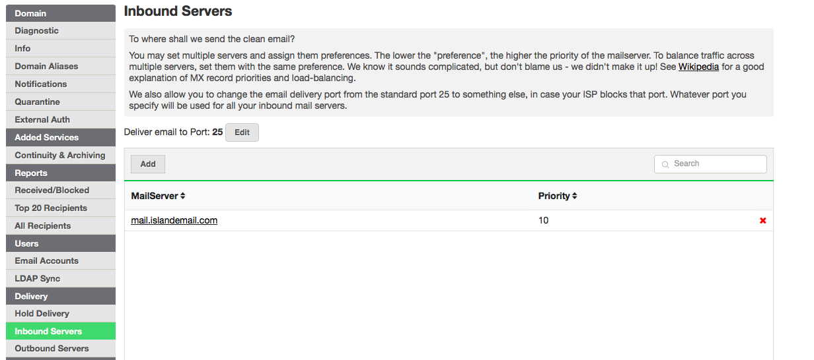
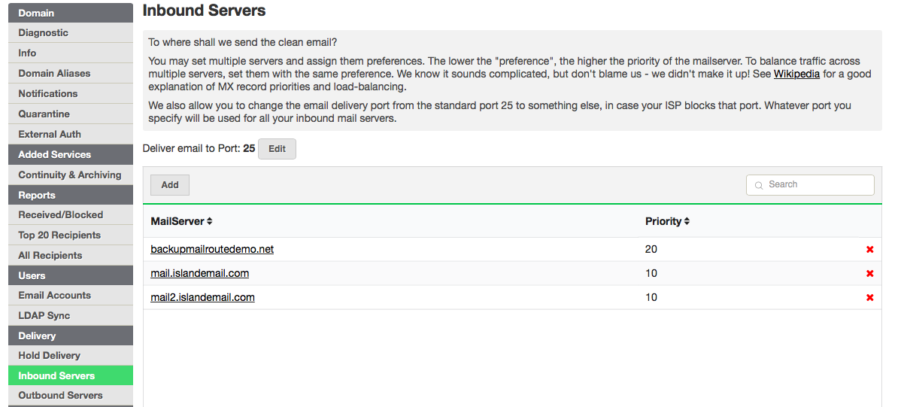

## Inbound Mail Servers (Delivery Mailservers)

After we accept and filter your email, we need to know where to send it. The
**Inbound Servers** tab is where you specify your mailserver(s).

You may have more than one server for delivery of email. MailRoute allows you
to set up redundant servers for failover, or to balance the load amongst
multiple servers.

The MailRoute inbound server configuration is modeled on the standard way that
MX records are specified for email delivery.

Each mailserver has an assigned "preference". The lower the "preference", the
higher the priority of the mailserver. We will try the highest priority
mailserver first, and if it doesn't respond, we'll then go to the next in the
list. If you have multiple mailservers with the same preference, we will
distribute traffic equally over them.

### Huh? I don't understand what you mean by "preference".

The standards for MX records are defined in [RFC
5321](http://tools.ietf.org/html/rfc5321), and according to this document, the
lowest numbered records are more preferable. So sometimes people think of
"preference" as "distance" - because shorter distances are better than long
ones, right?

### Just show me how to set this up!

When you're viewing a Domain's details, select the **Delivery** tab, and then
choose **Inbound Servers**.

To add a mailserver, click the " **Add** " button, and enter the mailserver
name or IP address, and select a preference.

### Can you give me some examples?

I have just **one** mailserver.

Ok, just list the one mailserver. The priority doesn't really matter, so just
leave it as the default.

I have **two** mailservers. One is the primary, and the other is the backup.
The primary should get all the email, but the backup should take over if the
primary is down

Ok, list two mailservers. Give the primary one the lower preference, and the
secondary the higher preference. Then we'll deliver all email to the primary,
but if it's down, we'll instantly switch to delivering to your secondary.

  * _Note: You can have more than two servers set up this way - indeed, you can have as many as you want_.

I have **two** mailservers, and I want to balance the traffic equally over the
two mailservers.

Ok, list two mailservers and give them the same preference. We will balance
the deliver across the two mailservers.

  * _Note: You can have more than two servers set up this way - indeed, you can have as many as you want_.

I have **three** mailservers, I want to **balance traffic** across the first
two, and **failover** to a third if both of those are down.

Ok, list three mailservers. Give the two primary servers the same preference.
Give the failover server a higher preference. We will balance the deliver
across the two primary mailservers, but failover to the backup server if both
are down.

  * _Note: You can have more than two servers set up this way - indeed, you can have as many as you want_.

I have **8** mailservers, and I want three to share the primary traffic, then
two backup servers, and then three tertiary servers that should balance the
traffic

Ok. Here goes.

List all 8 mailservers. Give the first three the same preference. Then the
next two a higher preference. Then give the tertiary servers a higher
preference still. Here are the settings you might use:

  * Server NamePreference  mail.mailroutedemo.com | 10  
---|---  
mail2.mailroutedemo.com | 10  
mail3.mailroutedemo.com | 10  
backup1.mailroutedemo.com | 20  
backup2.mailroutedemo.com | 20  
lastresort1.mailroutedemo.com | 30  
lastresort2.mailroutedemo.com | 30  
lastresort3.mailroutedemo.com | [30](http://mailroute.net/signup.html)  

Note: Be sure to disable SPF checks, greylisting, and blocklisting on your
email server. We do all that for you, so you're not going to lose any
filtering ability but having those enabled may cause email that we relay to
you to be bounced or lost.

[Start a free 30-day trial today.](http://mailroute.net/signup.html)

Contact [sales@mailroute.net](mailto:sales@mailroute.net) or
[support@mailroute.net](mailto:support@mailroute.net) for more information.

888.485.7726

