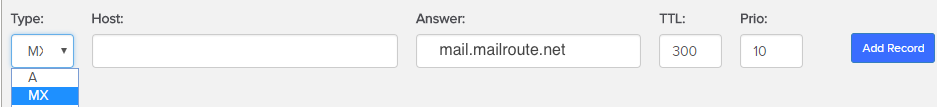

## MX Record Configuration: Name.com

  1. Log in to your [Name.com](https://www.name.com) account.
  2. Click on the **MY DOMAINS** button, located on the top right hand corner.
  3. Click on the domain name you wish to create an MX record for.
  4. Click **Manage DNS Records** , in the DNS column.
  5. Here you will add the desired MX record. Note any existing MX records (in case you need to restore them later), and then delete them.

  * In the drop-down menu under **Type** , select **MX**.
  * Fill in the **Answer(MailServer)** field: **_mail.mailroute.net_**
  * Fill in the **TTL** field: **300**
  * Fill in the **Priority** field: **10**
  * **Host field: (leave blank)**

11\. Click blue **Add Record** button **.  
**

****

[Click here to link to name.com
documentation.](https://www.name.com/support/articles/115004729247-Adding-an-
MX-Record?keyword=mx%20record)

[Start a free 30-day trial today.](http://mailroute.net/signup.html)

Contact [sales@mailroute.net](mailto:sales@mailroute.net) or
[support@mailroute.net](mailto:support@mailroute.net) for more information.

888.485.7726

