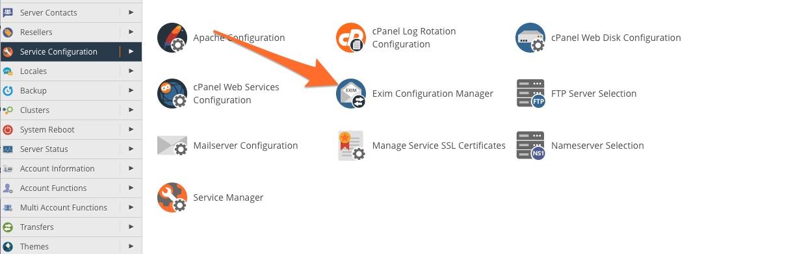
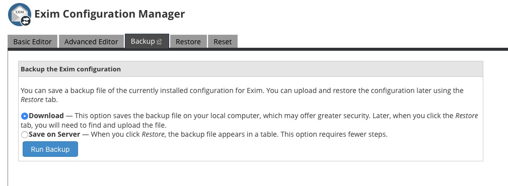

cPanel uses the Exim mailserver, so you'll need to to configure your outbound
SmartHost/RelayHost using the **Exim Configuration Manager** on your cPanel
server.

1\. To configure Exim, open the cPanel **WHM** and navigate to the **Exim
Configuration Manager** in the **Service Configuration** section of the
sidebar men:

2\. Before you make any changes, be sure to back up the current Exim
configuration in the **Backup** tab.

3\. Select the **Advanced Editor** tab. Search for the text “
**POSTMAILCOUNT** ", and enter the following into the text box:

smart_route:  
driver = manualroute  
domains = !+local_domains  
transport = remote_smtp  
route_list = * outbound.mailroute.net::25

If you want to know more about the format of the route_list line, take a look
at the [Exim manualroute documentation](https://www.exim.org/exim-html-
current/doc/html/spec_html/ch-the_manualroute_router.html).

4\. Finally, don’t forget to scroll to the bottom of the _Exim Advanced
Editor_ , where you’ll find the save button. Once you’ve done that, all email
originating from your server is relayed through the Smarthost.

[Start a free 30-day trial today.](http://mailroute.net/signup.html)

Contact [sales@mailroute.net](mailto:sales@mailroute.net) or
[support@mailroute.net](mailto:support@mailroute.net) for more information.

888.485.7726

