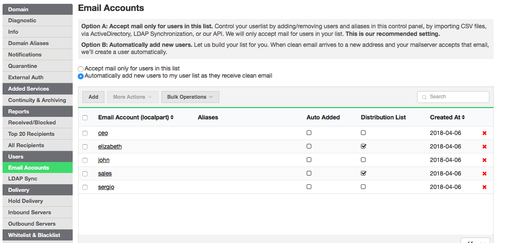

A complete list of mailbox addresses on your domain(s) is essential for
maximum protection.

MailRoute's system needs you to tell it who is legit (then we'll know who
isn't, thus protecting you from harvest attacks).

To complete your list of mailboxes, we offer these easy methods:

  * Upload users to the interface via a CSV file, or send the file to us for uploading
  * [LDAP Sync/ActiveDirectory](https://support.mailroute.net/hc/en-us/articles/115000403387-ActiveDirectory-LDAP-Synchronization?)
  * [API ](https://support.mailroute.net/hc/en-us/articles/224060448)with [libraries and scripts](https://github.com/mailroute)
  * Manually add your mailboxes to the interface

Manual input:

  1. Log in to the MailRoute interface at **<https://admin.mailroute.net>**.
  2. Select the **Domains** link from the top of the page options. 
  3. Click on the **domain** you want to work on
  4. Select the **Email Accounts** option in the side menu under the **Users** heading. 

During your 30-day trial, you can complete your list, including Auto-Added
accounts marked as such:

  1. Log in to the MailRoute interface at **<https://admin.mailroute.net>**.
  2. Select the Domains link from the top of the page options. 
  3. Click on the **domain** you want to work on
  4. Select the **Email Accounts** option in the side menu under the **Users** heading. 
  5. You will see a box indicated "Auto-Added". This means an address received clean email and was confirmed by your mail server as legit.
  6. Check the list of addresses for aliases and reassign aliases as needed. Aliases are free of charge. 
  7. Once your list is input, simply **check the box** that says " **Accept mail only for mailboxes in this list** " under the **Email Accounts** tab.
  8. **This function is disabled after the 30-day trial period.**

[Start a free 30-day trial today.](http://mailroute.net/signup.html)

Contact [sales@mailroute.net](mailto:sales@mailroute.net) or
[support@mailroute.net](mailto:support@mailroute.net) for more information.

888.485.7726

[**You** and one person found this
useful.](https://support.mailroute.net/forums/22372666/entries/29078036/voters)  
  
---

