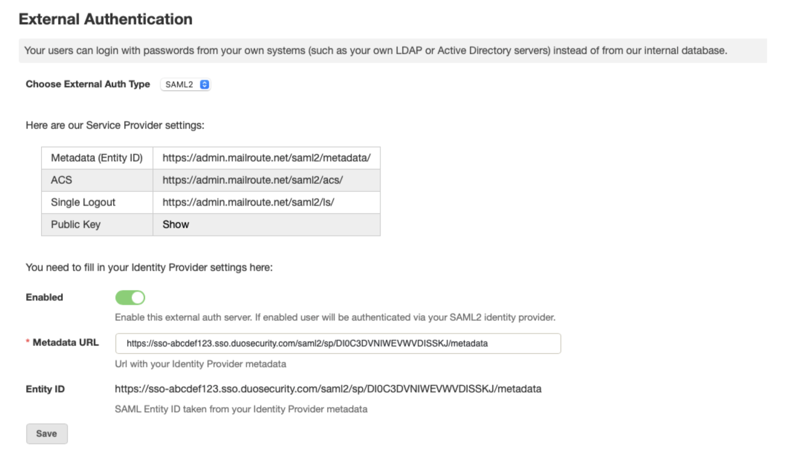

MailRoute can be integrated with the Duo Security service (duo.com) using our
native SAML2 integration.

You'll need to create a Cloud Application in the Duo service, and then
configure SAML2 on the MailRoute side. Here are some step-by-step directions.

## Create Your Cloud Application in Duo

  1. Log on to the[ Duo Admin Panel](https://admin.duosecurity.com/) (<https://admin.duosecurity.com/>) and navigate to **Applications**.
  2. Click **Protect an Application** and locate the entry for **Generic SAML Service Provider** with a protection type of "2FA with SSO hosted by Duo (Single Sign-On)" in the applications list. Click **Protect** to the far-right to start configuring Generic SAML Service Provider.
  3. Locate the **Metadata** section, and copy the **Metadata URL** and save it somewhere convenient. You'll need this to configure MailRoute to use Duo Security.
  4. Under Identifier ( **Entity ID** ) add: **https://admin.mailroute.net/saml2/metadata/**
  5. In Reply URL ( **Assertion Consumer Service URL** ) add: **https://admin.mailroute.net/saml2/acs/**
  6. In **Single Logout URL** add: **https://admin.mailroute.net/saml2/ls/**
  7. Click **Save**.

##    
  
Configuring SAML in MailRoute's Control Panel

  1. Login to your Admin account in [MailRoute's Control Panel (https://admin.mailroute.net)](https://admin.mailroute.net), and navigate to domain settings.
  2. Select **External Authentication** from the left-hand side tab
  3. Choose **External Auth Type** and switch to **SAML2**

Now you can fill in your Provider Settings to configure MailRoute to use Duo
security.

  1. Click the **Enabled** box
  2. Metadata URL: Remember that **Metadata URL** that you copied earlier when setting up Duo? Paste that in here under **Metadata URL**
  3. Click **Save**

****

You've now configured MailRoute to use SAML2 authentication with Duo Security.

If you have any questions or need any assistance, please feel free to reach
out to MailRoute Customer Support at support@mailroute.net

