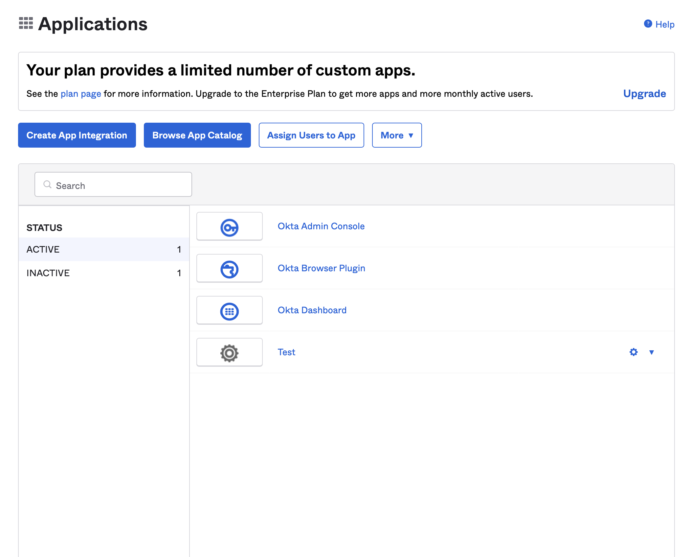
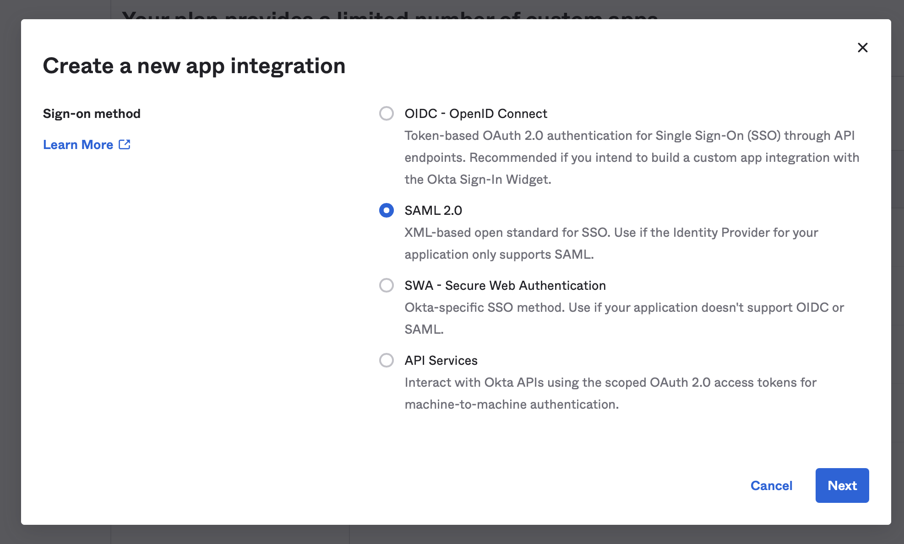
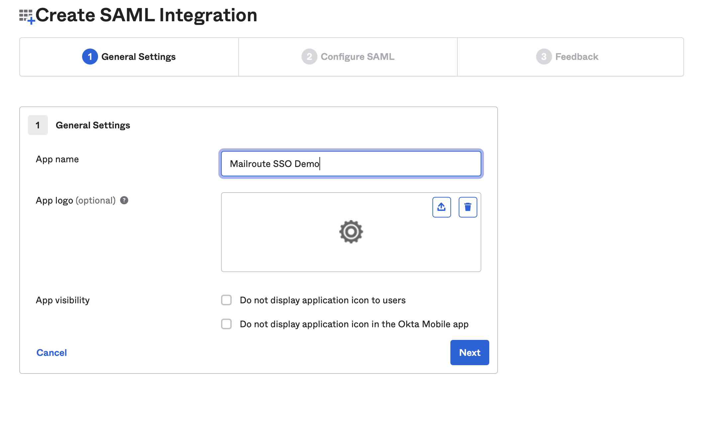
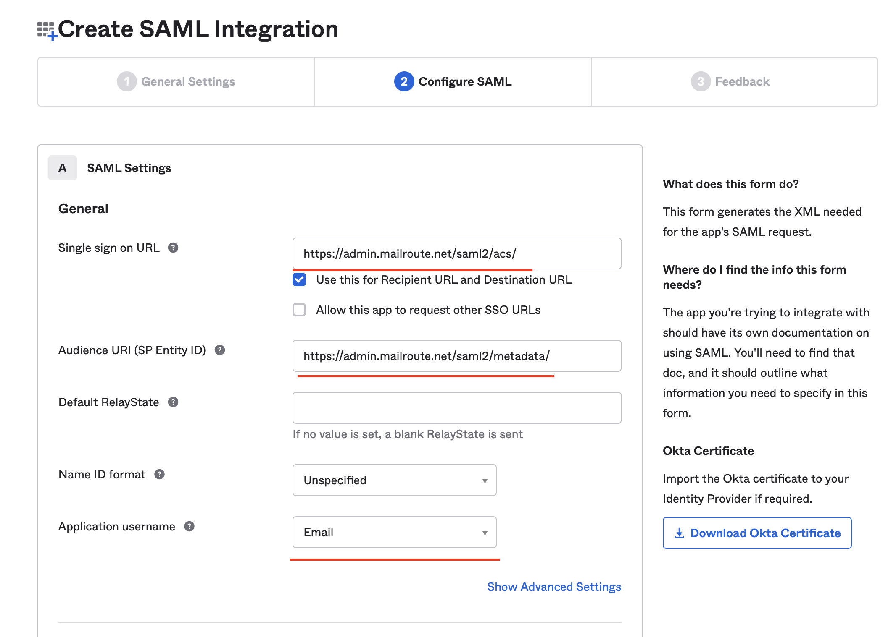
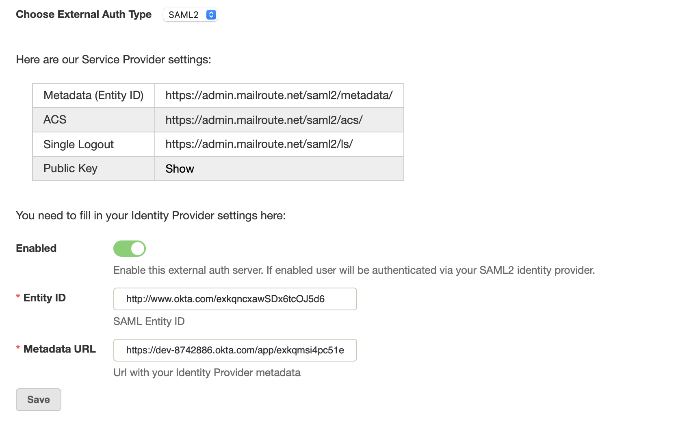
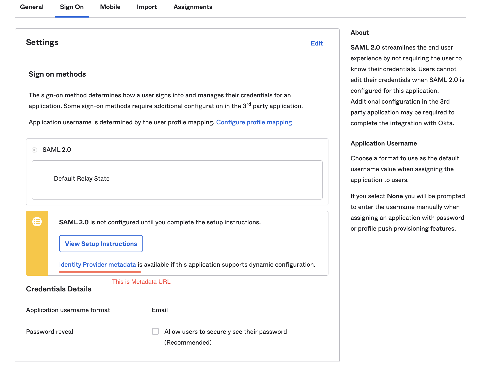
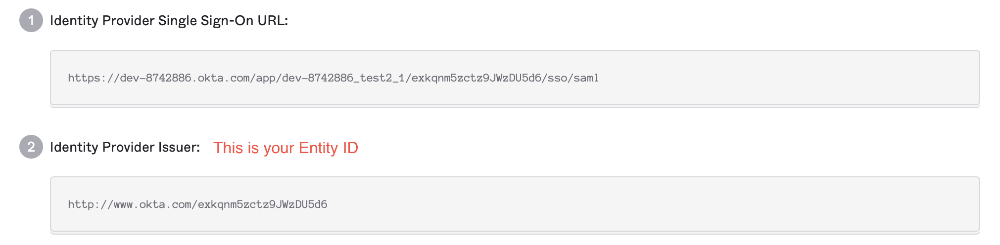

SAML2 or Security Assertion Markup Language 2.0 is a standard for exchanging
authentication and authorization data between security domains. It enables
cross-domain single sign-on (SSO) by distributing authentication tokens to
users.

For the security and convenience of our customers, MailRoute supports SAML2
compatible providers as external authentication for single sign-on capability.

There are two separate sites to set up single sign-on: the service provider
configuration, done in the MailRoute Control Panel, and the identity provider
configuration done within your SSO system.

### To setup with Okta

1\. Login to Okta and select **Applications** menu.

2\. Click " **Create App Integration** ".

3\. Select **SAML 2.0**.

4\. Enter the name for you application. Click Next.

5\. Fill in the following settings:

  * **Single sign on URL** : https://admin.mailroute.net/saml2/acs/
  * **Audience URI (Entity ID)** : https://admin.mailroute.net/saml2/metadata/
  * **Application username** : choose "Email" 

Click next.

6\. Choose " **I'm an Okta customer adding an internal app** " and click
**Finish.** Do not close this page, we will need to copy some of these
settings in the following steps.

### Configuring SAML in MailRoute's Control Panel

1\. Login to your Admin account in MailRoute's Control Panel.

2\. Select **External Authentication** from the left-hand side tab

3\. Select the toggle, **Choose External Auth Type** and switch to **SAML2**

In **filling in your Provider Settings** , please do the following:

1\. Click the **Enabled** box

2\. **Entity ID:** Please enter the **Identity Provider Issuer** from your
Okta app page.

3\. **Metadata URL:** Copy **Identity Provider metadata** from your Okta app
page.

To obtain **Identity Provider Issuer** click on **View Setup Instructions** in
your Okta application:

