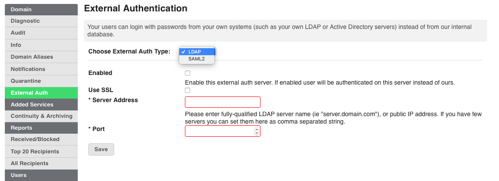
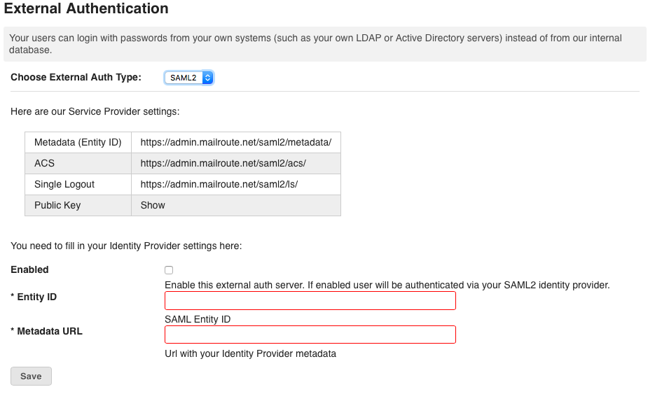

SAML2 or Security Assertion Markup Language 2.0 is a standard for exchanging
authentication and authorization data between security domains. It enables
cross- domain single sign on (SSO) by distributing authentication tokens to
users.

For the security and convenience of our customers, MailRoute supports SAML2
compatible providers as external authentication for single-sign on capability.

There are two steps to set up single sign-on: the service provider
configuration, done in the MailRoute Control Panel, and the identity provider
configuration done within your SSO system.

On the MailRoute Control Panel, login to your admin account and choose
External Authentication on the tabs on the left hand side of the screen.

Once you have selected SAML2 from the drop down box, you will see this screen.

Enter the Entity ID data and the Metadata URL from the Service Provider
settings listed above. Click Save.

Next Step:

Configure your SSO system with an Identity Provider. Providers such as OKTA
([www.okta.com](http://www.okta.com/)) and OneLogin
([www.onelogin.com](http://www.onelogin.com/)) are amongst those we support.

How to configure using OKTA please see article
[here](https://support.mailroute.net/hc/en-us/articles/115012576667)

For a full list of Provider Logs: <https://en.wikipedia.org/wiki/SAML-
based_products_and_services>

For SAML2 information and reference please see:
<https://en.wikipedia.org/wiki/SAML_2.0>

