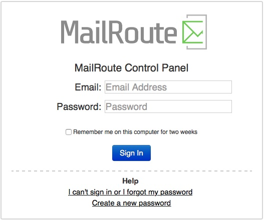
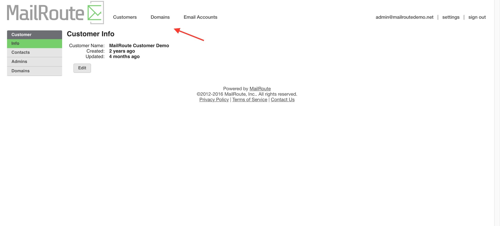
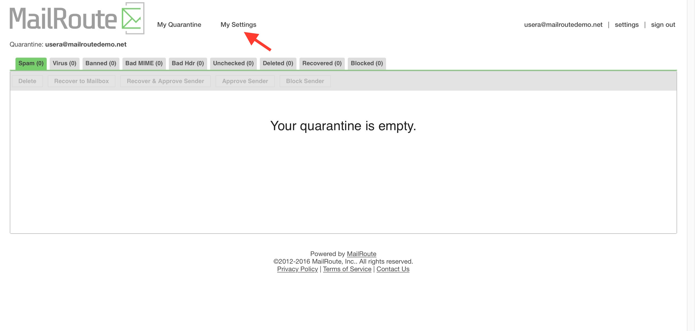

This guide contains information for the Administrators of MailRoute Email
Protection Services: detailed information on setting up your account and
managing domains, mailboxes and settings. It assumes that you are familiar
with administering email services for an organization.

### Support Resources

  * Online Support (forums, knowledgebase): [http://support.mailroute.net](http://support.mailroute.net/)
  * Email: [support@mailroute.net](mailto:support@mailroute.net)
  * Telephone: (888) 485-7726 Press 1

We are always ready to help.

### Concepts

#### Organization

MailRoute's organizational structure follows this pattern:

    
    
        Customer
          Domain
            Email Account (Mailbox)
    

A **Customer** has one or more **Domains**. A **Domain** has one or more
**Email Accounts** associated with it.

As a **Customer Admin** , you're in control of all your domains and all your
mailboxes. An admin can add or remove domains and change their email delivery
settings, add and edit Allow/Block lists, default filter and notification
settings. They can add or remove mailboxes, set their per-mailbox settings,
and view their individual email quarantines. You can make all these changes
through the MailRoute Control Panel at
[https://admin.mailroute.net](https://admin.mailroute.net/), or via our
[API](https://support.mailroute.net/hc/en-us/sections/205312008-API).

### The MailRoute Control Panel

#### Logging In

Once you've signed up for MailRoute, you're provided with an administrative
login for the MailRoute Control Panel via email. Visit
[https://admin.mailroute.net](https://admin.mailroute.net/) and login with
your email address and password.

**See** **[this article](https://support.mailroute.net/hc/en-
us/articles/224060948-Creating-a-Login-with-MailRoute)** for step-by-step
**login** instructions.

#### Navigating the Control Panel

The options at the top of the **Control Pane** l provide quick access to all
your **Customers** , **Domains** , and **Email Accounts**.

In addition, if your login email is also on a domain that is filtered by
MailRoute, you can access your own personal Quarantine and your individual
mailbox settings.

#### More Details

The details for all the different **Customer, Domain, Email Account** and
personal settings are available in our [online Admin
Guide](https://support.mailroute.net/hc/en-us/sections/205311888-Admin-
Guides-) which covers:

  * Customers 
    * [Customer List](https://support.mailroute.net/hc/en-us/articles/115000375768-Customer-List-Customers-)
    * [Customer Admins](https://support.mailroute.net/hc/en-us/articles/115000362407-Customer-Admins-)
    * [Customer Contacts](https://support.mailroute.net/hc/en-us/articles/115000362807-Customer-Contacts-Billing-Technical-Emergency)
  * Domains

    * [Domain List](https://support.mailroute.net/hc/en-us/articles/115000365427-Domain-List-and-Add-Domain)
    * [Domain Aliases](https://support.mailroute.net/hc/en-us/articles/115000364447-Domain-Aliases)
    * [Email Delivery Holds](https://support.mailroute.net/hc/en-us/articles/115000389927-Email-Delivery-Hold)
    * [Inbound Mail Servers](https://support.mailroute.net/hc/en-us/articles/115000393247-Inbound-Mail-Delivery-Servers)
    * [Outbound Mail Servers](https://support.mailroute.net/hc/en-us/articles/115000396427-Outbound-Mail-Servers-SmartHost-Relay-)
    * [Domain Quarantine](https://support.mailroute.net/hc/en-us/articles/115000378428-Domain-Quarantine)
    * [Allow and Block Lists - Domain-wide](https://support.mailroute.net/hc/en-us/articles/115000369427)
    * [Quarantine Notifications - Domain](https://support.mailroute.net/hc/en-us/articles/224061408-Quarantine-Notifications)
    * [Filter Settings - Domain](https://support.mailroute.net/hc/en-us/articles/115000392687-Filter-Settings-Domain)
    * [TLS - Transport Layer Security](https://support.mailroute.net/hc/en-us/articles/224058888)
  * Email Accounts

    * [Email Account List](https://support.mailroute.net/hc/en-us/articles/115000380848-Email-Accounts-List-Populating-your-account-)
    * [Email Account Aliases and + addresses (plus addressing)](https://support.mailroute.net/hc/en-us/articles/115000379888-Email-Account-Aliases-and-addresses-plus-addressing-)
    * [User Quarantine](https://support.mailroute.net/hc/en-us/articles/224061428)
    * [Quarantine Notifications](https://support.mailroute.net/hc/en-us/articles/224061408)
    * [Filter Settings](https://support.mailroute.net/hc/en-us/articles/224061388)
    * [Allow and Block Lists](https://support.mailroute.net/hc/en-us/articles/224061368)
  * Your Account

    * [Changing Your password](https://support.mailroute.net/hc/en-us/articles/224061348)

[  
Start a free 30-day trial today.](http://mailroute.net/signup.html)

Contact [sales@mailroute.net](mailto:sales@mailroute.net) or
[support@mailroute.net](mailto:support@mailroute.net) for more information.

888.485.7726

