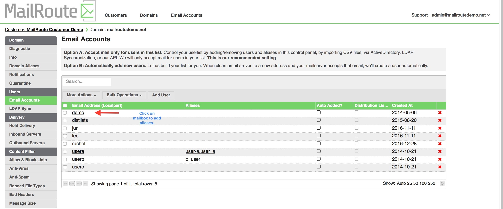
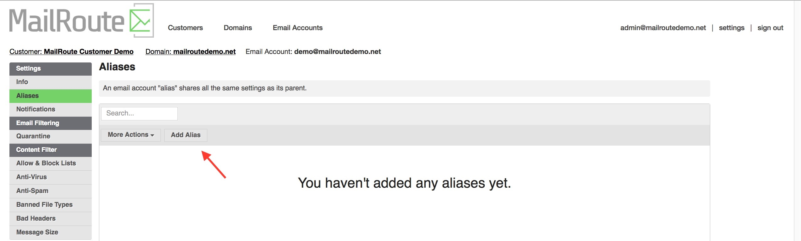
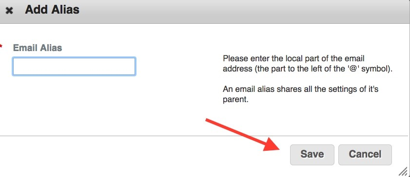
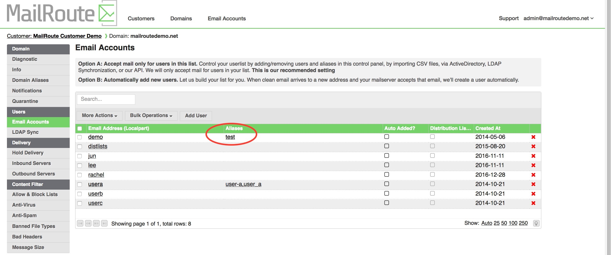
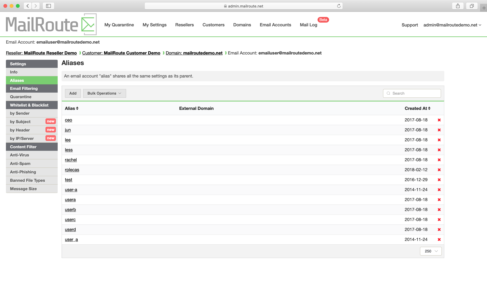

An **Email Account may have one or more Aliases**. An **Email Account Alias**
inherits all the settings and mailboxes of its parent account. It will share
the same filter settings, the same allow and block lists, and share a common
quarantine with its parent and other aliases.

For example, suppose you have a mailbox "admin@mailroutedemo.com", and that
mailbox also uses several aliases: 'sales@mailroutedemo.com',
"postmaster@mailroutedemo.com", "fred@mailroutedemo.com". You can list each of
these additional email addresses as aliases of admin@mailroutedemo.com. Then,
when you change the settings for one, or allow a sender, it will affect all
the different addresses. Quarantined email for each will end up in one shared
quarantine for easy viewing.

Add an **Email Account Alias** by clicking on mailbox

Click the **Aliases** from the left menu. Click the **Add Alias** button to
add a new **Email Account Alias**.

Enter only the " **localpart** " of the email address - part to the **left
of** the " **@** " symbol.

The **alias** will show up to the right of the **mailbox** it has been
assigned to.

Edit an **Email Account Alias** by clicking on its name. Delete it with the
red **X**

****

Some users setup their emails with **\+ addresses** and **\- addresses** ,
which we support free of charge (we do not bill for **aliases** or **\+
addresses** or **\- addresses** ).

If you have user@domain.com, and amend that for various purposes ( **user+**
mailroute@domain.com, **user+** amazon@domain.com) then all address extensions
are automatically supported and do not need to be listed separately.

**Other aliases** like **info@** , **admin@** , do need to be listed in the
system. They can be aliases of a listed mailbox, and will share that mailbox's
quarantine, settings, allow/block lists, etc. Or you can list them
individually, but, since they will have separate settings and quarantine, etc,
they will be billed as such.

To change an alias back to a regular mailbox with it's own settings, simply
delete the alias and click 'Add' to the email user field.

  
[Start a free 30-day trial today.](http://mailroute.net/signup.html)

Contact [sales@mailroute.net](mailto:sales@mailroute.net) or
[support@mailroute.net](mailto:support@mailroute.net) for more information.

888.485.7726

