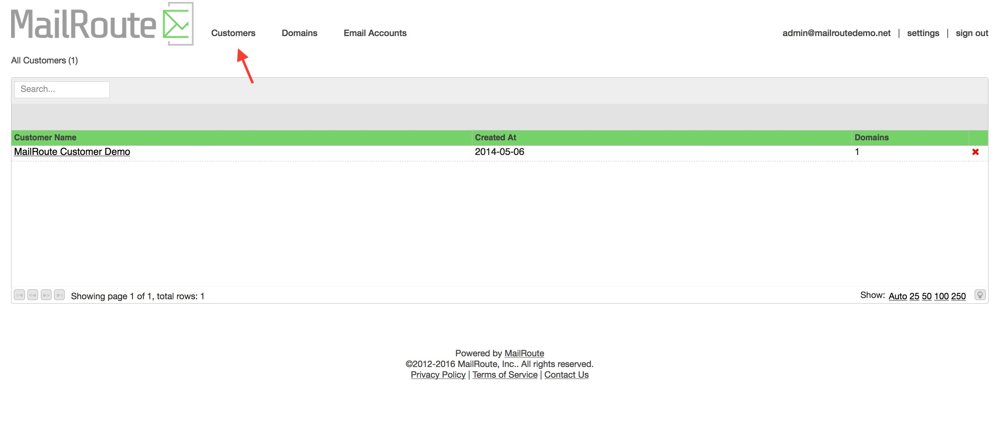
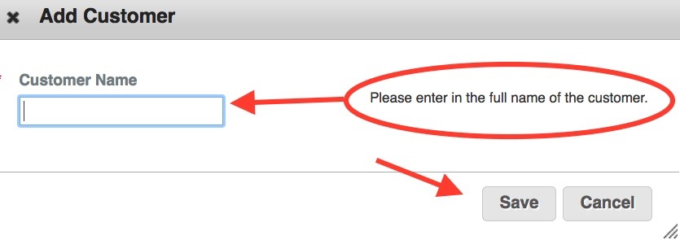

The ability to add and manage **Customers** is only available to **Resellers**
of MailRoute's email protection services. To enquire about becoming a
Reseller, email sales@mailroute.net.

The **Customers** list provides access to each of the customers for which you
are an administrator.

Simply click on a customer to edit the customer or to manage their domains.
Selecting a customer will take you into a screen from which you can add/manage
their domains, mail server, email accounts and more.

Click the red **X** at the far right of the customer to delete it.

**Important:** Deleting a customer will delete the customer and all of its
associated domains and email accounts. There is no way to undo this!

**Add** a **Customer** by clicking on the **Add Customer** button.

[Start a free 30-day trial today.](http://mailroute.net/signup.html)

Contact [sales@mailroute.net](mailto:sales@mailroute.net) or
[support@mailroute.net](mailto:support@mailroute.net) for more information.

[888.485.7726](tel:888.485.7726)

