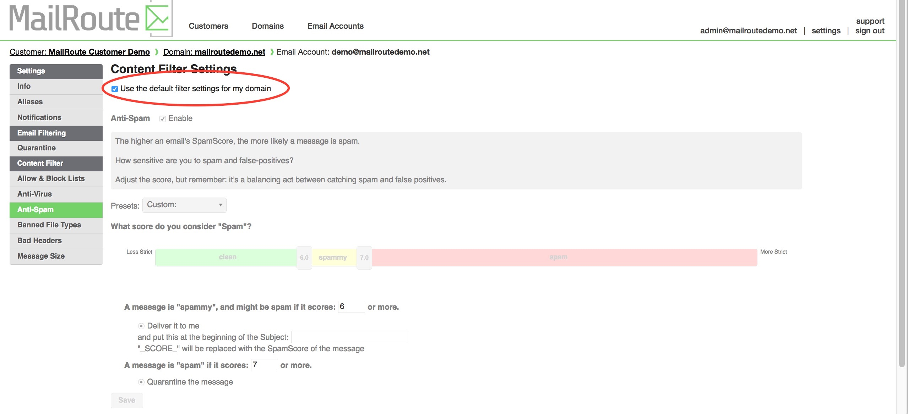
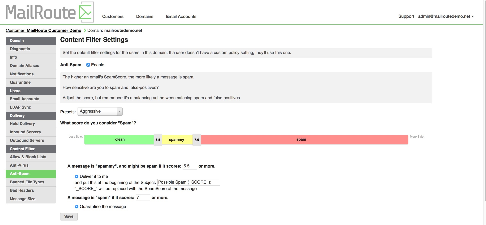
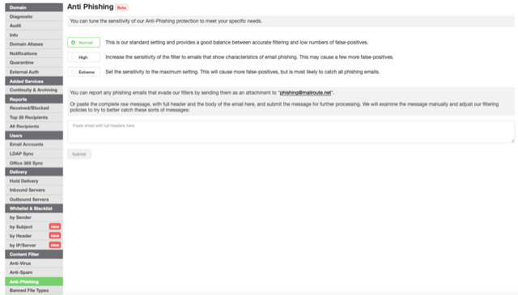
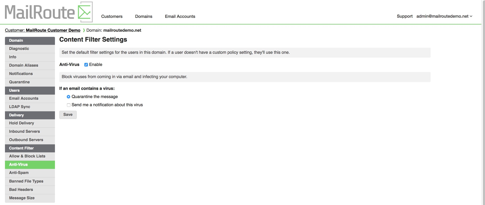
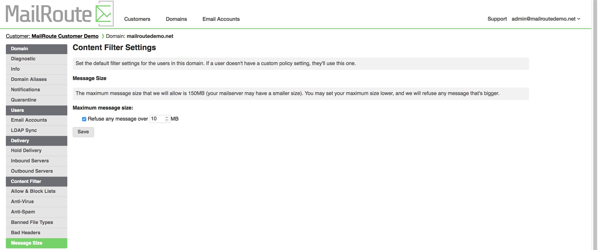
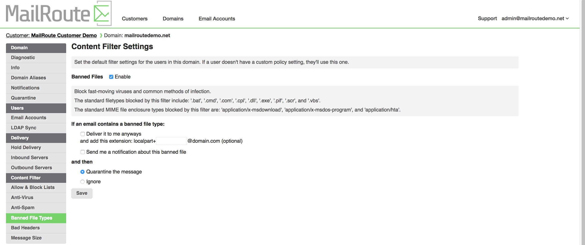
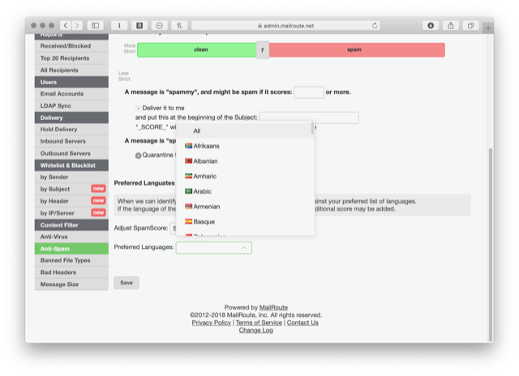
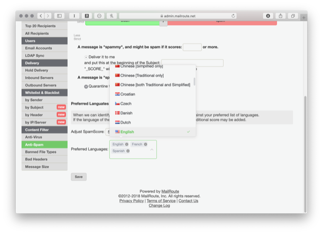

## Filter Settings

If the domain administrator has provided us with a complete list of mailboxes
for your domain, then it enables per-mailbox policy settings. These override
the domain-wide default settings your administrator has selected.

### Default Settings

You can set your account to use the domain-wide settings by choosing the
checkbox **Use the default filter settings for my domain.**

### Spam Filter Settings

The Spam Filter settings has the most options. You can choose from various
pre-defined presets for filtering, or set your own, with any level of
granularity.

Messages that are **spammy** can be delivered with their Subject lines
rewritten. **Spam** messages can be quarantined. And you can choose the score
at which each of those happens. Our standard settings simply quarantines at a
score of 7.0. But you might want to make this number higher or smaller, or add
the option to rewrite the Subject. It's entirely in your control.

###

### **Anti-Phishing Filter Settings**

Adjust filters to increase scoring rules of phishing emails. 'Normal' is our
standard weighted setting. 'High' and 'Extreme' increase the sensitivity of
the filters. Keep in mind, increasing the filter sensitivity will cause an
increase of false-positives.

To report any phishing emails that have come through the filters, attach a
copy of the original email body and header to
[phishing@mailroute.net](mailto:phishing@mailroute.net) or paste the original
email body and header in the space provided and click submit.

### Virus Filter Settings

Your options for virus-infected emails are much simpler - do you want a
notification sent to you when a virus-infected message is quarantined?

### Size Filter Settings

Likewise, you can opt to reduce the maximum allowed message size for your
email. Our maximum limit is 150MB.

### Banned Filetypes Filter Settings

Banned Filetypes are messages that contain various types of dangerous
enclosures. The standard filetypes blocked by this filter include: .bat, .cmd,
.com, .cpl, .dll, .exe, .pif, .scr, .js, .jar and .vbs.

These restrictions apply to files embedded inside other files, like zip or tar
files too.

Besides quarantining these emails and deciding if you want a notification, you
can also allow them through to you. You can even set a "plus extension" for
delivery, so you can have the message delivered to a variant of your email
address, like **user+banned@domain.com.** Some people like to use this to
support client-side filtering.

**Preferred Languages** ****

When a message comes in, we try to classify the language used in the body of
the message. This isn't always possible - it could be too short, or ambiguous,
or it might be encoded in some fashion. But we are able to identify it a good
portion of the time.

"Preferred Languages" lets you specify the languages you prefer to accept -
languages not in your list will have a penalty applied to them, causing the to
score higher, and to be more like to enter, or be guaranteed to enter the
quarantine.

The default setting is to allow All
languages:

If you delete the "All" entry from the list by clicking the small x next to
it, then you can choose specific languages you prefer:

The default penalty for a message with an identified language that does not
match your personal list, is 5 points. You can increase or decrease this to
whatever you prefer. Picking a number substantially higher than your
quarantine cutoff point (default is 7.0) will make sure those messages go to
the quarantine, unless they are overridden by a whitelist entry.

[Start a free 30-day trial today.](http://mailroute.net/signup.html)

Contact [sales@mailroute.net](mailto:sales@mailroute.net) or
[support@mailroute.net](mailto:support@mailroute.net) for more information.

888.485.7726

