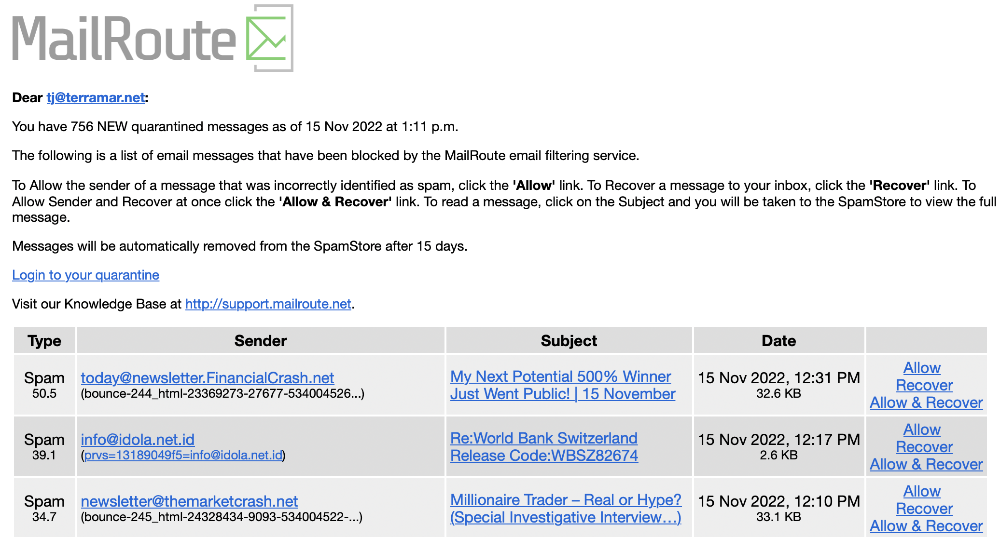
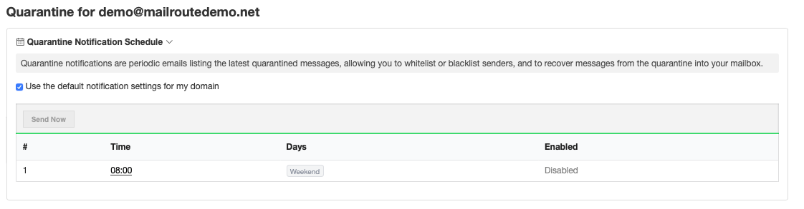

## Overview, Customization & How To Ensure Receipt/Delivery

We can send notifications of messages in the quarantine right to your inbox.
If your domain administrator has provided us with a complete list of mailboxes
for your domain, then this feature is available to you. Notifications can be
customized by account admins to provide different permissions.

You can view each piece of mail: Allow, Recover, or Allow and Recover, simply
by clicking the links in the notification. You do not need to login to your
MailRoute account.

A quarantine notification looks like this:

Setting Up Your Quarantine Notification

You can choose timezone, days of the week and times of day, in limitless
configurations, to schedule receipt of notifications, or go with the default
setting your administrator has chosen.

Go to the Quarantine tab in your Dashboard and above the Quarantine box there
is the Notification Schedule and click on the Schedule.

Please note: Notifications are only sent out if there is something new to
report since the last notification was delivered.

## How To Ensure Delivery of Notifications

Notifications contain spammy messages, so they do raise red flags when passing
through spam filters.

If you're using MailRoute as part of a layered system of email protection --
i.e., in conjunction with another service or filter -- then please:

**_Allow List: noreply@mailroute.net_**

This will ensure that notifications get through the various filters and are
delivered to your inbox, from where you can manage your MailRoute Quarantine.

**Admins** : To customize your Quarantine Email Notification Preferences
please see our article here:

<https://support.mailroute.net/hc/en-us/articles/15225926806163-Quarantine-
Notification-Email-Customization>

[Start a free 30-day trial today.](http://mailroute.net/signup.html)

Contact [sales@mailroute.net](mailto:sales@mailroute.net) or
[support@mailroute.net](mailto:support@mailroute.net) for more information.

Support: 888.485.7726

