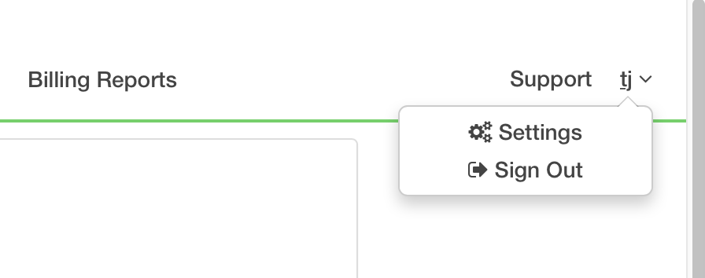
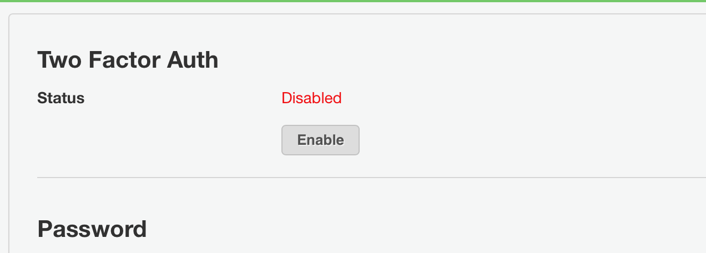
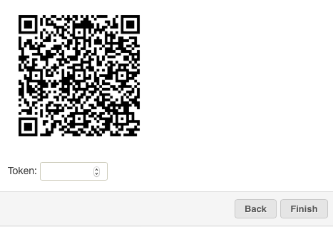
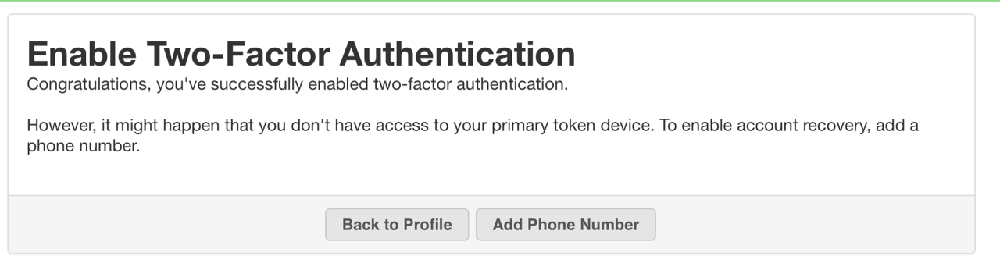
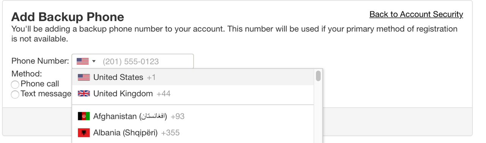
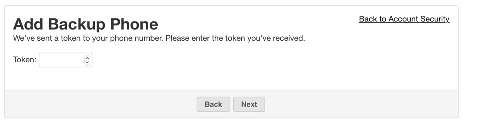
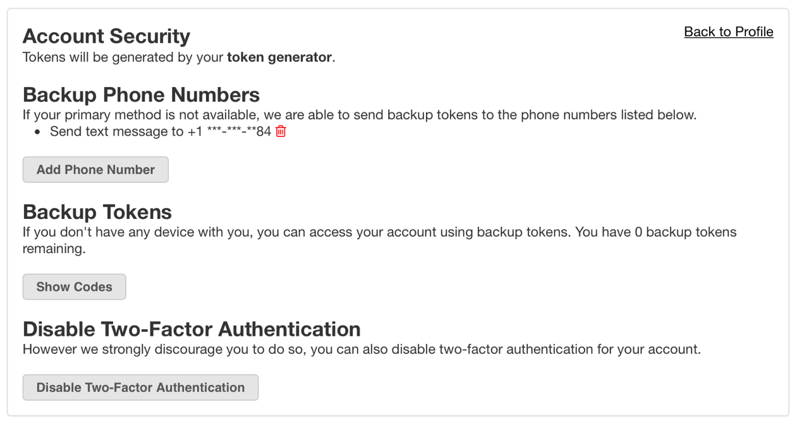
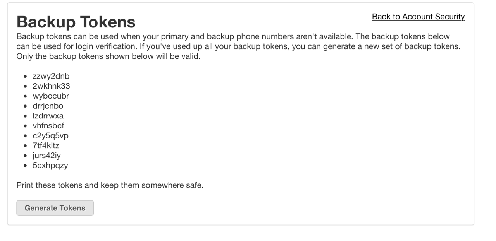
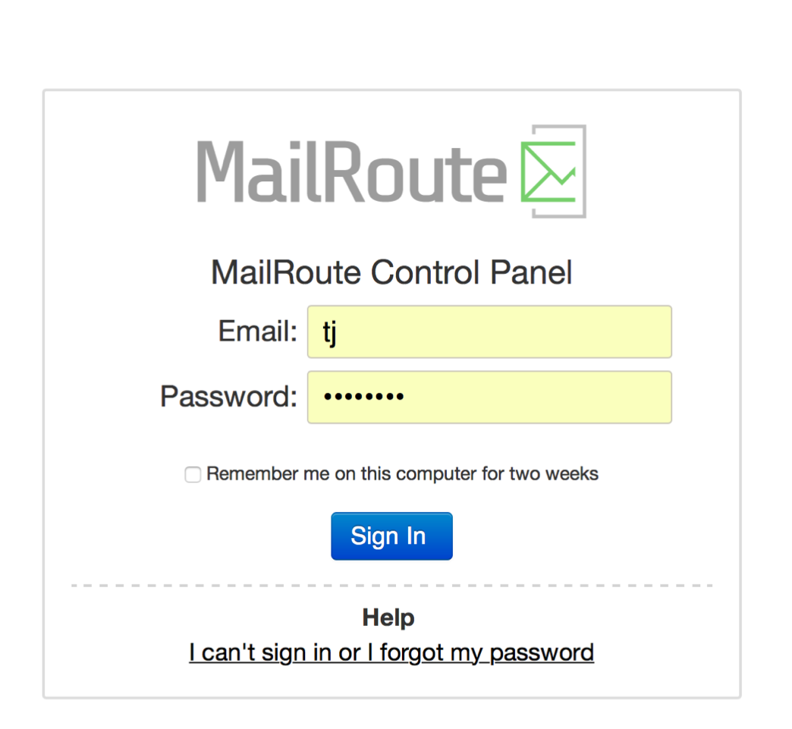
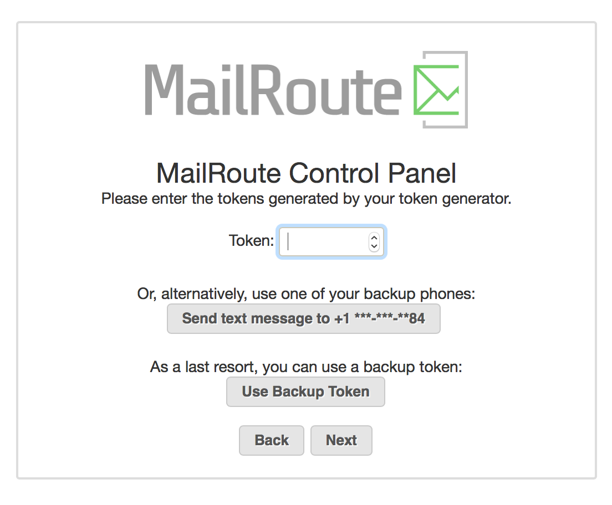

**Account Security at MailRoute**

**What is MFA?**

Multi-factor authentication (sometimes called 2FA, or two-factor
authentication) confirms a user's identity by using two or more components of
authentication, or validity checks. An everyday example is like paying for
items with your credit card and being asked for a piece of photo I.D. to
validate the identity of you and the details on the credit card.

Regular authentication requires "something you know": a password. With MFA,
we've added to the sign-in process: "something you have". What's the
"something you have"? That's your mobile phone, typically. That way, if
someone guesses or steals your password, they still cannot login without your
mobile phone.

This implementation is typical in our industry: It requires you to have an app
on your phone. It is synchronized with our server, and it displays a six-digit
code that changes once a minute. You have to type in that code to login.

**How does it work with MailRoute?**

First, you need to install an MFA app on your phone.

Authy, available for both iOS and Android:

[http://authy.com](http://authy.com/)

Google Authenticator for iPhone:

<https://itunes.apple.com/us/app/google-authenticator/id388497605?mt=8>

For Android:

[https://support.google.com/accounts/answer/1066447?co=GENIE.Platform%3DAndroid&hl=en](https://support.google.com/accounts/answer/1066447?co=GENIE.Platform=Android&hl=en)

MFA can be enabled or disabled for your MailRoute account. It's found in the
Settings menu under your login name, in the upper-right corner of the Control
Panel:

At the top of the Settings screen is:

Clicking "Enable" will walk you through a wizard to set up MFA for your
account.

The first thing displayed is a QR Code. Authenticator or Authy can scan this
code using your phone's camera to store the MailRoute keys in the device. The
app will then display a six-digit code. Enter that code under "Token" to
synchronize the MailRoute Control Panel and your phone.

After you enter in the token and click Next, you'll have set up MFA for your
account and can start using it.

Your security is our primary focus.

For additional safety, we want to also have a backup method for accessing our
Control Panel, in case you don't have your cell phone with
Authenticator/Authy. So click "Add Phone Number" to add a backup
authentication method:

This can be your cell phone, but if you lose your phone, you'll have to get a
replacement set up on the same number before you can access our Control Panel
again. So you might choose to use a different number instead.

Enter your phone number. Select your country from the pull-down menu and then
add your phone number:

Click "Next" and you'll get either an SMS message or a phone call with a six-
digit number to enter on the next screen.

After entering the token and clicking "Next" you'll be at your general Account
Security page:

Here, you can add additional backup phone numbers, disable MFA, or get one-
time use backup tokens.

What are one-time use backup tokens? When you click "Show Codes", it will
generate a set of one-time use tokens. You can print these out and keep them
safe. Don't share them with anyone, of course! If you lose your phone and need
to get access to our Control Panel, you can use one of the one-time use
tokens.

Now you're ready to go.

Log out of the site, and log back in. Everything looks the same at first:

Click "Sign In" and you're now asked for your token:

Enter the token from Authenticator/Authy, or use one of the backup methods,
and then you will be in the control panel, or dashboard.

**It's an extra step whenever you login to our site, but your security is
worth it!**

Questions? Contact [support@mailroute.net](support@mailroute.net).

[Start a free 30-day trial today.](http://mailroute.net/signup.html)

Contact [sales@mailroute.net](mailto:sales@mailroute.net) or
[support@mailroute.net](mailto:support@mailroute.net) for more information.

888.485.7726

