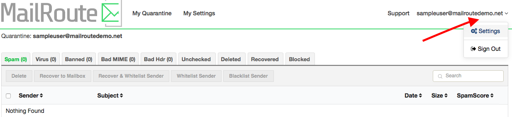
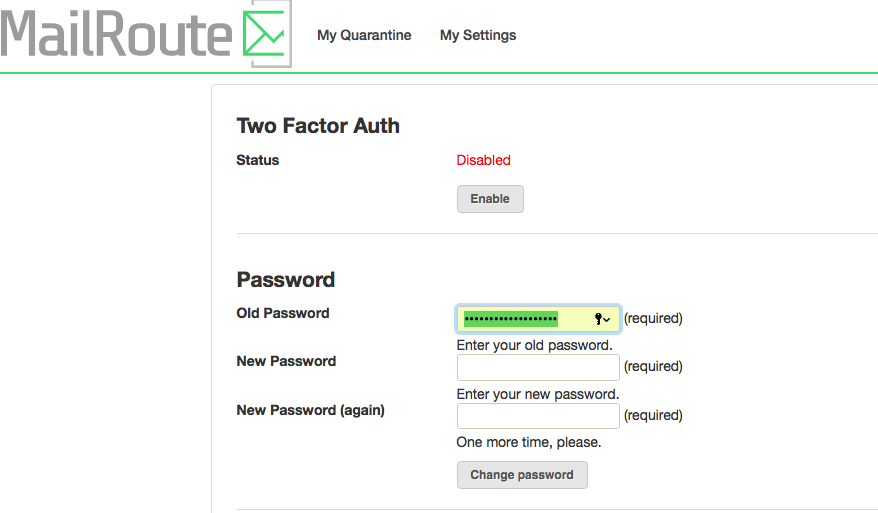

## Changing Your Password From Within the Control Panel

If you're logged in and want to change your password, just click the drop down
menu at the top right of the Control Panel to the right of your user name.
Choose Settings.

And then change your password.

[Start a free 30-day trial today.](http://mailroute.net/signup.html)

Contact [sales@mailroute.net](mailto:sales@mailroute.net) or
[support@mailroute.net](mailto:support@mailroute.net) for more information.

888.485.7726

