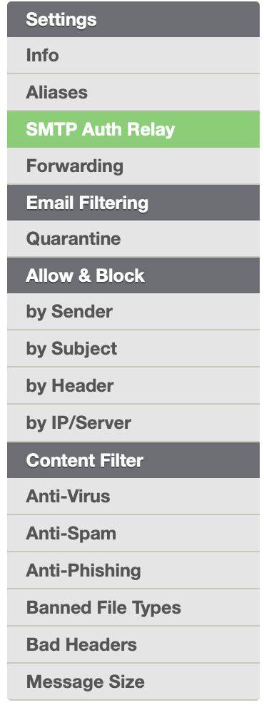
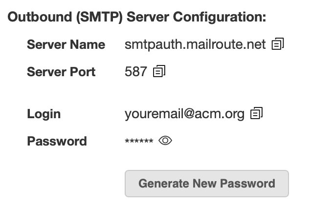
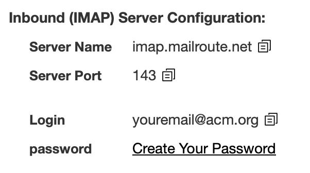

MailRoute uses separate passwords for Inbound and Outbound email servers.
While this may seem confusing at first, there are important security reasons
behind this approach.

## **Why Two Passwords?**

  1. **Enhanced Security** : Our Inbound (IMAP) and Outbound (SMTP) servers operate independently, running in separate clusters with passwords stored in different database tables and formats.
  2. **Future-Proofing** : The Inbound (IMAP) server password is identical to your MailRoute Control Panel login. This setup allows us to easily implement new authentication technologies like OAUTH, Multi-factor authentication, or Passkeys as email clients evolve.
  3. **Diverse Device Support** : Outbound servers often interact with devices having varied security requirements, such as scanners and fax machines, not just email clients.
  4. **Improved Security Management** : Separate passwords make it easier to prevent mail flow from compromised accounts without affecting your access to the MailRoute Control Panel.

By understanding and properly using these two passwords, you can ensure secure
and efficient email management through MailRoute.

## **Accessing Your Passwords**

###  **Outbound/SMTP Server Password** :

  1.     1.       1. Log in to the MailRoute Control Panel
      2. Click on **SMTP Auth Relay** in the left-side menu  
  
  
  

      3. Find your password in the **Outbound (SMTP) Server Configuration** section  
  

      4. Click the "eye" icon to reveal the password  
      5. Use the "copy" icon to copy it to your clipboard  
      6. Enter that password into your email client to configure your Outbound/ (SMTP) Server Configuration

### **Inbound/IMAP Server Password:**

This is the same as your MailRoute Control Panel login password

If you've only accessed our Control Panel through a partner site, you may need
to set up a local password:

  1.     1.       1. Log in to the MailRoute Control Panel
      2. Click on **SMTP Auth Relay** in the left-side menu  
  

      3. Find the **Outbound (SMTP) Server Configuration** section  
  

      4. Click "Create your password"
      5. Follow the prompts to set up your password

### **Resetting your MailRoute Control Panel/Inbound (IMAP) Password:**

If you need to completely reset your MailRoute Control Panel and Inbound
(IMAP) Server Configuration password, you can do so

  1.     1. Visit <https://admin.mailroute.net/accounts/password_setup/#/>
    2. Enter your email address to receive an email with instructions to reset your password
    3. Use this new password for your Inbound/IMAP Server when configuring your email client

