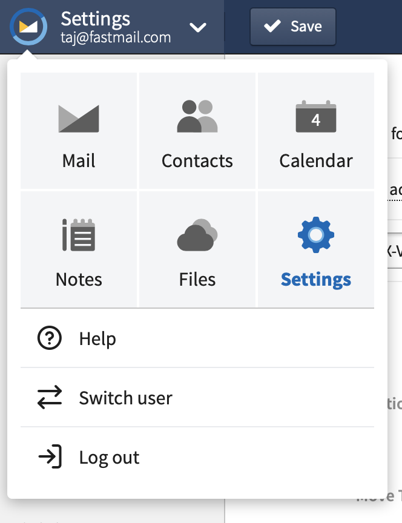
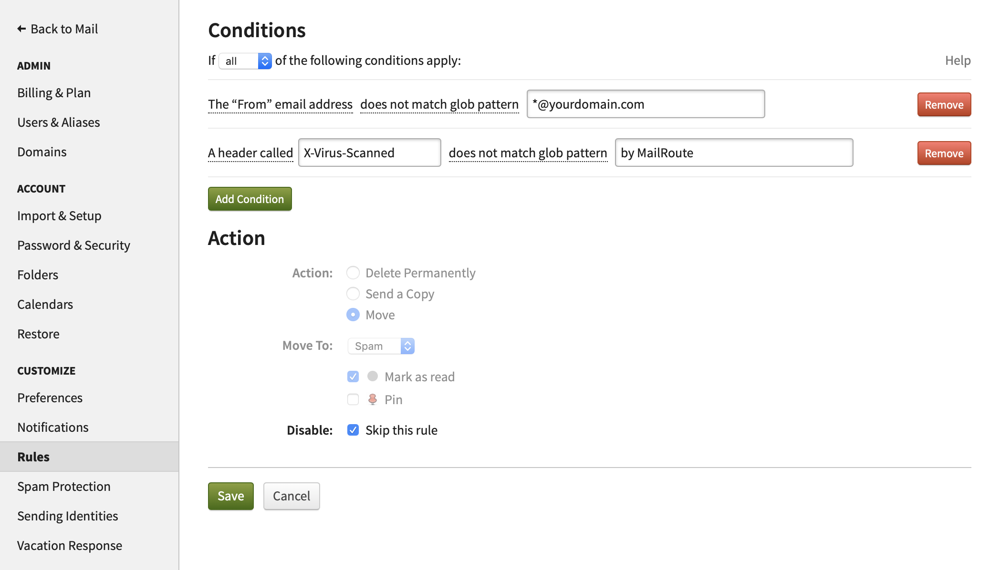
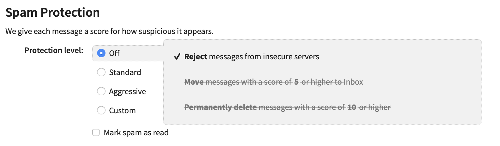

1\. Login to Fastmail

2\. Choose "Settings" from the top-left icon:

3\. Choose "Rules"

4\. Click "Add Rule"

5\. Create a rule like this:

6\. Click Save

Optional, but hightly recommended - disable FastMail additional Spam Fitlering

1\. Click "Spam Protection" from left side menu

2\. Choose "Off"

[Start a free 30-day trial today.](http://mailroute.net/signup.html)

Contact [sales@mailroute.net](mailto:sales@mailroute.net) or
[support@mailroute.net](mailto:support@mailroute.net) for more information.

888.485.7726

