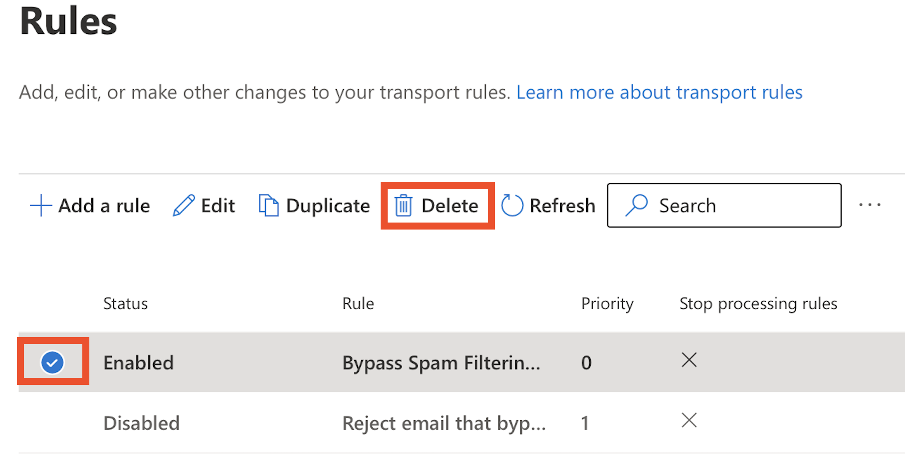

Microsoft has gone and made a change to how they handle some of their email
filtering when using a third-party cloud service! The old method, relying upon
**Mail Flow Rules** to bypass email filtering for mail that passed through
MailRoute, and to stop people from sending mail that bypasses us is no longer
the preferred methodology.

Microsoft talks about some of this stuff in their article [Managing mail flow
using a third-party cloud service with Exchange
Online](https://learn.microsoft.com/en-us/exchange/mail-flow-best-
practices/manage-mail-flow-using-third-party-cloud)

We need to **delete those two rules** , add a new **Inbound transport** , and
then configure **Advanced Filtering for Connectors in Exchange Online**.

This will help prevent MS from sending mail to the Office Quarantine, and
improve the accuracy of filtering overall.

Attached is an overly-detailed step-by-step description of everything you need
to do. It's not as bad as it looks :)

We're going to do these things in order:

  1. Delete the old rules.
  2. Configure an **Inbound Transport** in Exchange online to allow Office 365 to identify that your mail is coming from a trusted partner who is doing email filtering for you
  3. Configure **Advanced Filtering for Connectors in Exchange Online** to improve your filtering and reduce false-positives on the Microsoft side

# Step 1. **Delete** the old **Mail Flow Rules**

  * Visit <https://admin.exchange.microsoft.com/#/transportrules>
  * Delete each of the rules, by selecting a rule, and then hitting the delete button:  
  
  

# Step 2. Configure **Inbound Transport**

Microsoft uses an inbound **Transport** to identify email that comes in via
MailRoute to prevent false-positives from their own email filtering.

  * Visit <https://admin.exchange.microsoft.com/#/connectors> to manage your connectors.
  * Click **Add a connector**  
  
  

  * Choose **Partner organization** and click **Next:  
**  

  * Give your connector a name like **MailRoute Inbound** , be sure **Turn it on** is selected, and then click **Next:**  
  
  
  

  * In **Authenticating sent email** , choose the option **By verifying that the sender domain matches one of the following domains** , enter ***.mailroute.net** and click the **+** (plus) icon to add this sender domain. After it's added, click **Next:  
  
**

  * In **Security restrictions** , choose the checkboxes **Reject email messages if they aren't sent over TLS** and **And require that the subject name on the certificate that the partner uses to authenticate with Office 365 matches this domain name** and enter ***.mailroute.net** into the text field, and then click **Next:  
  
** **  
  
**

  * In **Review connector** , verify that everything looks good, and then click **Create connector** :  
  

# Step 3. Configure **Advanced Filtering for Connectors in Exchange Online**

This will reduce false-positives on Microsoft's side and improve filtering
effectiveness. It also prevents people from bypassing MailRoute and sending
email directly to you without filtering.

Microsoft has an article explaining how it all works at
<https://learn.microsoft.com/en-us/exchange/mail-flow-best-practices/use-
connectors-to-configure-mail-flow/enhanced-filtering-for-connectors#what-
happens-when-you-enable-enhanced-filtering-for-connectors>

  * Jump right to the configuration page at <https://security.microsoft.com/skiplisting>
  * Click on your **MailRoute Inbound** connector  
  

  * Choose **Skip these IP addresses**... **,** enter **199.89.0.0/21** into the text area, and then choose **Apply to the entire organization** , and click **Save:**  
  
  
  

And you're done! I hope that wasn't too bad.

[Start a free 30-day trial today.](http://mailroute.net/signup.html)

Contact [sales@mailroute.net](mailto:sales@mailroute.net) or
[support@mailroute.net](mailto:support@mailroute.net) for more information.

888.485.7726

