### How to Use MailRoute with Google Apps for Inbound and Outbound Protection

MailRoute has always supported Inbound filtering for Google Apps users, but
**Google has new settings to increase the functionality** , and to make sure
that their own spam filters don't double-filter the mail.

In addition, **MailRoute now supports outbound email relay of mail for Google
Apps for Mail users**. This allows your outbound mail to be filtered by
MailRoute, preventing inadvertent transmission of viruses or spam from
infected machines, and allows MailRoute to use your outbound email sending
patterns to fine-tune your inbound spam filtering, reducing potential-false
positives even further than before!

* _it is not necessary to add your outbound server details in MailRoute's Control Panel once you have completed the steps below._

# Configure MailRoute for your Inbound Google Workspace Servers

This was probably done for you when you first signed up with our service. But
if you're migrating to Google Workspace, or making changes, you'll need to set
up your **Inbound Servers** in the MailRoute Control panel at
<https://admin.mailroute.net>

**Set up your google apps mail servers in MailRoute under Delivery &
Mailservers and assign their priorities.**

We will need to know where to send your email.

**See our article** about entering your mail servers **here** >
**[https://mailroute.zendesk.com/entries/23219453-Inbound-Mail-
Servers](https://support.mailroute.net/hc/en-us/articles/115000393247-Inbound-
Mail-Delivery-Servers).**

The most common values for Google Workspace inbound servers are:

**Mailserver** | **Priority**  
---|---  
ASPMX.L.GOOGLE.COM | 1  
ALT1.ASPMX.L.GOOGLE.COM | 5  
ALT2.ASPMX.L.GOOGLE.COM | 5  
ALT3.ASPMX.L.GOOGLE.COM | 10  
ALT4.ASPMX.L.GOOGLE.COM | 10  
  
#  
**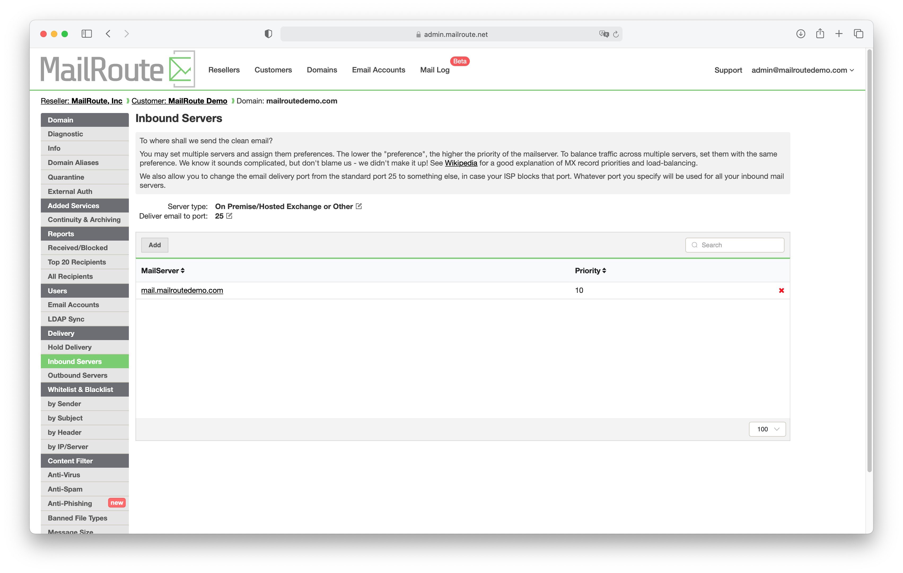**  
  
 **Configure Google Apps**

There are three steps to configuring Google Workspace for MailRoute -
configuring the inbound email routing, configuring outbound email routing, and
setting your SPF records. Each has a number of steps, but they aren't as
complicated as they look.

## **Step 1. Configure Inbound Email Routing**

This configuration ensures that Google will accept email that has been routed
through MailRoute, and will respect our spam filtering methodologies and not
further subject the email to additional filtering that could cause false-
positives.

A. Visit **<https://admin.google.com> **and login with your administrator
password.

B. Select " **Apps** ", and then **Google Workspace,** and then **Gmail:**

**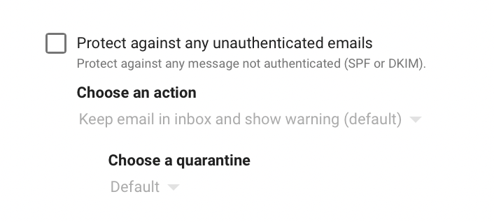**

C. Scroll down to and click the section labeled **Spam, Phishing, and
Malware** , and then click **Inbound Gateway:**

**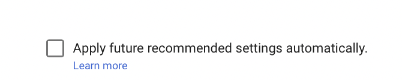**

D. Click **Enable** and then click **Add** to add an inbound address range:

**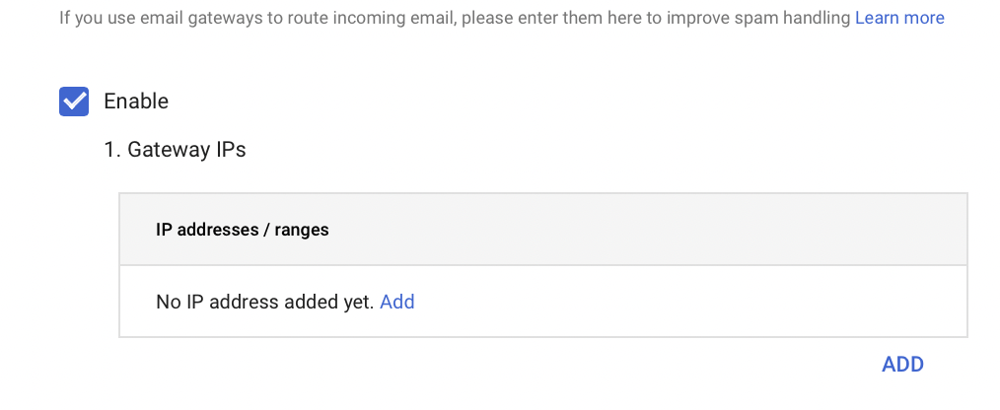**

E. In the **Add IP Address** dialog box, enter **199.89.0.0/21** and click
**Save:**

**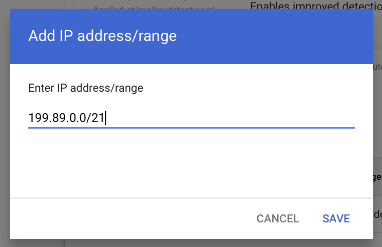**

F. Select the following checkboxes:

  * **Automatically detect external IP (recommended)**
  * **Require TLS for connections from the email gateways listed above**
  * **Message is considered spam if the following header regexp matches**
  * **Disable Gmail spam evaluation on mail from this gatway, only use header value**

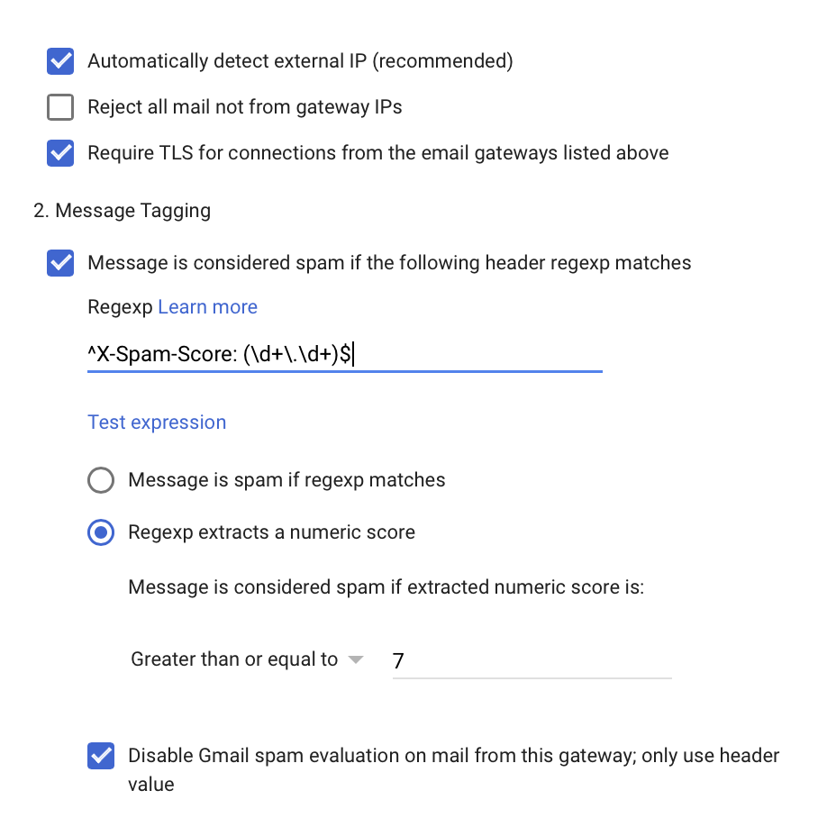

G. Under **Message Tagging,** in the **Regexp** field, enter **^X-Spam-Score:
(\d+\\.\d+)$**

H. Then select the radio button **Regexp extracts a numeric score**

I. Under " **message is considered spam if extracted numeric score is** "

  * Choose " **Greater than or equal to** " from the popup menu, and set the value to " **7** "

J. Choose " **Disable gmail spam evaluation on mail from this gateway; use
only header value** "

And your configuration should look like this:

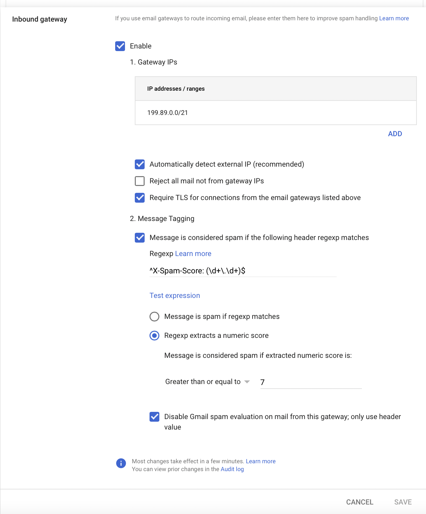

##

K. Click **Save**

##

## Step 2. Configuring Outbound Routing

The Outbound configuration directs email for outside domains through
MailRoute, and makes sure that email from one user in your domain to another
stays within Gmail, and is NOT routed out through MailRoute.

### Step 2A. First we need to set up a Google Workspace Host to handle
Internal Email Routing

1\. Visit [**https://admin.google.com**](https://admin.google.com) **** and
login with your administrator password.

2\. Select " **Apps** ", and then **Google Workspace,** and then **Gmail:**

****

3\. Scroll down to the section labeled **Hosts** , and click **Add Route**

4\. Give the new route a name like **Internal Google Workspace.**

5\. Under **Specify email server** , choose **Single Host** , and enter
**aspmx.l.google.com** , and the port number **25**

6\. Make sure the checkbox **Perform MX lookup on host** is NOT checked. Check
the boxes

  * **Require mail to be transmitted via a secure (TLS) connection (Recommended)**
  * **Require CA signed certificate (Recommended)**
  * **Validate certificate hostname (Recommended)**

**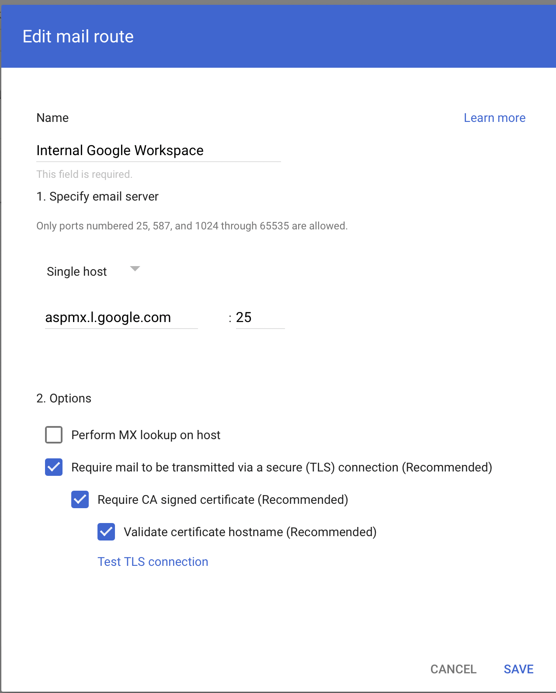**

7\. Click **Save**

### Step 2B. Now we will set up Google Workspace to route outbound email
through MailRoute

1\. In the breadcrumbs at the top, select **Settings for Gmail** to navigate
back to the other settings.

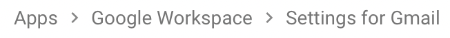

2\. Scroll down to, and then click the section labeled **Routing** ,

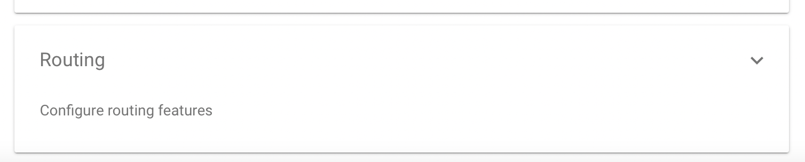

3\. Click the subsection **Outbound Gateway**

4\. Under **Route outgoing emails to the following SMTP Server** , enter
**outbound.mailroute.net** and click **Save**

**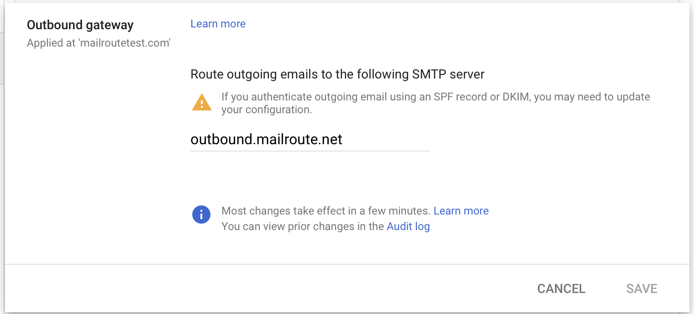**

This will route outbound email to other domains out through the MailRoute
Outbound Relay Service

Now we want your internal mail to be delivered right to your users, not sent
back out through MailRoute where it undergoes additional filtering.

5\. Under **Routing** click **Add another rule**

6\. Give the route a name like **Workspace Internal Routing**

7\. Select the checkbox **Internal - Sending**

**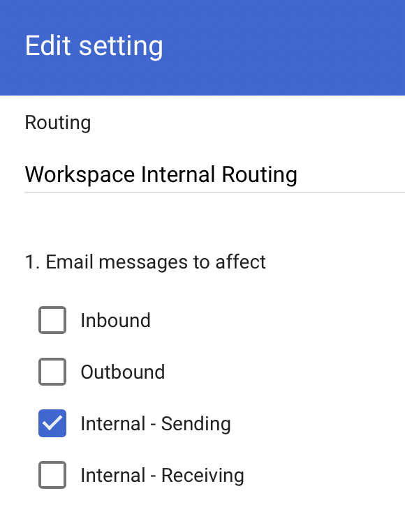**

8\. In section #2, Make sure the **Modify message** menu item is checked, and
choose the checkbox **Change Route** and use the menu below that to chose the
host you set up earlier **Internal Google Workspace**

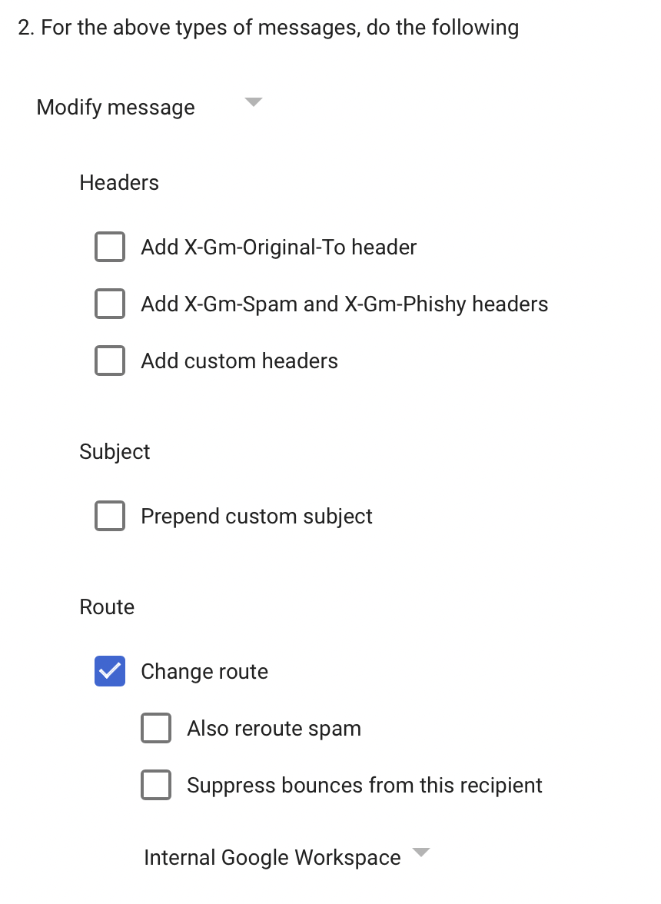

9\. Scroll way down to the bottom and click **Show options**

****

10\. In Section B, choose the checkboxes

  * **Users**
  * **Groups**

11\. In Section C choose the checkbox **Only affect specific envelope
senders,** choose **Pattern Match** from the popup menu, and enter in your
domain in the **Regexp** field:

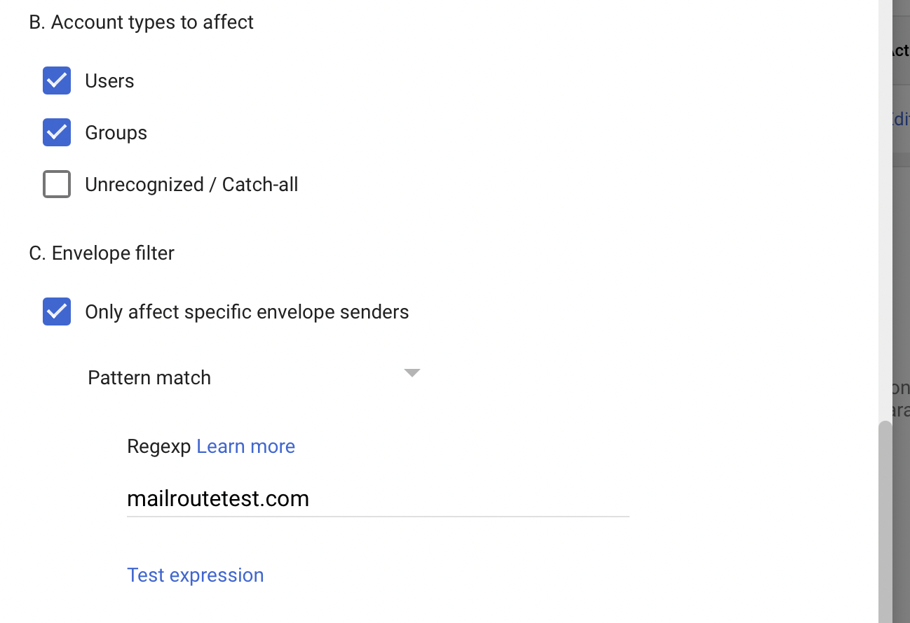

12\. Click **Save**

### Step 2C. Update Safety Settings

G Suite/Workspace safety settings will, by default, check for SPF, DKIM, and
DMARC errors. MailRoute already does this, and quarantines email that fails
these tests. Leaving the Google tests in place can result in their blocking of
legitimate email that MailRoute has already filtered. In addition, we have
seen Google block email from their own IP addresses! We want to be sure
everything you need gets through, so here's one last configuration step to
take.

1\. Visit **https ://admin.google.com/** and login with your administrator
password.

2\. Select " **Apps** ", and then **Google Workspace,** and then **Gmail:**

****

3\. Scroll to and click the **Safety** configuration option section

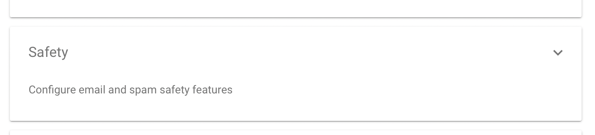

4\. Scroll to the section **Spoofing and Authentication** and click on it to
adjust the settings

5\. Turn off the options **Protect against any authenticated emails** and
**Apply future recommended settings automatically:**

That's it for the configuration within Google Workspace! It is now configured
to accept clean email relayed from MailRoute, to route outside email out
through MailRoute, and to keep your internal email inside Google Workspace.

Please note that It can take Google up to an hour for changes to propagate.
Most of the time it happens really fast, but we have seen it take a while.

There's one last things you need to do, and it's with your DNS host: you need
to make sure you have the correct SPF records in place.

## Step 3. Set up your SPF records for both MailRoute and Google Workspace.

Your SPF record MUST include both the entries for MailRoute and for Google
Workspace, so it must include **include:spf.mailroute.net** and
**include:_spf.google.com**

Your SPF record may look like this:

"v=spf1 include:[spf.mailroute.net](http://spf.mailroute.net/)
include:_[spf.google.com](http://spf.google.com/) -all"

[Start a free 30-day trial today.](http://mailroute.net/signup.html)

Contact [sales@mailroute.net](mailto:sales@mailroute.net) or
[support@mailroute.net](mailto:support@mailroute.net) for more information.

888.485.7726

