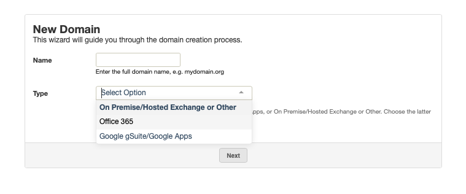
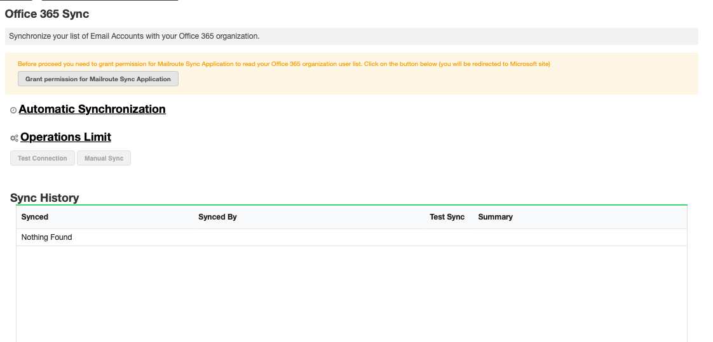
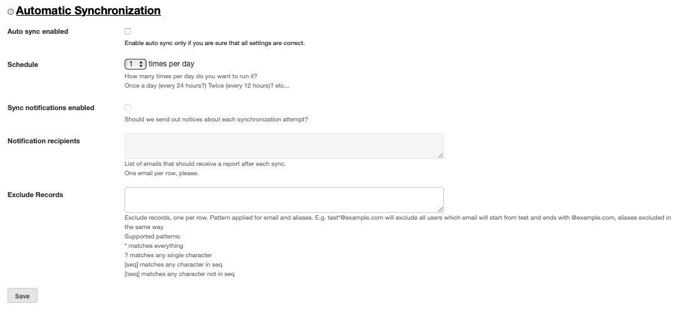

MailRoute has created a full level API-level integration for more efficient
management of G Suite users. Our system will sync to G Suite so all your user
lists, aliases, distribution lists are automatically updated on our end
whenever you change things in G Suite.

To begin the sync option you will first need to ensure the correct server type
is listed in our control panel.

You can select server type:

  * When adding a new domain
  * When changing a server that already exists in your dashboard.

1) When adding a new domain to the dashboard, add the new domain and select
which server type from the drop down menu. Click Next.

2) If you are changing your server type in your dashboard, go to Inbound
Servers and click on the edit icon to the right of the existing Server type. A
menu will pop up and from there select server type from the drop down menu.
Click Save.

In both cases, once the server type is selected you will now see the
corresponding Sync tab listed under 'Users'

Select the Sync tab and proceed through the steps to complete. You will need
to begin by granting permission for MailRoute to read your organization's user
list.

Once permission has been granted, set Up Automatic Synchronization for your
sync schedule.

You can have our AD/LDAP sync process run automatically from 1 to 4 times per
day.

  * Auto Sync Enabled 

Once you've tested your AD/LDAP Sync via the manual sync process and are
comfortable that everything is working to your satisfaction, you can enable
Automatic Synchronization.

_required: no_  
 _default: off_

  * Schedule 

Choose from 1 to 4 times per day.

_required: no_  
 _default: 1_

  * Sync Notifications Enabled 

You may have sync reports emailed to one or more email addresses after each
sync process.

_required: no_  
 _default: none_

  * Notification Recipients 

A comma separated list of email addresses to receive the Sync Notifications

_required: no_  
 _default: none_  
 _example: user@domain.com_

  * Save your configuration by clicking the **Save** button

Operations Limit

  1. Test your configuration and perform Manual Sync 

    * **Test Connection**

This will attempt to connect to your server and retrieve a few records based
on your connection settings.

    * **Manual Sync**

This will perform a full sync operation. If you've specified notification
email addresses, they will be notified the results of the process.

You can also view your sync history below

