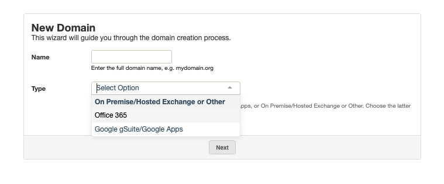
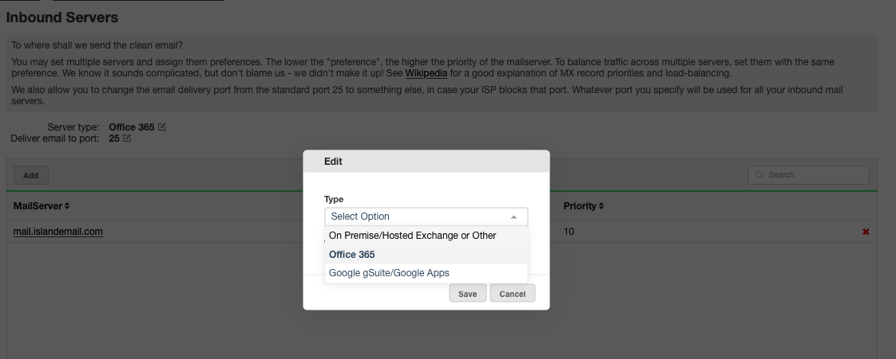

MailRoute has created a full level API-level integration for more efficient
management of your Microsoft Office 365 Government/GCC High users. Our system
will sync to Microsoft Office 365 Government/GCC High so all your user lists,
aliases, distribution lists are automatically updated on our end whenever you
change things in o365.

To begin the sync option you will first need to ensure the correct server type
is listed in your dashboard.

To enable this sync feature, please visit our Control Panel at
[https://admin.mailroute.net](https://admin.mailroute.net/)

You can select server type

  * When adding a new domain
  * When changing a server that already exists in your dashboard.

1) When adding a new domain to the dashboard, add the new domain and select
which server type from the drop down menu. Click Next.

2) If you are changing your server type in your dashboard, go to Inbound
Servers and click on the edit icon to the right of the existing Server type. A
menu will pop up and from there select server type from the drop down menu.
Click Save.

In both cases, once the server type is selected you will now see the
corresponding Sync tab listed under 'Users'

  * Select the "Office 365" Sync tab and proceed through the steps to complete. 

  * Click the button "Grant permission for MailRoute Sync Application"

  * This will redirect you to a Microsoft site where you may login with your GCC High administrator credentials. You'll be asked to give the MailRoute Sync App read-only permission to access your User and Group lists.

  * You'll need to give the app permission to access your directory listing of users and groups.

  * Once app permissions have been granted you can do a "Manual Sync" of the data and check it out for accuracy.

  * Once you are satisfied that everything is correct, you may enter the "Automatic Synchronization" settings area and set it to run automatically.

