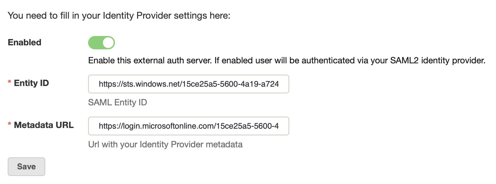
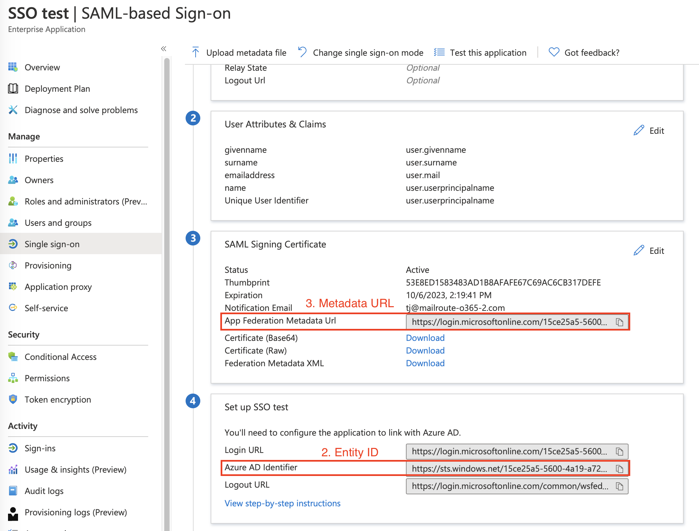

SAML2 or Security Assertion Markup Language 2.0 is a standard for exchanging
authentication and authorization data between security domains. It enables
cross- domain single sign on (SSO) by distributing authentication tokens to
users.

For the security and convenience of our customers, MailRoute supports SAML2
compatible providers as external authentication for single-sign on capability.

There are two separate sites to set up single sign-on: the service provider
configuration, done in the MailRoute Control Panel, and the identity provider
configuration done within your SSO system.

(The following has been adapted from Microsoft's SAML/Azure configuration
instructions)

**To set up with Microsoft Azure**

Login to your Microsoft account as an Admin

In the [Azure portal](https://portal.azure.com/), on the left navigation
panel, click **Azure Active Directory**.

To open the single sign-on settings:

  1. In the [Azure portal](https://portal.azure.com/), on the left navigation panel, click **Azure Active Directory**.

  2. In the **Azure Active Directory** blade, click **Enterprise applications**. The **All applications** blade opens to show a random sample of the applications in your Azure AD tenant.

  3. Click " **new application** ". On the next screen click " **create your own application** ". Type in any name for your new application which will be used for SAML2 auth and save it.

  4. Click **Single sign-on**. Under **Single Sign-on** , click **SAML**

## Set up Single Sign-On with SAML

#### **1\. Basic SAML Configuration**

Under **Identifier** (Entity ID) add:
**https://admin.mailroute.net/saml2/metadata/**  
In **Reply URL** (Assertion Consumer Service URL) add:
**https://admin.mailroute.net/saml2/acs/**

**Do not run tests yet, we'll do that later.**

#### **2\. User Attributes & Claims**

You may leave it as is.

#### **3\. SAML Signing Certificate**

Azure AD uses a certificate to sign the SAML tokens that it sends to the
application.

Click **Add a certificate** link to create new signing certificate.

Click **New certificate**. Choose **Sign SAML response and assertion** in
Signing option dropdown and click **save** to generate new certificate.

## Assign users to the application

Microsoft recommends testing the single sign-on with several users or groups
before rolling out the application to your organization.

To assign a user or group to the application:

  1. Open the application in the portal, if it isn't already open.
  2. In the left application blade, click **Users and groups**.
  3. Click **Add user**.
  4. In the **Add Assignment** blade, click **Users and groups**.
  5. To find a specific user, type the user name into the **Select** box, click the checkbox next to the user’s profile photo or logo, and click **Select**.
  6. Find your current username and select it. You can optionally select more users.
  7. In the **Add Assignment** blade, click **Assign**. When completed, the selected users appear in the **Users and groups** list.

## Configuring SAML in MailRoute's Control Panel

1\. Login to your Admin account in MailRoute's Control Panel.

2\. Select **External Authentication** from the left-hand side tab

3\. Select the toggle, **Choose External Auth Type** and switch to **SAML2**

In **filling in your Provider Settings** , please do the following:

1\. Click the **Enabled** box

2\. **Entity ID:** Please enter the **Azure AD Identifier** from your Azure
app page.

3\. **Metadata URL:** Copy **App Federation Metadata Url** from your Azure app
page.

4\. Click **Save**.

## Test single sign-on

You are ready to test your settings.

  1. Open the single sign-on settings for your application in Azure portal (Azure active directory - Enterprise applications - choose your SAML2 application).
  2. Scroll to the bottom of the section.
  3. Click **Test SAML Settings**. The testing options appear.

  1. Click **Sign in as current user**. This test lets you first see if single sign-on works for you, the admin.

For more information, please see the Microsoft article
[here](https://docs.microsoft.com/en-us/azure/active-directory/manage-
apps/configure-single-sign-on-portal)

