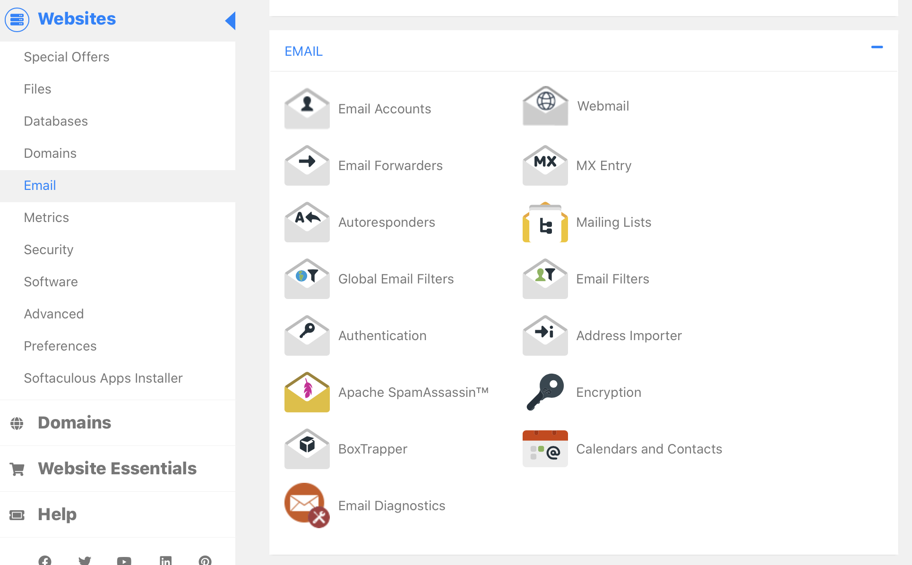
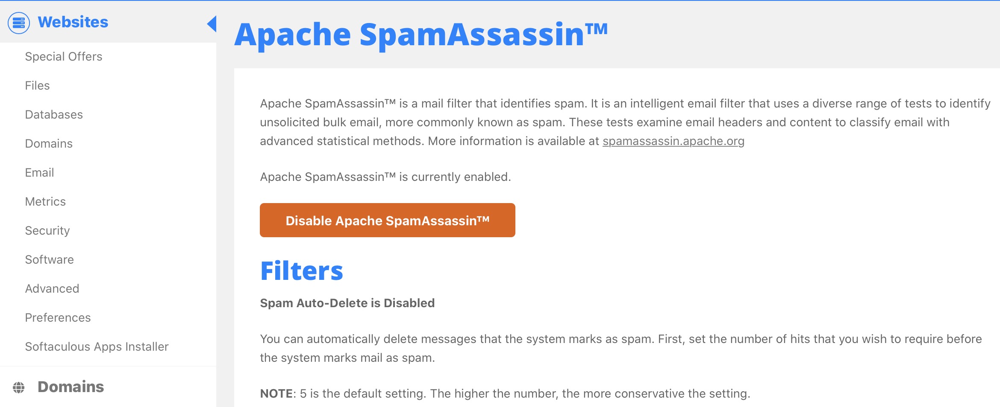
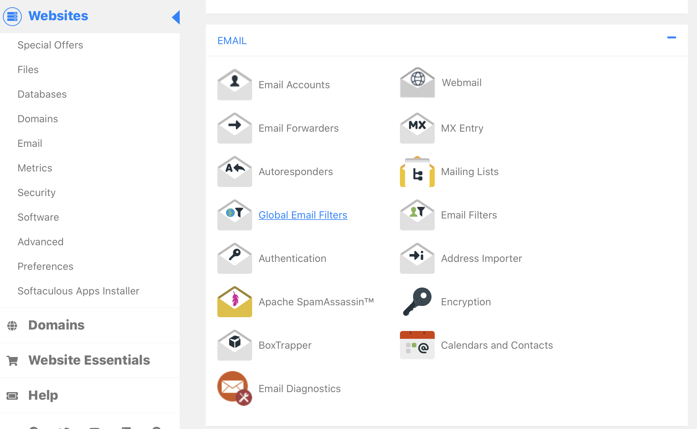
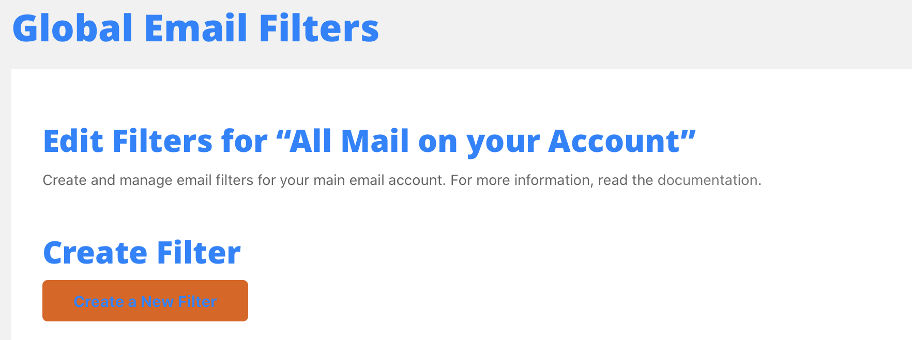
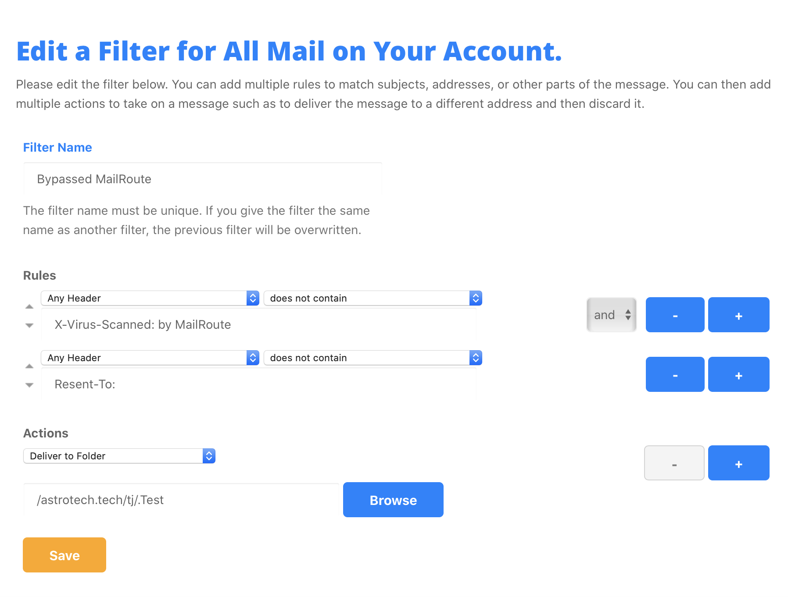

To configure your cPanel host to bypass the internal SpamAssassin filter and
to discard, reject, or file email that did not pass through MailRoute, simply
follow these steps:

1\. Login to your cPanel account.

2\. Click "Email" in the left menu to scroll to the Email Features:

3\. Click 'Apache SpamAssassin"

4\. Click 'Disable SpamAssassin"

5\. Click "Go Back":

6\. Click "Email" in the left-hand column again to return to the email
settings.

7\. Click "Global Email Filters":

8\. Click "Create Filter":

9\. Name the new filter "Bypassed MailRoute", and add two rules -

"Any Header" "does not contain" "X-Virus-Scanned: by MailRoute"

AND

"Any Header" "does not contain" "Resent-To:"

Choose "Deliver to Folder" or "Discard Message" or "Fail with Message" per
your preferences:

And then click "Save"

That's it! That will disable the additional SpamAssassin filtering built into
cPanel, and remove any email that came directly into your server, bypassing
MailRoute

