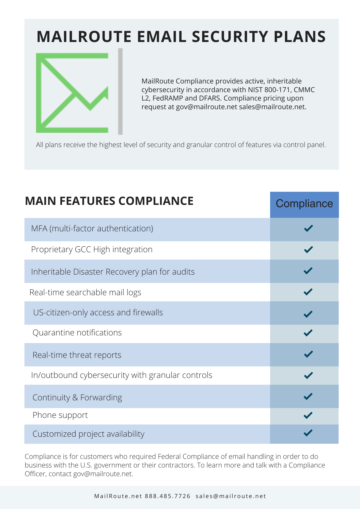

For more information, email [sales@mailroute.net](mailto:sales@mailroute.net)
or [gov@mailroute.net](mailto:gov@mailroute.net).

Start a free 30-day trial [here](https://mailroute.net/pages/pricing).

