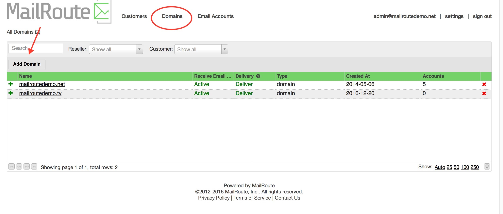
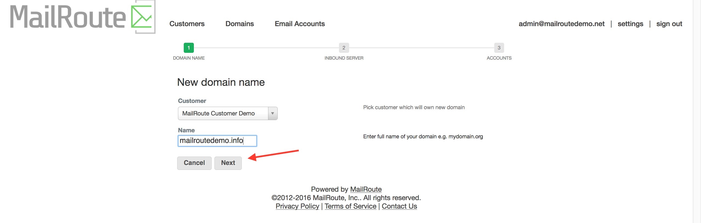
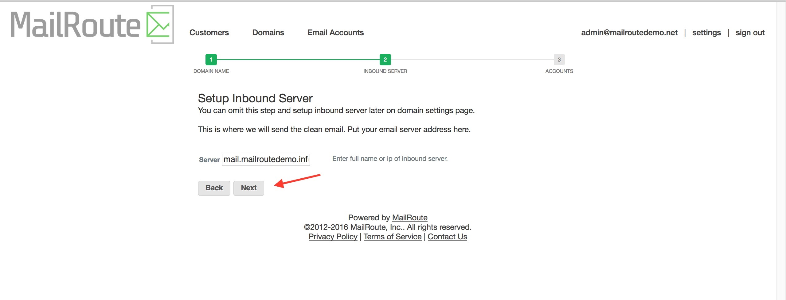
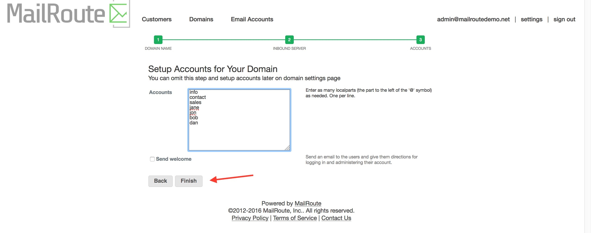
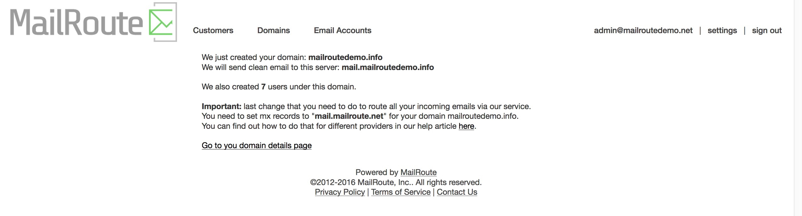

The **Domains** list provides access to each of the domains for which you are
an **Administrator**.

Simply click on a domain to edit that domain or to manage its **Email
Accounts**. Click the red **X** at the far right of the domain to delete it.

**Important:** Deleting a domain will delete the domain and all of its
associated settings and email accounts. There is no way to undo this!

You can _deactivate_ a domain by clicking on the domain and clicking either
the "Active" column or the green dot to the left of the domain name. We will
not accept email sent to _inactive_ domains, it will be bounced.

You can also put email delivery for a domain on _hold_ by clicking the "Hold"
column. We will accept email for a domain that's on hold, but we won't try to
deliver it to your mailserver. We'll queue it until you release the hold. This
is useful if you want to pause delivery while you upgrade a mailserver, for
example.

The _Domain List_ displays both **Domains** and **Domain Aliases** for quick
reference. The **Type** column indicates whether the domain is a domain or an
alias of a primary domain.

Add a domain by clicking on the **Add Domain** button, which will start our
new **Domain Setup Wizard**.

[Start a free 30-day trial today.](https://www.mailroute.net/pricing-sign-up/)

Contact [sales@mailroute.net](mailto:sales@mailroute.net) or
[support@mailroute.net](mailto:support@mailroute.net) for more information.

[888.485.7726](tel:888.485.7726)

