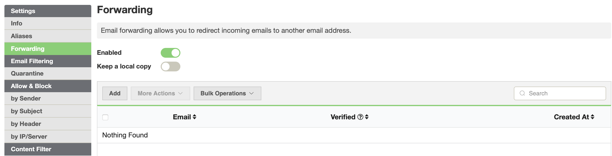
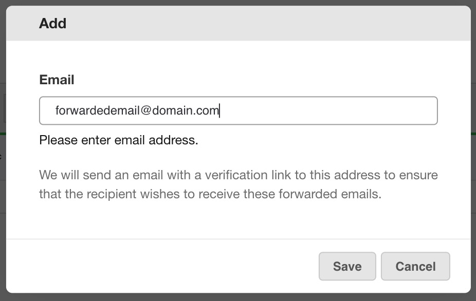
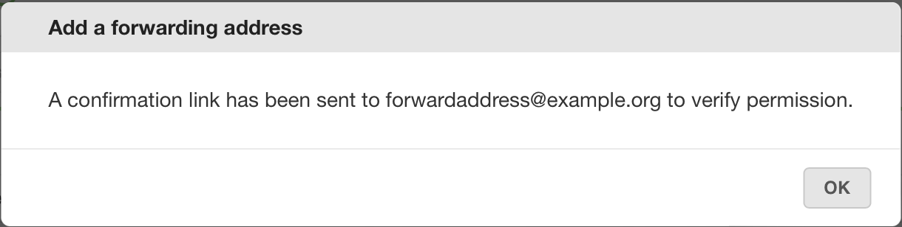
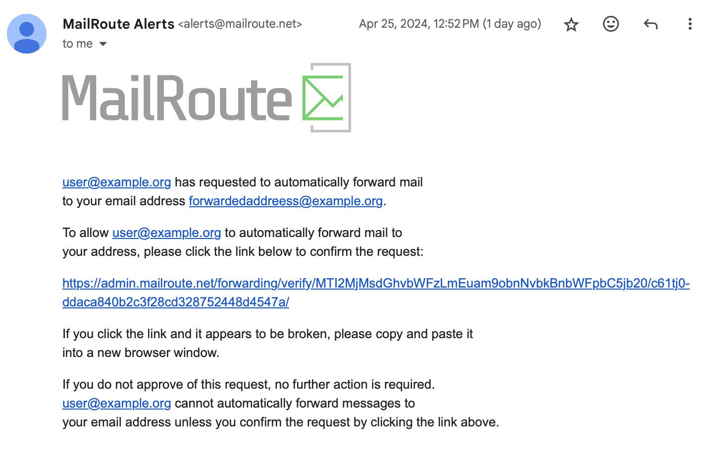
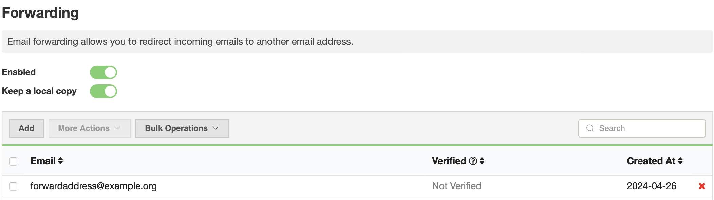

Some MailRoute plans, such as [Enterprise and
Compliance](https://mailroute.net/pages/pricing), include our Forwarding
feature which allows for mail to be forwarded to another address without
breaking SPF, DKIM or DMARC.

_*If you would like Forwarding and are not sure of your plan or would like to
upgrade, please contact support@mailroute.net_

## A Note About Forwarding

Having your email client or your server doing forwarding can be very
problematic. Different mail services and mail clients do it in different ways.
In one way, they simply redirect the mail and leave the SMTP sender envelope
intact. Messages forwarded this way almost certainly fail SPF and DMARC
checks.

## MaiRoute Uses SRS

With MailRoute, we forward your mail using proper re-sending protocols to
ensure optimal mail deliverability. In order to not break SPF when forwarding
email, we use something called SRS (Sender Rewriting Scheme)
(<https://en.wikipedia.org/wiki/Sender_Rewriting_Scheme>). This rewrites the
SMTP Envelope sender so that it will pass SPF checks - without this, any email
forwarded from a domain with an SPF record will fail SPF checks. And if an
email fails SPF checks, it increases the chances that it will fail DMARC
checks as well.

## How to Set Up Forwarding

To set up Forwarding with MailRoute the Customer Administrator must first
request the feature to be enabled by sending an email request to
[support@mailroute.net](mailto:support@mailroute.net)

Once this request has been approved and enabled, Admins and Users can create
the necessary forwarding addresses in the selected mailboxes.

_*Please note forwarding is not available for distributions lists._

## MailRoute Control Panel Instructions

Login with your MailRoute credentials to admin.mailroute.net

Select **Forwarding** from the menu on the left. Click the **Enabled** toggle.

If you want a copy of the email to go to both the parent address **and** the
forwarded address, click on the **Keep a local copy** toggle.

Click **Add** :

**Add** the address where mail will be forwarded. A verification email email
with a link will be sent to the recipient. This ensures the recipient wishes
to receive forwarded emails from this address.

Click **Save**.

You will receive this notice.

The forwarded address will receive an email like this:

Click on the link to confirm the request.

Before the email verification link is confirmed you will see the details here:

Once the forwarding recipient has confirmed that they wish to receive the
forwarded message, email forwarding will commence.

That's it! You've set up a forwarded email!

