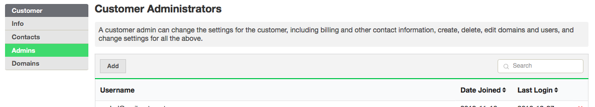
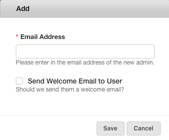

A **Customer Admin** can manage all aspects of a **Customer** account, as well
as its associated **Domains** and **Email Accounts**.

One person, with a single login, can be an administrator of and manage
multiple MailRoute Customers.

This is a position of responsibility. **Administrators** can change every
aspect of their service, from the domains that are filtered to the settings of
individual mailboxes, including making changes that can disable filtering, or
even cause email to bounce.

Click the **Admins** tab for a **Customer** to view their **Administrators.**

To add an **Admin** , click the **Add Admin** button and enter the email
address of the person you wish to add.

You can choose to send them a Welcome email, which will give them login
information and provide a link to the MailRoute Control Panel.

[Start a free 30-day trial today.](http://mailroute.net/signup.html)

Contact [sales@mailroute.net](mailto:sales@mailroute.net) or
[support@mailroute.net](mailto:support@mailroute.net) for more information.

888.485.7726

