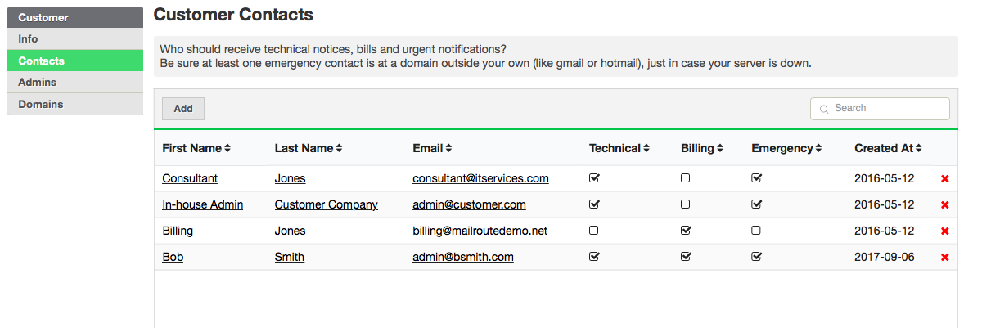
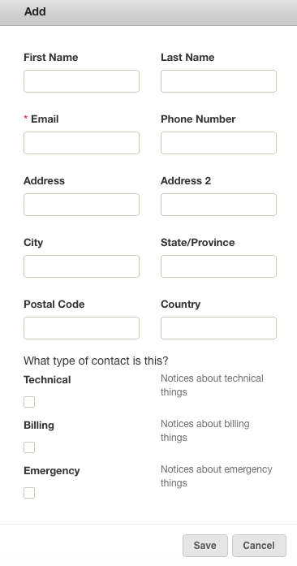

A **Customer** may have three types of **Contacts** , and you may list more
than one person for each category:

  * Billing
  * Technical
  * Emergency

A _Billing_ contact will receive invoices from MailRoute or their associated
Reseller.

A _Technical_ contact receives alerts and notices about our services.

An _Emergency_ contact will be used if we need to contact you in case of an
emergency, such as when we detect that your email server is down and not
accepting email.

One person can belong to more than one of these categories.

*For Technical and Emergency: Please **list email addresses that are not on your domain(s)** so we can still contact you if your server goes down.

Click the **Contacts** tab to view your contacts. You can edit the contact by
clicking on their name or change the type of contact by clicking in the
appropriate boxes. The red **X** will delete the **Contact**.

Click the **Add** button to add a contact and hit Save.

[Start a free 30-day trial today.](http://mailroute.net/signup.html)

Contact [sales@mailroute.net](mailto:sales@mailroute.net) or
[support@mailroute.net](mailto:support@mailroute.net) for more information.

888.485.7726

