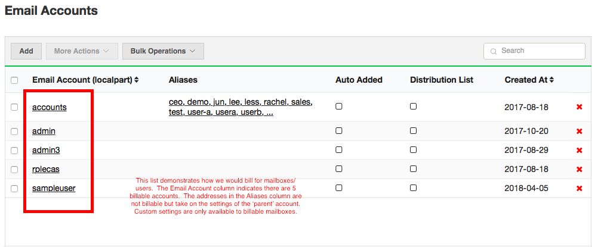
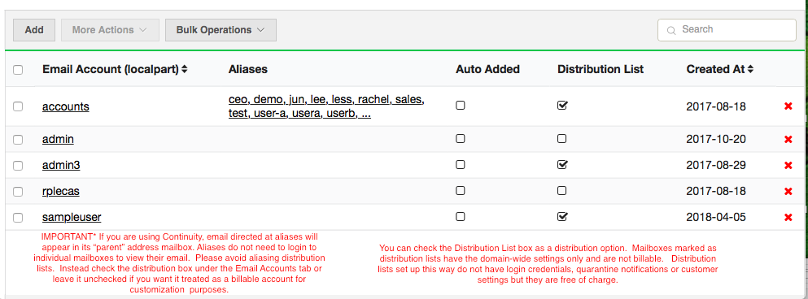
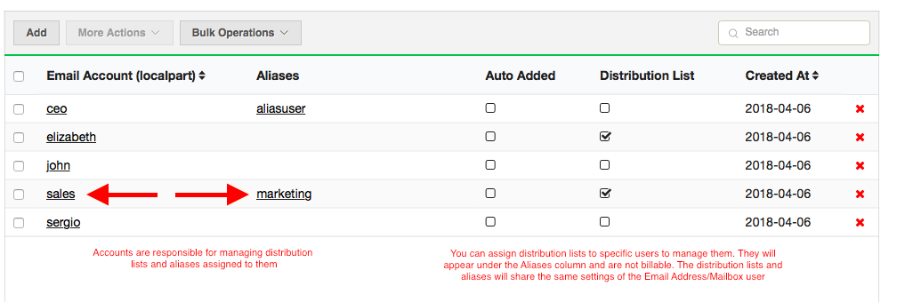
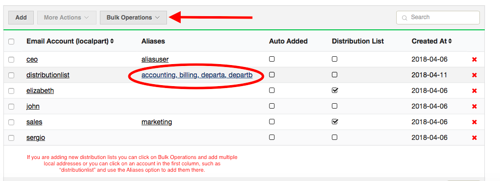
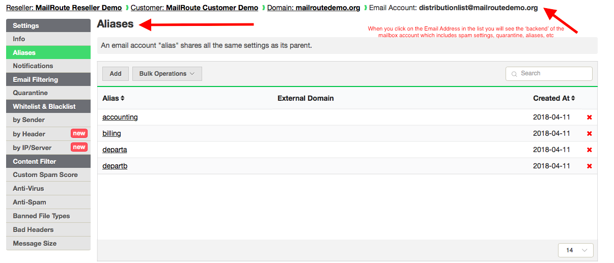

Below are the various ways customers can set up distribution lists.

**1)** Add the distribution lists to the list of accounts and **set custom
rules**. These are **billable** under this condition.

**2)** Add the distribution lists or if they are already listed, **check the
box** under the **Distribution lists** column.

  * Keep in mind that checking the distribution lists box only allows filter settings that match your domain-wide settings. Distribution lists are not billable unless customization is required.

  * This means that address will receive all of our protection but will not have login credentials, quarantine notifications or custom settings. This also means it is now free of charge.

  * IMPORTANT: If you are using our newly released Continuity and Archiving Lite service, email directed at aliases will appear in its "parent" address' mailbox. Aliases do not need to log in to individual mailboxes to view their email. However, you will need to avoid aliasing distribution lists. Instead check the distribution box under the Email Accounts tab or leave it unchecked if you want it treated as a billable account for customization purposes. 

  * NOTE: **If you convert an address from a regular address to a distribution list, the aliases are lost**. If you require aliases to any distribution lists **do not use this set up**. 

**3)** Add the distribution lists as **aliases** or if already added to the
accounts list **reassign them as an alias**.

  * You can assign dist. lists and aliases 'as aliases' to an email account. These will share the same settings as the email account and that account is responsible for managing (settings, checking quarantines, etc) the assigned aliases and distribution lists in our system. **Mail flow is not affected**. If several users get email at one of the distribution lists, mail will continue to deliver to them but the account the dist. lists are assigned to is responsible for them in our system. 

**4)** Or you can **create a single billable dummy account** and assign the
dist. lists to it. Admins will need to manage this by logging in and checking
quarantines, updating settings ,etc.

  * You can click on an **Email Account** in the list and it will take you to the backend of that account. Here you can create custom settings, add aliases, view aliases, quarantined emails, etc. 

[Start a free 30-day trial today](http://mailroute.net/signup.html).

Contact [sales@mailroute.net](mailto:sales@mailroute.net) or
[support@mailroute.net](mailto:support@mailroute.net) for more information.

888.485.7726

