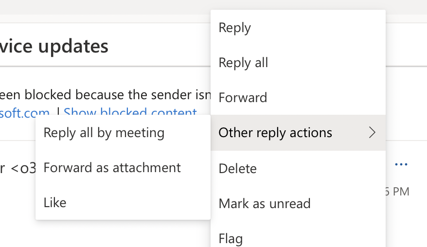

In order to fully analyze the message that made it through our filters, we ask
that you send the email exactly as you received it. The intact headers and
body must not be changed or modified in any way.

Why do we need this? It's important to have the original email sent to us as
an attachment so we are able to run it through our filters and see all the
scoring detail. We can use the message to further train our filters or create
new filtering rules.

Here's a widely used method of forwarding an email as an attachment:

1\. Create a brand new email.

2\. Move that window over so you can see your inbox listing of all your
emails.

3\. Drag the email (s) from the inbox listing over to the body of that new
email you created in Step 1. This will put the full, intact message into the
body of that new email as an attachment.

4\. Send us that new email.

Have a different email client? Here are some instructions for other email
software:

## Microsoft/Office 365

Select the message you want to forward. Click on the three dots ... in the
upper right corner>choose Other reply actions>Forward as attachment.

Send to abuse@mailroute.net

## Macintosh Mail

Select one or more messages, and choose "Forward as Attachment" from the
Message menu.

## Outlook Express / Windows Mail

Right-click the message that you want to forward. In the menu that appears,
click ‘Forward as Attachment’ at the top of the screen. Type in the email
address and press ‘send’.

If you want to send multiple messages, you can also drag and drop messages
onto the message window. You can also select multiple messages by holding the
‘Shift’ or ‘Ctrl’ keys when clicking, and then right-click and ‘Forward as
Attachment’ as above.

## Outlook 2011 for Mac

Click on “E-mail” to create a new email (or attach to any reply). Select the
email you want to forward in the folder, and then drag it to the body area of
the email. (An alternative is to select multiple emails as in Outlook 2003/XP
below.)

## Outlook 2010

Right-click the message, select ‘More Actions’ and then click the ‘Forward as
Attachment’ option.

## Outlook 2007

In Outlook 2007, ‘Forward as Attachment’ is available from the ‘Actions’ menu
when one or more emails are selected.

## Outlook 2003/XP

To forward multiple emails, select the messages (by holding the ‘Shift’ or
‘Ctrl’ keys when clicking). Then right-click and select ‘Forward items’. This
automatically attaches the emails to a blank message – Outlook decides for
itself whether to forward as an attachment depending on how many messages you
are forwarding. Type in the email address you want to send to and press
‘send’.

Or, you can simply create a new email. You can then either drag and drop one
or more messages into the new message (if after selecting the message you
can’t see the new message window any more, drag it instead to the taskbar
button for the new message and the window you want should come to the
foreground); or from the menu, click the ‘Insert’ menu and then choose ‘Item’.
In the top half of the window that opens, select the folder that contains the
email you want to send, usually Inbox. Select the message you want to attach,
and make sure that any ‘Insert As’ option is set to ‘Attachment’ before
clicking ‘OK’. Type the destination email address and press ‘send’.

You can have Outlook always forward as attachment by going to ‘Tools’ >
‘Options’ > ‘Preferences’ > ‘E-mail Options’ > ‘When forwarding a message’,
and selecting ‘Attach original message’ > ‘OK’.

