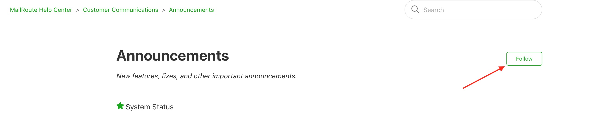

**Please subscribe to the Announcements forum on our help desk, to receive
timely information on MailRoute's service.**

Login, click to Customer Communications, then click on Announcements, then
click Follow button.

[Start a free 30-day trial today.](http://mailroute.net/signup.html)

Contact [sales@mailroute.net](mailto:sales@mailroute.net) or
[support@mailroute.net](mailto:support@mailroute.net) for more information.

888.485.7726

