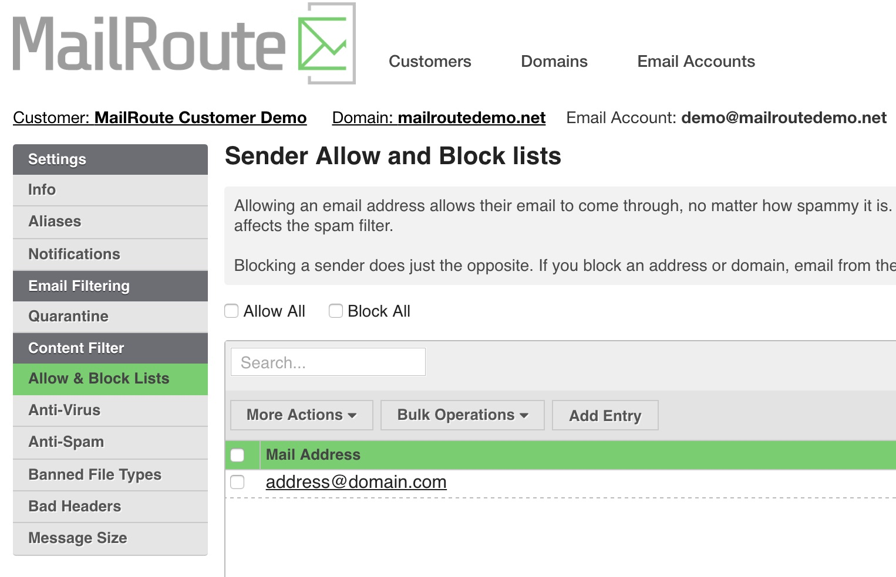

We've been as busy as ever, over here at MailRoute, working to improve and
enhance your experience with our email protection services. We appreciate your
business and strive to make user and admin functions the best they can be.

You'll notice layout changes to our site at admin.mailroute.net and Quarantine
Notifications beginning 2016 Dec 20, 18:00 Pacific.

MailRoute's [Continuity site](https://support.mailroute.net/hc/en-
us/articles/225721848-Video-Continuity-100-Mail-Uptime) remains unchanged. To
add 100% mail uptime with our Continuity service, contact sales@mailroute.net.

**Notable changes to the Filtering interface include:**

  * Menus down the left side of the page. Tabs are gone, allowing for more information to flow down the left side (giving you more options!).
  * Domain setup wizard is new.
  * New terminology for the interface and Quarantine Notifications:
  * Blacklist and Whitelist are being deprecated in favor of "Block" and "Allow", now found together under the new "Allow & Block Lists" menu item and on Quarantine Notifications.
  * "Releasing" an email from the quarantine is now called "recovering".

No information has been changed within your account. Thanks again for choosing
MailRoute!

