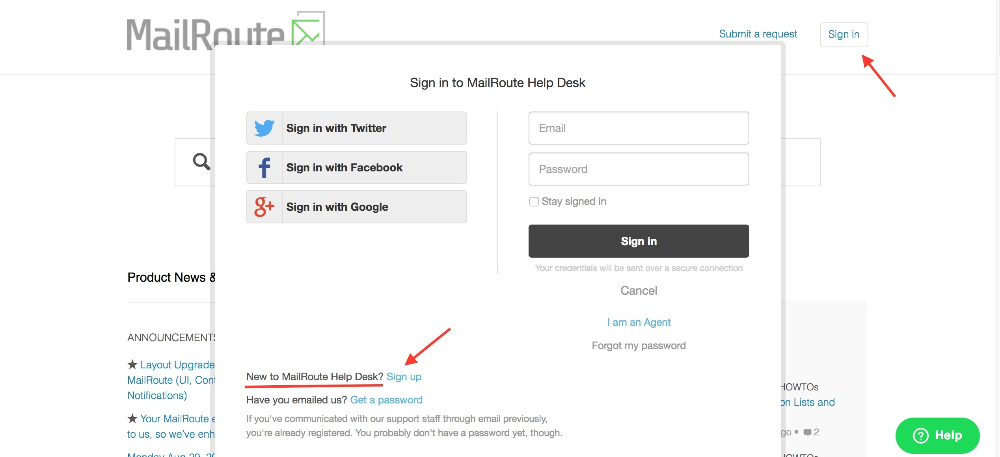
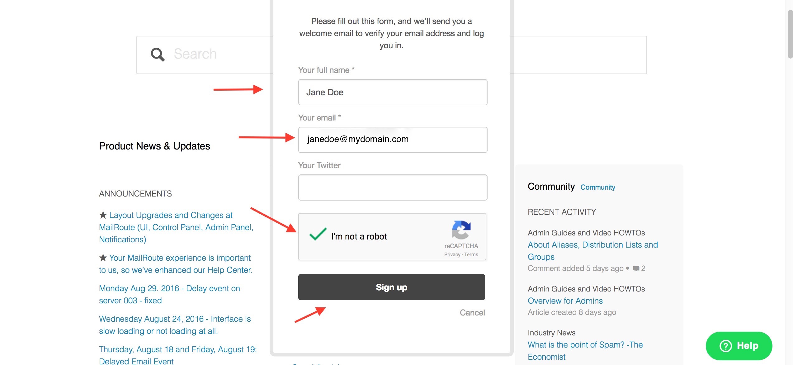
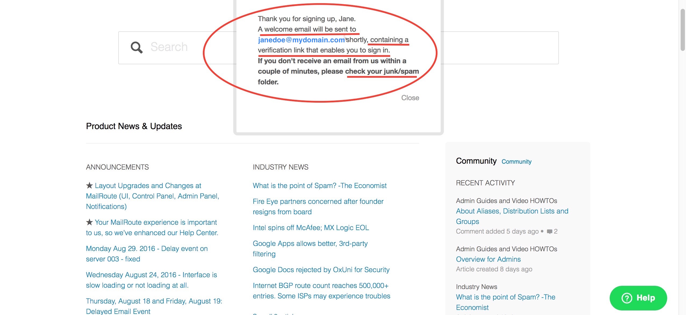
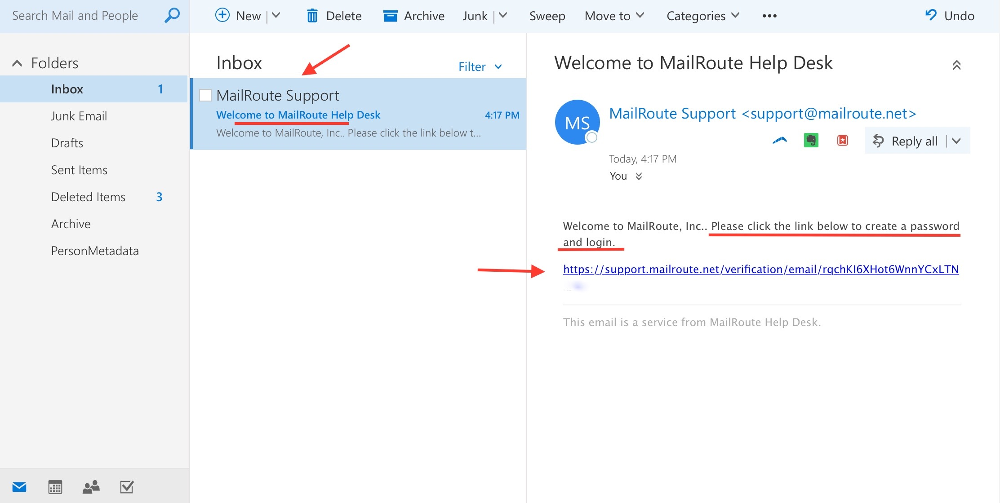
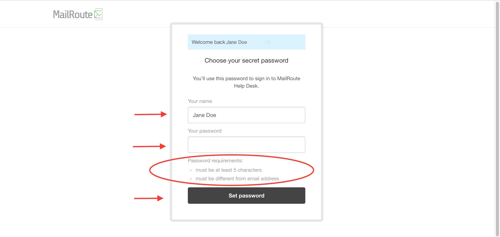
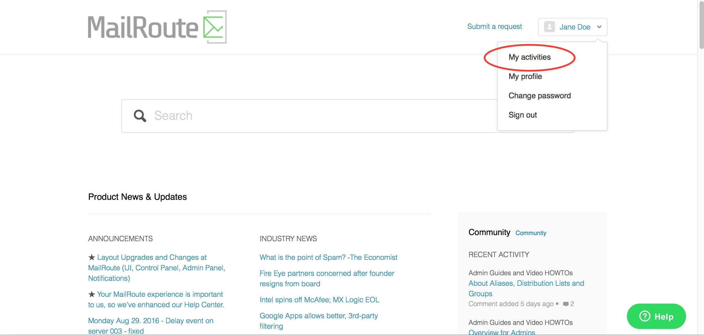
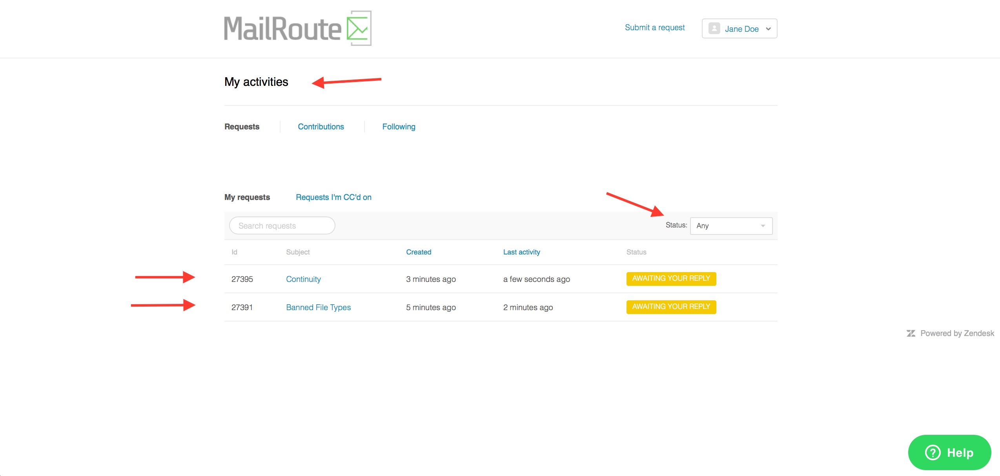
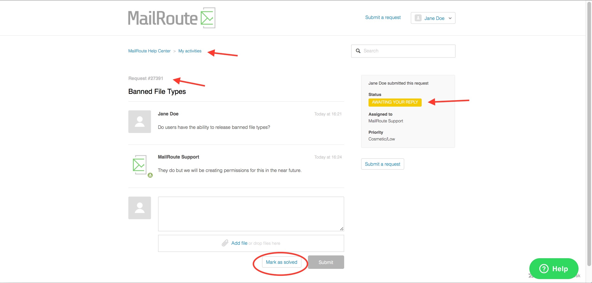
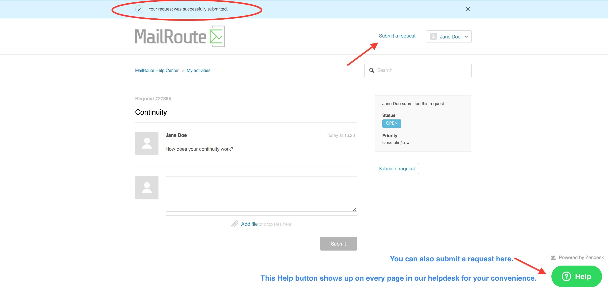
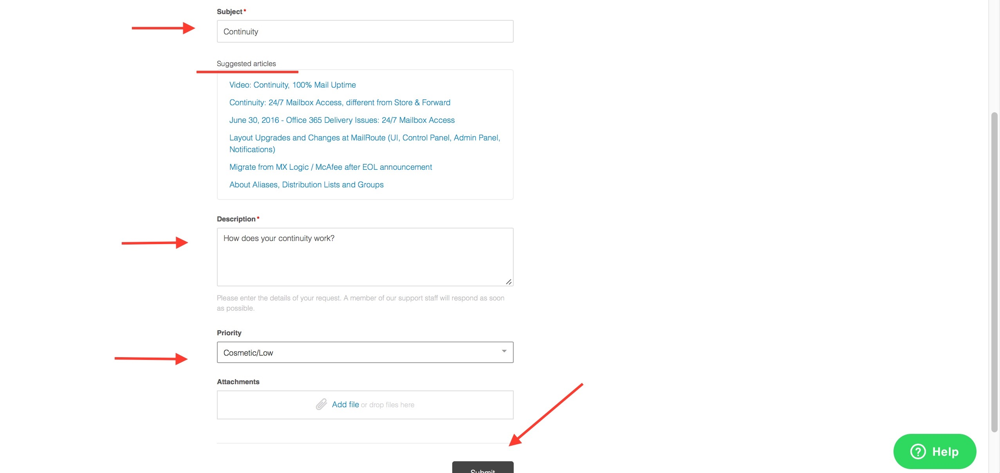

**To subscribe to our Help Desk to submit and follow up on tickets
click[here](https://support.mailroute.net/hc/en-us).**

**1**. Click on **Sign In**. A window will open which gives you several
options to log in. Click on the **Sign up** link next to " **New to MailRoute
Help Desk**?".

**2**. A new window will open.

  * Fill out your **name**
  * Enter the **email address** you want to login with
  * Check **I'm not a robot**
  * Click on the **Sign up** bar. 

**3**. A window will open notifying you that a **verification link has been
sent to the email address you provided.**

**4**. Check your inbox and open the **Welcome to MailRoute Help Desk** email.
**Click on the link** to finish setting up your login.

**5**. **Choose a password** , enter it and hit **Set Password**.

6\. You should now be logged into **MailRoute's Help Desk**. Click on the drop
down menu under your name. You will see **My Activities** and other options.
**My Activities** will show you tickets that you have submitted, responses to
them and/or their status.

**7**. Example of two submitted tickets.

**8**. Example of an open ticket in your **My Activities** view.

**9**. You have a couple of options to **submit tickets** outside of emailing
support@mailroute.net from your email client.

**10**. Example of a ticket ready to submit showing Subject, Suggested Links,
Description and Priority. You can also attach files then select Submit. A pop-
up bar will appear that your ticket was successfully submitted (see #9 above).

[Start a free 30-day trial today](http://mailroute.net/signup.html).

Contact [sales@mailroute.net](mailto:sales@mailroute.net) or
[support@mailroute.net](mailto:support@mailroute.net) for more information.

[888.485.7726](tel:888.485.7726)

