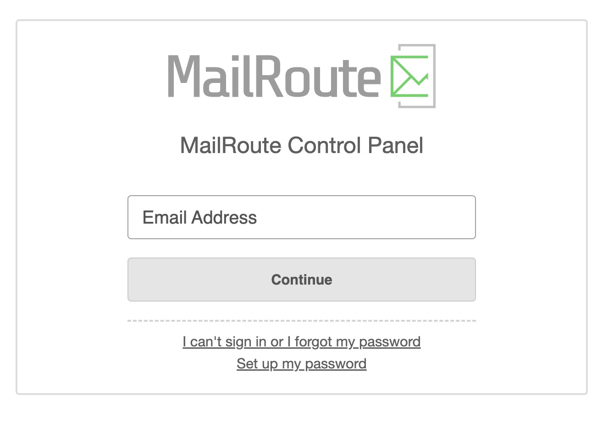
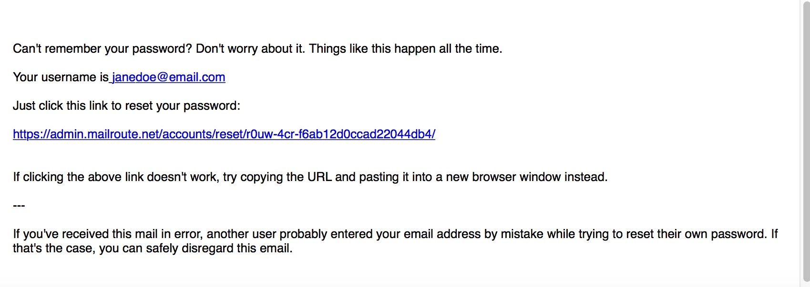

To log in to MailRoute's interface click the link in your set up email or you
can go to admin.mailroute.net and click login.

**Step 1** : Click on the link below the button ‘ **Set up my password** ’.

**Step 2** : Enter your email address and click **Send me setup/reset
instructions**.

**Step 3** : You will see the page below appear.

**Step 4** : You should see this authentication email in your inbox. Click the
link and **enter a password** of your choosing.

That's it!

If you need further assistance, please submit an email to
[support@mailroute.net](mailto:support@mailroute.net).

Thank you for choosing MailRoute for your anti-spam services!

