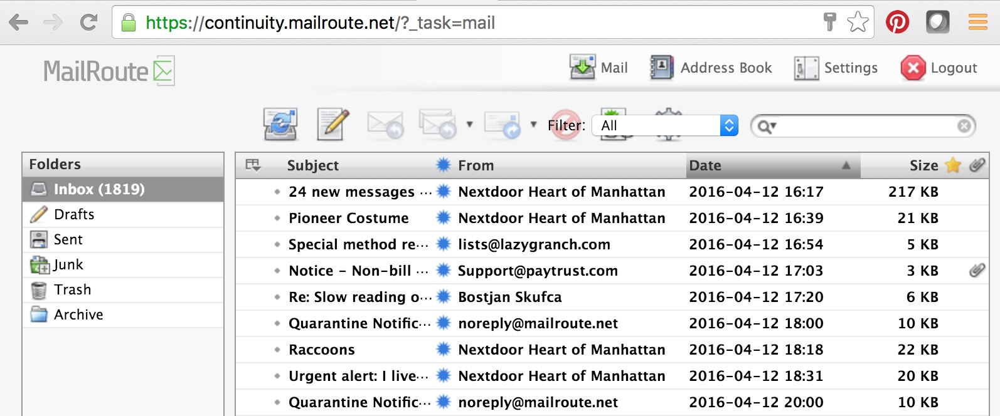

## What is MailRoute Email Continuity?

**Email Continuity is different from Store & Forward. **[Store &
Forward](https://support.mailroute.net/hc/en-us/articles/224061288) spools
your mail for up to 15 days when your server is unavailable and is included
with MailRoute's Filtering service; Continuity improves productivity during
outages by providing access to 30, 60 or 90 days of clean mail and all new
mail, while your server or ISP is down.

MailRoute’s 24/7 Mailbox Continuity is included with Enterprise and Compliance
plans, and is an add-on service to Basics customers. It is a secure, reliable
disaster-recovery email solution. We make your email available even when your
mailserver is not. (This is not to be confused with a feature that is included
with all plans: Store & Forward, which holds your mail for up to 15 days
during outages, so mail is not lost or bounced.)

With Continuity, a secure web portal provides access for all email addresses
on your domain(s) during outages or scheduled downtime.

  * 24/7 mailbox availability
  * No additional activation required beyond purchase
  * 30, 60 or 90 days of clean mail available; starts accruing the day service is activated
  * No loss in productivity

## When do I need it?

Corporate disaster-management or disaster-recovery plans include email
continuity. This insures that your team remains productive and your customers
can reach you. Continuity is something you purchase before you need it.

## How does it work?

You will be a MailRoute Email Security customer using our inbound/outbound
protection. You will also have populated your Filtering account with the
correct mailboxes for your domain.

The MailRoute Continuity site is separate from the administrative control
panel. It uses a standard webmail interface, so there is no training required
for your users; anyone who has used webmail will be comfortable using our
Continuity service.

Simply have users login at <https://continuity.mailroute.net/> .

Email directed at aliases will appear in its "parent" address' mailbox.

Since the MailRoute Continuity service requires your users to login to
[https://continuity.mailroute.net](https://continuity.mailroute.net/) to
access their stored email, be sure that passwords are set up for each user,
before you actually need Continuity.

You can assign passwords to your users when you first create them in your
email-filtering account ([admin.mailroute.net](https://admin.mailroute.net)).
You can set them up manually, upload them via CSV file upload, or use our
powerful API.

Some admins prefer to let their users set their passwords, and do not assign
passwords when creating their MailRoute accounts. These users can use the "[I
can't sign in or I forgot my
password](https://admin.mailroute.net/accounts/signup_or_restore/)".

Admins can always set a password for a user via the [MailRoute Control
Panel](https://admin.mailroute.net/), so in an emergency, you can always set a
password for your user. If possible, do have your users login to their
filtering account, so we have their passwords before Continuity is needed.
Otherwise you'll need to assign passwords to grant them access during your
outage.

(Please note that MailRoute Support will NOT change passwords for users. This
is to ensure the security of the entire service: only the administrators for a
domain can change a user's password.)

##

## What is Archiving Lite?

Archiving Lite is a disaster-recovery service. It provides access to 30, 60 or
90 days of clean mail to fix any "oops" moments that inevitably occur: a user
deleted a piece of mail and it's no longer on your server, your servers are
down (see Continuity above), or you just like to know that the CYA option is
there.

Archiving Lite is coupled with Continuity. It is a secure, reliable disaster-
recovery email solution.

Archiving Lite **does not** meet the standards for evidentiary use/meta data.
This is for short-term recovery to fix user error or function as a "peace of
mind" option.

With Continuity and Archiving Lite, a secure web portal provides access for
all email addresses on your domain(s) during outages or scheduled downtime.

  * 24/7 mailbox availability
  * No additional activation required beyond purchase
  * 30, 60 or 90 days of clean mail available; starts accruing the day service is activated
  * No loss in productivity

## Pricing & Signup

  1. 30 days of Continuity and Archiving Lite are included with MailRoute Enterprise and Compliance Plans, and it is available as an extra-cost add-on for Basics Plan users for $1 per user per month. The retention period can be increased to 2 Months for an additional $0.50 per user per month, and to 3 months for an additional $2 per user per month.

### **For more information or a quote,
contact[sales@mailroute.net](mailto:sales@mailroute.net) or call
888.485.7726.**

### Try our email protection service free of charge for 30 days, no credit
card required. [Stop spam now! ](http://mailroute.net/signup.html)

